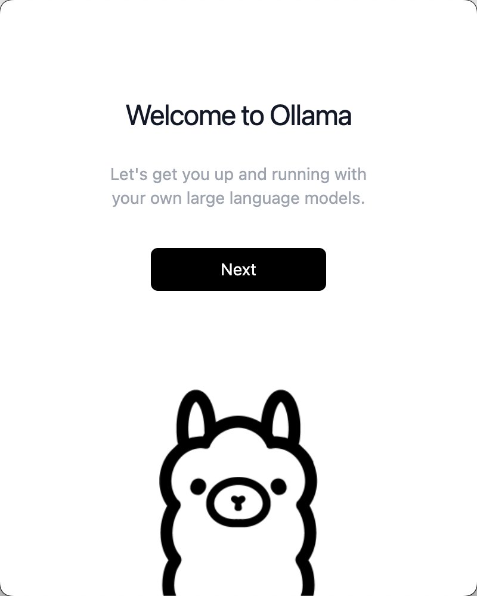

## 为什么要本地运行DeepSeek？

主要是有以下一些好处
1. 隐私：所有的请求数据都在本地，不会被上传到服务器
2. 速度：本地运行速度更快，节省了网络开销
3. 稳定：本地运行不会受到`DeepSeek`服务器的影响,最近因为`DeepSeek`太火，导致官方的服务器经常挂掉
4. 成本：本地运行不需要花费订阅成本，主要成本就是自己本地服务器的成本

## 安装

### 环境

我这里的安装环境主要是 `mac m1` 16GB + 256GB

### 模型选择

目前`deepSeek-r1`的蒸馏模型有多个参数版本，参数越多，模型越大，效果越好，但是速度也会变慢

我这里因为本地`mac`的机器限制，所以打算使用`deepSeek-r1-1.5b`版本，这个版本的参数比较少，模型也比较小

### 安装ollama

要运行`deepSeek-r1`我们首先要安装一个能运行大模型的工具，这里我们选择`ollama`

`ollama`目前也是`github`最火的大模型运行工具，star数量有`119k` star

- [ollama github](https://github.com/ollama/ollama): https://github.com/ollama/ollama
- [ollama 官网](https://ollama.com/): https://ollama.com/

这里我们直接去官网下载`ollama`应用即可

下载完成后我们直接打开

然后下一步安装命令行工具

命令行工具安装完成后我们就可以选择运行我们的模型了

这里点击`Finish`代表我们的`ollama`安装完成

### 安装deepSeek-r1

目前`ollama`官方已经支持`deepSeek-r1`模型，我们可以去看看有哪些模型

可以看到目前`deepSeek-r1`是`ollama`中最火的模型，下载量遥遥领先，没有之一

我们看看`deepSeek-r1`的详情

可以看到有多个参数模型选择

我这里因为本地限制选择参数最小的`deepSeek-r1-1.5b`版本， 支持15亿参数的小语言模型

>注意这里都是通过DeepSeek-R1 蒸馏出来的比较小的模型，参数比较少，但是速度比较快

打开命令行工具直接执行命令`ollama run deepseek-r1:1.5b`

执行完成后我们就可以看到`deepSeek-r1-1.5b`模型在自动下载运行了

看到输出`success`代表我们的`deepSeek-r1-1.5b`模型安装成功

目前已经安装运行完成，我们可以直接在命令行中直接使用`deepSeek-r1-1.5b`模型了

我们可以问一个简单的问题

比如用`java实现冒泡算法`

可以看到和`deepSeek`官方不同的是还会给出思考过程

这样使用cmd的方式界面太丑了，使用起来也不方便，所以我们可以使用开源的`ai`客户端界面来使用`deepSeek-r1-1.5b`模型

## 安装ai客户端

这里我们使用比较流行的`chatbox`

- [chatbox github](https://github.com/Bin-Huang/chatbox): https://github.com/Bin-Huang/chatbox
- [chatbox 官网](https://chatboxai.app/): https://chatboxai.app/

这里直接下载就完事了

下载完直接打开,点击 选择使用自己的API key或者本地模型

然后选择`ollama`模型

然后进行模型的配置

API域名填本地就行`http://127.0.0.1:11434`

模型选我们下载的`deepSeek-r1-1.5b`

然后保存试试效果

可以看到项目命令行工具，看起来还是要舒服多了

## 总结

本地运行`deepSeek-R1`的蒸馏模型还是比较容易的

主要下载`ollama`和`deepSeek-r1`蒸馏模型就行。

但是受限于本地机器限制,`deepSeek-r1-1.5b`蒸馏的模型参数比较少，效果也不是特别好哈哈

如果有更好的机器可以选择更多参数的蒸馏模型。