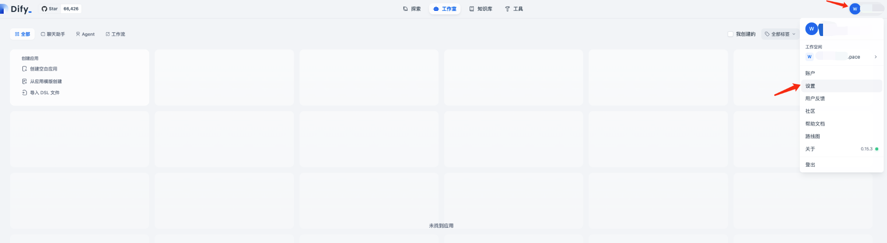
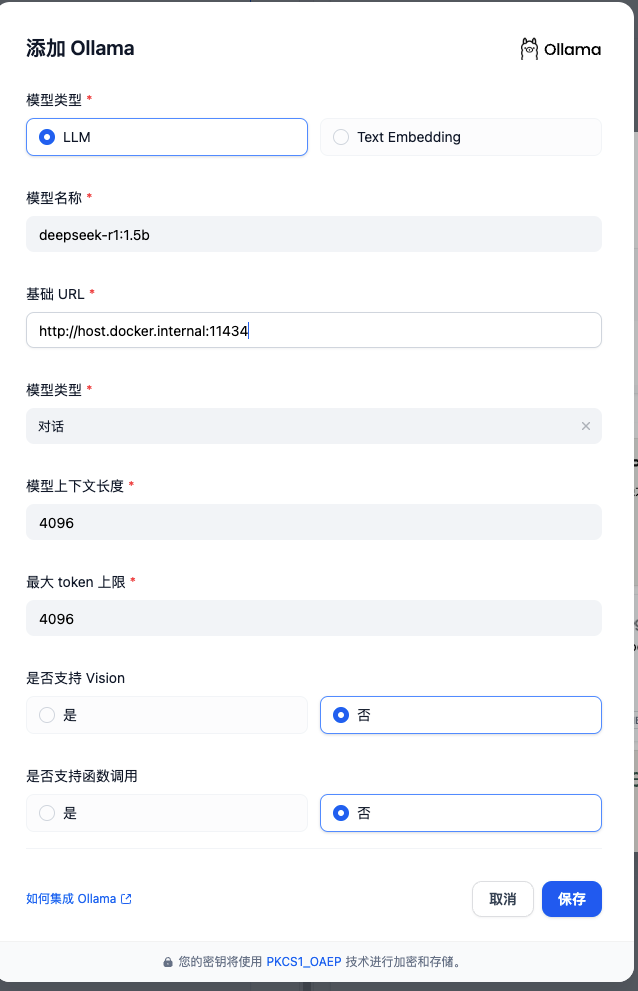

## 前言

之前就在教大家在本地部署过`deepseek`蒸馏模型。今天我们再来看看如何基于`deepseek`+`dify`打造个人专属知识库。


## deepseek本地部署

`deepseek`如何在本地部署参考之前的文章就好了

- [deepseek本地部署](https://mp.weixin.qq.com/s/NlUVOVFvrkDh9bgoRz99mw): https://mp.weixin.qq.com/s/NlUVOVFvrkDh9bgoRz99mw


## dify本地部署

### dify是什么

Dify 是一款开源的大语言模型(LLM) 应用开发平台。它融合了后端即服务（Backend as Service）和 LLMOps 的理念，使开发者可以快速搭建生产级的生成式 AI 应用。
即使你是非技术人员，也能参与到 AI 应用的定义和数据运营过程中。

由于 Dify 内置了构建 LLM 应用所需的关键技术栈，包括对数百个模型的支持、直观的 Prompt 编排界面、高质量的 RAG 引擎、稳健的 Agent 框架、灵活的流程编排，
并同时提供了一套易用的界面和 API。这为开发者节省了许多重复造轮子的时间，使其可以专注在创新和业务需求上。

> 来源于官网


### dify能做什么


- 创业: 快速的将你的 AI 应用创意变成现实，无论成功和失败都需要加速。在真实世界，已经有几十个团队通过 Dify 构建 MVP（最小可用产品）获得投资，或通过 POC（概念验证）赢得了客户的订单。

- 将 LLM 集成至已有业务: 通过引入 LLM 增强现有应用的能力，接入 Dify 的 RESTful API 从而实现 Prompt 与业务代码的解耦，在 Dify 的管理界面是跟踪数据、成本和用量，持续改进应用效果。

- 作为企业级 LLM 基础设施: 一些银行和大型互联网公司正在将 Dify 部署为企业内的 LLM 网关，加速 GenAI 技术在企业内的推广，并实现中心化的监管。

- 探索 LLM 的能力边界: 即使你是一个技术爱好者，通过 Dify 也可以轻松的实践 Prompt 工程和 Agent 技术，在 GPTs 推出以前就已经有超过 60,000 开发者在 Dify 上创建了自己的第一个应用。

> 来源于官网


本次我们主要是基于`deepseek`+`dify`打造个人专属知识库。

### dify本地部署

部署方式有很多种，我们这里以最简单的`Docker Compose`方式部署

我本地环境: mac m1 16G + 256G

1. 下载`Dify` 源代码

```shell
git clone https://github.com/langgenius/dify.git
```

2. 配置环境

```shell
cd dify/docker
cp .env.example .env
```
3. 启动 Docker 容器

```shell
docker compose up -d
```


4. 检查所有容器是否启动成功

```shell
docker compose ps
```

正常应该显示如下信息
```shell
NAME                  IMAGE                              COMMAND                   SERVICE      CREATED              STATUS                        PORTS
docker-api-1          langgenius/dify-api:0.6.13         "/bin/bash /entrypoi…"   api          About a minute ago   Up About a minute             5001/tcp
docker-db-1           postgres:15-alpine                 "docker-entrypoint.s…"   db           About a minute ago   Up About a minute (healthy)   5432/tcp
docker-nginx-1        nginx:latest                       "sh -c 'cp /docker-e…"   nginx        About a minute ago   Up About a minute             0.0.0.0:80->80/tcp, :::80->80/tcp, 0.0.0.0:443->443/tcp, :::443->443/tcp
docker-redis-1        redis:6-alpine                     "docker-entrypoint.s…"   redis        About a minute ago   Up About a minute (healthy)   6379/tcp
docker-sandbox-1      langgenius/dify-sandbox:0.2.1      "/main"                   sandbox      About a minute ago   Up About a minute             
docker-ssrf_proxy-1   ubuntu/squid:latest                "sh -c 'cp /docker-e…"   ssrf_proxy   About a minute ago   Up About a minute             3128/tcp
docker-weaviate-1     semitechnologies/weaviate:1.19.0   "/bin/weaviate --hos…"   weaviate     About a minute ago   Up About a minute             
docker-web-1          langgenius/dify-web:0.6.13         "/bin/sh ./entrypoin…"   web          About a minute ago   Up About a minute             3000/tcp
docker-worker-1       langgenius/dify-api:0.6.13         "/bin/bash /entrypoi…"   worker       About a minute ago   Up About a minute             5001/tcp
```

包括 3 个业务服务
- api
- worker  
- web

6 个基础组件 
- weaviate
- db  
- redis 
- nginx 
- ssrf_proxy 
- sandbox

## 配置dify

### 设置管理员账号

启动完成后我们直接访问`http://localhost/install`进行管理员账号设置


### 设置本地模型为Ollama

设置完管理员账号我们需要设置模型为`Ollama`







然后设置我们之前部署的本地模型

注意这里的两个参数
第一个模型名字一定要填写正确，你本地部署的是哪个蒸馏模型，就填哪个名字，填写错误会找不到模型。
我这里是`deepseek-r1:1.5b`，所以填写`deepseek-r1:1.5b`,如果是部署的其他蒸馏模型，需要修改名字

第二个参数就是基础URL,这里因为模型部署在本地，`dify`部署在`docker`中。
所以我们使用`http://host.docker.internal:11434`进行通信


### 创建空白应用

设置完成后我们创建一个空白应用


创建完成后我们发现聊天窗口有一个上下文可以选择


这里的上下文就是我们本地知识库发挥的地方

### 添加知识库

我们直接添加一个知识库


这里导入的文件支持多种文件格式


导入后有一些高级参数设置


> 实际语料库的训练时间会根据语料库的大小和模型的复杂性而有所不同。这里只是简单演示

## 效果

我们回到工作室在上下文中选择我们的知识库，然后进行测试

我们这里简单的用一个不怎么训练的知识库进行测试，比如我设置我公众号的最新文章地址导入，然后进行测试


可以看到可以回复出我们设置的知识库中的一些信息，比如返回我的公众号最新文章

## 一些踩坑

使用`docker compose up -d`启动后显示如下信息


表面上看所有容器都启动了，实际上有如下两个问题
1. nginx可以看到没有端口映射，状态在重启
2. redis没有端口映射

### nginx启动失败
查看Nginx容器的log发现打印如下错误

```shell
[emerg] 10#10: host not found in upstrream "api" in /etc/nginx/conf.d/default.conf:8
nginx: [emerg] host not found in upstream "api" in/etc/nginx/conf.d/default.conf:8
```
可以看到主要是`api`域名解析失败了


这里我的解决方式是修改`docker-compsoe`文件,在`nginx`服务中显式加入`default`网络

```yaml
services:
  nginx:
    networks:
      - default  
      - ssrf_proxy_network
```

### redis没有自动映射端口

这里我直接修改`docker-compose`文件，添加`redis`端口映射

```yaml
  redis:
    image: redis:6-alpine
    ports:
      - "6379:6379"
```

## 参考
- [Dify](https://docs.dify.ai/zh-hans): https://docs.dify.ai/zh-hans