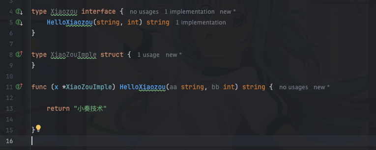

## 背景

最近在用`goalng`写一些代码，用到了一些`goalng`的接口，相比`java`的接口来说，`golang`的接口还是挺有意思的，与`java`相比有一些不同，下面听我详细道来

## 接口方法定义无需参数名定义

### golang

```go
type Xiaozou interface {
	
	HelloXiaozou(string, int) string
}

```
> 可以看到`golang`中接口参数名可以省略，实际使用来看接口里面的参数名似乎确实没啥用，但是java里面必须强制带参数名

### java

```java
public interface Xiaozou {
    String HelloXiaozou(String aa, int bb); 
}
```

## 隐式实现

所谓的`隐式实现`就是指你的结构体(类)无需添加`implements`关键字，只要实现了接口的方法，那么这个结构体就是这个接口的实现类

我们来看看具体代码

### golang

```go
type Xiaozou interface {
	
	HelloXiaozou(string, int) string
}

type XiaoZouImple struct {
}

func (x *XiaoZouImple) HelloXiaozou(aa string, bb int) string {

	return "小奏技术"

}
```

这里可以看到`XiaoZouImple`结构体实现了`Xiaozou`接口，但是并没有显示的使用`implements`关键字




### java

```java
public interface Xiaozou {
    
    String HelloXiaozou(String aa, int bb); 
}

public class XiaoZouImple implements Xiaozou {

    @Override
    public String HelloXiaozou(String aa, int bb) {
        return "小奏技术";
    }
}
```

可以看到java中需要使用`implements`关键字来显示的实现接口

## 空接口

可以看到上面的接口实现中无需使用`implements`关键字，只要实现了接口的方法，那么这个结构体就是这个接口的实现类

所以有了空接口的概念，空接口就是一个没有任何方法的接口，所有类型都实现了空接口，所以空接口可以接受任何类型的值

优点类似java的`Object`类，可以接受任何类型的值

所以空接口主要是在以前`golang`没有泛型的时候使用，用来接受任何类型的参数值

比如如下的一个方法
```go
func printAny(v interface{}) {
    fmt.Println(v)
}

printAny(42)
printAny("hello")
printAny([]int{1, 2, 3})
```

当然也可以用来实现一个能存储任意类型的数据类型，比如
```go
type XiaoZou struct {

    data map[string]interface{}
}

func (c *XiaoZou) Get(key string) interface{} {
    return c.data[key]
}

func (c *XiaoZou) Set(key string, value interface{}) {
    c.data[key] = value
}

```

## 方法集

golang的接口仅能定义方法，不能定义常量

在java里面由于接口的变量是默认`public static final`的，所以经常会使用接口来定义常量

比如正常java中常量定义需要手动添加`public static final`

```java
public class Constants {

    public static final String XIAO_ZOU = "xiaozou";
}
```

而使用接口定义常量默认就是`public static final`

```java
public interface Constants {

    String XIAO_ZOU = "xiaozou";
}

```


而`goalng`中接口只能定义方法，不能定义常量

## 总结

总的来说`golang`的接口相比`java`的接口来说更加简洁，比如隐式实现，接口定义的方法参数名可以省略。

接口的隐式实现有利有弊吧，越简洁意味着可读性越差，二者的区别主要是还是语言设计者的思维方式不同