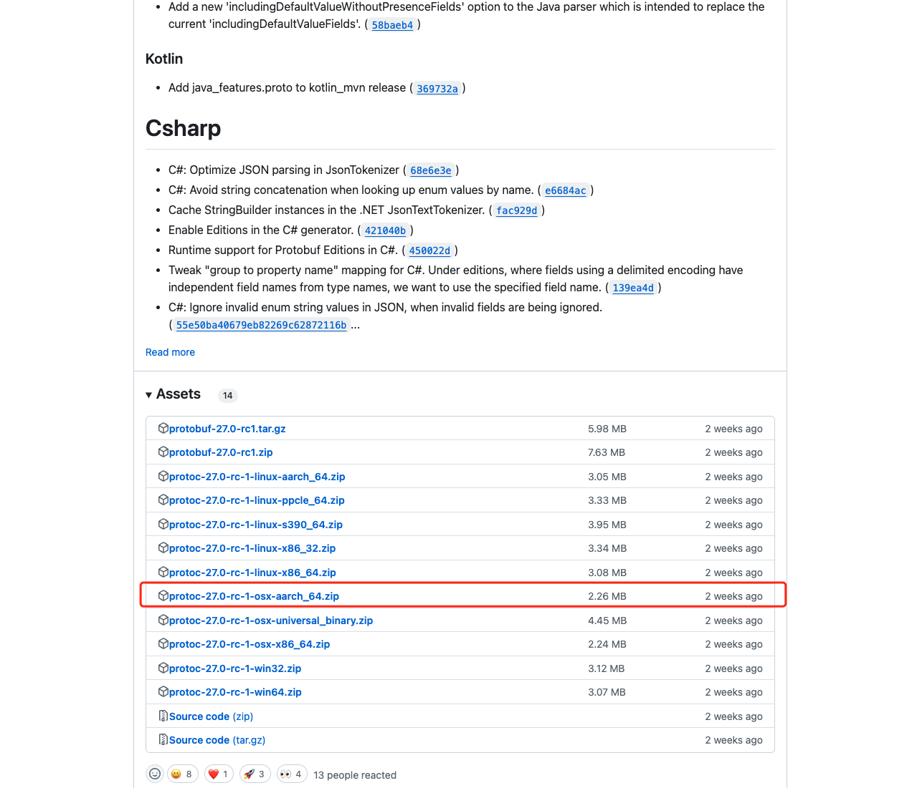
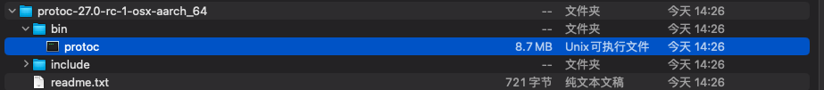
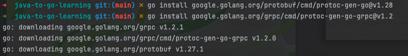
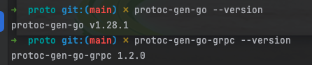
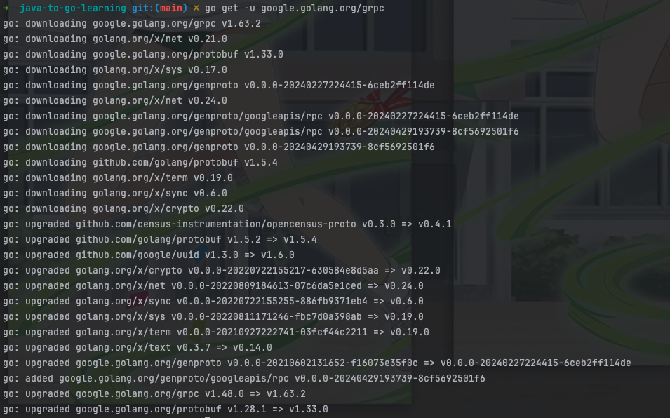

## 环境准备

### 安装Protocol Buffers 

目前最新版本是27.0-rc1

[github下载地址](https://github.com/protocolbuffers/protobuf/releases)



根据自己的系统选择不同的版本，我这里是`arm`架构，所以选择`arm`压缩包即可


解压完成后就是这个样子




然后直接执行 `bin`目录下面的`protoc`脚本


执行完后再执行`protoc --version`看是否安装成功


可以看到我的版本是`libprotoc 3.21.9`

### 安装protocol编译插件

```shell
go install google.golang.org/protobuf/cmd/protoc-gen-go@v1.28
````

>该插件会根据.proto文件生成一个后缀为.pb.go的文件，包含所有.proto文件中定义的类型及其序列化方法。

```shell
go install google.golang.org/grpc/cmd/protoc-gen-go-grpc@v1.2
````

>该插件会生成一个后缀为_grpc.pb.go的文件，其中包含：
>一种接口类型(或存根) ，供客户端调用的服务方法。
>服务器要实现的接口类型。



上述命令会默认将插件安装到$GOPATH/bin，为了protoc编译器能找到这些插件，请确保你的$GOPATH/bin在环境变量中。

可以执行如下命令设置环境变量
```shell
export PATH="$PATH:$(go env GOPATH)/bin"
```

检查是否安装成功
```shell
protoc-gen-go --version

protoc-gen-go-grpc --version
```




## 实战

### 整体目录


### 引入grpc依赖

```shell
go get -u google.golang.org/grpc
```



### 编写 hello.proto 文件
```proto
syntax = "proto3";

package proto;

option go_package = "./;proto";

// 定义HelloService
service HelloService {
  // 定义一个SayHello方法
  rpc SayHello (HelloRequest) returns (HelloReply) {}
}

// HelloRequest消息包含一个greeting字段
message HelloRequest {
  string greeting = 1;
}

// HelloReply消息包含一个response字段
message HelloReply {
  string response = 1;
}
```

### 生成go文件

这里主要是生成 `helloworld.pb.go` 和 `helloworld_grpc.pb.go` 文件

执行命令
```shell
 protoc --go_out=. --go-grpc_out=. hello.proto
```


### 编写服务端代码

```go
package main

import (
	"context"
	"google.golang.org/grpc"
	"java-to-go-learning/student/grpc-demo/proto"
	"log"
	"net"
)

// server用于实现hello.HelloServiceServer
type server struct {
	proto.UnimplementedHelloServiceServer
}

// SayHello实现hello.HelloServiceServer接口
func (s *server) SayHello(ctx context.Context, in *proto.HelloRequest) (*proto.HelloReply, error) {
	log.Printf("Received: %v", in.GetGreeting())
	return &proto.HelloReply{Response: "Hello " + in.GetGreeting()}, nil
}

func main() {
	lis, err := net.Listen("tcp", ":50051")
	if err != nil {
		log.Fatalf("failed to listen: %v", err)
	}
	s := grpc.NewServer()
	proto.RegisterHelloServiceServer(s, &server{})
	log.Printf("server listening at %v", lis.Addr())
	if err := s.Serve(lis); err != nil {
		log.Fatalf("failed to serve: %v", err)
	}
}

```

### 编写客户端代码

```go
package main

import (
	"context"
	"google.golang.org/grpc"
	"google.golang.org/grpc/credentials/insecure"
	"java-to-go-learning/student/grpc-demo/proto"
	"log"
	"time"
)

func main() {
	// 设置服务端地址
	address := "localhost:50051"
	conn, err := grpc.Dial(address, grpc.WithTransportCredentials(insecure.NewCredentials()))

	if err != nil {
		log.Fatalf("did not connect: %v", err)
	}
	defer conn.Close()
	c := proto.NewHelloServiceClient(conn)

	ticker := time.NewTicker(2 * time.Second)
	defer ticker.Stop()

	for range ticker.C {
		// 调用服务端的SayHello
		ctx, cancel := context.WithTimeout(context.Background(), time.Second)
		r, err := c.SayHello(ctx, &proto.HelloRequest{Greeting: "world"})
		if err != nil {
			log.Fatalf("could not greet: %v", err)
		}
		log.Printf("Greeting: %s", r.GetResponse())
		cancel() // 确保在下一次循环开始前取消上下文
	}
}

```

## 运行效果


## 参考
- https://grpc.io/docs/languages/go/quickstart/
- https://grpc.io/docs/protoc-installation/
- https://github.com/protocolbuffers/protobuf/releases
- https://github.com/grpc/grpc-go/blob/master/examples/helloworld/helloworld/helloworld.pb.go