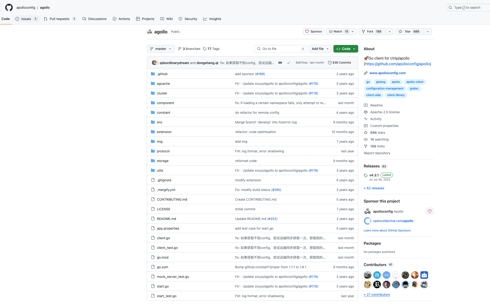

## 背景

最近有个golang服务要接入apollo，所以要研究下`apollo`的`golang`接入方式

发现官方提供了`agollo`的`golang` sdk
- [agollo](https://github.com/apolloconfig/agollo)
  

> 实际维护频率也处于比较低频的状态

## 接入步骤


1. 引入依赖

```shell
go get -u github.com/apolloconfig/agollo/v4@latest
```

2. 从apollo读取配置信息


我这里先总结下大致步骤，后面会给出完整代码

    1. 构建`*config.AppConfig`

    2. 通过`*config.AppConfig`读取到一个`string`对象(properties)，即所有配置文件(官方不支持yaml的直接读取)

    3. 将`properties`转换为`map[string]interface{}`对象

    4. 将`map[string]interface{}`对象转换为`yaml`对象


> 如果只需要读取`properties`文件，可以直接使用`agollo`提供的`GetContent`方法，之后无需进行其他转换


## 完整代码

```golang
 const (
	envApolloAddr    = "APOLLO_ADDR"
	envApolloAppID   = "APOLLO_APP_ID"
	envApolloCluster = "APOLLO_CLUSTER"

	defaultApolloAddr = "http://127.0.0.1:8080"
	defaultAppID      = "小奏技术"
	defaultNamespace  = "xiaozou.yaml"
)

func readConfigByApollo() *Config {
	c := getApolloConfig()

	client, err := agollo.StartWithConfig(func() (*config.AppConfig, error) {
		return c, nil
	})
	if err != nil {
		panic(err)
	}
	configYAML := client.GetConfig(defaultNamespace).GetContent()

	propMap, err := propertiesToMap(configYAML)
	if err != nil {
		panic(err)
	}
	// 将map转换为YAML字节流
	yamlBytes, err := yaml.Marshal(propMap)
	if err != nil {
		panic(err)
	}

	var apolloConfig *Config
	err = yaml.Unmarshal(yamlBytes, &apolloConfig)
	if err != nil {
		_ = fmt.Errorf(err.Error())
		panic(err)
	}

	// 打印解析后的配置，或者进行后续处理
	fmt.Printf("Config: %+v\n", apolloConfig)

	return apolloConfig

}

func getApolloConfig() *config.AppConfig {
	apolloAddr := os.Getenv(envApolloAddr)
	if apolloAddr == "" {
		apolloAddr = defaultApolloAddr
	}
	fmt.Printf("apollo addr: %s\n", apolloAddr)

	appID := os.Getenv(envApolloAppID)

	if appID == "" {
		appID = defaultAppID
	}

	namespace := os.Getenv(envApolloCluster)
	if namespace == "" {
		namespace = defaultNamespace
	}
	c := &config.AppConfig{
		AppID:          appID,
		Cluster:        "default",
		NamespaceName:  namespace,
		IP:             apolloAddr,
		IsBackupConfig: true,
		Secret:         "",
	}
	return c
}

func propertiesToMap(properties string) (map[string]interface{}, error) {
	result := make(map[string]interface{})
	lines := strings.Split(properties, "\n")
	for _, line := range lines {
		if line == "" || strings.HasSuffix(line, "#") {
			continue
		}
		parts := strings.SplitN(line, "=", 2)
		if len(parts) != 2 {
			return nil, fmt.Errorf("invalid property format: %s", line)
		}
		// 处理嵌套
		value := parseValue(parts[1])
		keys := strings.Split(parts[0], ".")
		lastMap := result
		for i, key := range keys {
			if i == len(keys)-1 {
				lastMap[key] = value
			} else {
				if _, ok := lastMap[key]; !ok {
					lastMap[key] = make(map[string]interface{})
				}
				lastMap = lastMap[key].(map[string]interface{})
			}
		}
	}
	return result, nil

}

func parseValue(str string) interface{} {

	if str == "true" || str == "True" {
		return true
	} else if str == "false" || str == "False" {
		return false
	}
	if i, err := strconv.Atoi(str); err == nil {
		return i
	}

	if strings.HasPrefix(str, "[") && strings.HasSuffix(str, "]") {
		str = str[1 : len(str)-1] // 移除括号
		if str == "" {
			return []string{}
		}
		// 分割字符串，并去除每个元素周围的空格
		elements := strings.Split(str, ",")
		for i, el := range elements {
			elements[i] = strings.TrimSpace(el)
		}
		return elements
	}

	// 返回原始字符串
	return str

}
```

上面的`Config`结构体如下
```golang
type Config struct {
	Server  *Server                   `yaml:"server"`
	Log     *Log                      `yaml:"log"`
	Topic   *Topic                    `yaml:"topic"`
	Configs map[string]RocketmqConfig `yaml:"rocketmq"`
}
```