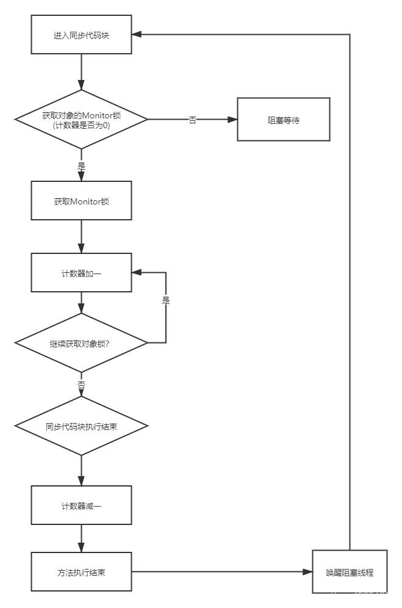

## java中的可重入锁

熟悉java的朋友都知道，在java中不管是`synchronized`还是`ReentrantLock`都是可重入锁,使用起来也非常简单

### synchronized

- 同步实例方法

```java
public synchronized void instanceMethod() {
    // 同步方法的代码
}

```

- 同步静态方法

```java
public static synchronized void staticMethod() {
    // 同步方法的代码
}
```

- 同步代码块

```java
public void someMethod() {
    synchronized(this) {
        // 同步代码块
    }
}
```

上面都是基于`this`对象实例的锁，静态方法的锁是当前类的`Class`对象

当然也可以使用其他对象实例的锁，手动传入一个对象

```java
private final Object lock = new Object();

public void someMethod() {
    synchronized(lock) {
        // 同步代码块
    }
}
```

### ReentrantLock

ReentrantLock就是手动挡，但是也支持重入
```java
public class XiaoZou {
    
    private final Lock lock = new ReentrantLock();

    public void someMethod() {
        lock.lock();
        lock.lock();
        try {
            // 同步代码块
        } finally {
            lock.unlock();
            lock.unlock();
        }
    }
}
```

## 核心原理

其实可重入锁的核心原理就是维护一个`monitor`计数器即可，每次加锁`+1`，解锁`-1`，当`monitor`为`0`的时候才能释放锁

大致流程如下图




对于大佬们来说设计支持可重入锁的锁也是非常简单的，那为什么`golang`不支持呢？


## golang中的Mutex

实际golang中比较简单经典的锁用法就是

```go
func main() {
	var mu sync.Mutex
	mu.Lock()
	defer mu.Unlock()
}
```

如果我们试试一把锁加多次会怎么样呢?

```go
func main() {
	var mu sync.Mutex
	mu.Lock()
	mu.Lock()
	defer mu.Unlock()
}
```

 没错，报错了
 ```
 fatal error: all goroutines are asleep - deadlock!
 ```

说明golang是不支持可重入锁的

## golang为什么不支持可重入锁

我们去`golang`官方社区，查找相关`issues`就会发现早有人提出一样的问题

[go/issues/24192](https://github.com/golang/go/issues/24192): https://github.com/golang/go/issues/24192

有一位小伙伴提出`可重入锁通常意味着坏代码`，然后贴上了`stackoverflow`的讨论地址
[stackoverflow](https://stackoverflow.com/questions/14670979/recursive-locking-in-go/14671462#14671462):https://stackoverflow.com/questions/14670979/recursive-locking-in-go/14671462#14671462

`golang`的官方说法，如果你遇到了需要使用重入锁的场景，实际是你的代码出现了坏味道，你需要重新设计你的代码

互斥锁的本意就是"我需要保持不变".可重入锁会破坏他们


我们看看官方给的例子

```go
     func F() {
             mu.Lock()
             ... do some stuff ...
             G()
             ... do some more stuff ...
             mu.Unlock()
     }

     func G() {
             mu.Lock()
             ... do some stuff ...
             mu.Unlock()
     }
```

通常，当调用`mu.Lock`返回时，调用代码现在可以假设受保护的不变量保持不变，直到它调用`mu.Unlock`

如果递归互斥锁的实现允许在当前线程已经持有 mu 时， 让 G 中的 `mu.Lock` 和 `mu.Unlock` 调用变成无操作，
那么当在 G 内部 `mu.Lock` 返回时，**不变量可能成立，也可能不成立**。这取决于 F 在调用 G 之前做了什么。
或许 F 并没有意识到 G 需要这些不变量，并且已经破坏了它们（在复杂代码中这完全有可能）

从互斥宏观角度来看，要么是F执行，要么是G执行，两者是互斥的，这就是`mu`的原语
但是可重入打破了这个原语，因为F和G都可以同时执行，这就是`mu`的原语被破坏了


所以如果你要实现类似的功能推荐你使用如下方式去代替
```go
     func g() {
             ... do some stuff ...
     }

     func G() {
             mu.Lock()
             g()
             mu.Unlock()
     }
```

递归互斥锁只是一个错误，不过是滋生漏洞的温床

## 总结

总的来说就是`goalng`的设计者`Russ Cox`认为可重入是一种错误设计，会破坏`mu`互斥的原语

本来在原语上两个应该互斥的方法因为可重入变的不互斥了，出现需要可重入锁的场景，实际上是你的代码出现了坏味道，需要重新设计

可以看到`golang`从设计层面就避免了很多坏代码的味道，比如不支持可重入锁，不支持循环引用等。从编译层面去规范代码，这也是`golang`的一大特色

但是也就带来了一些开发上的不便利，你需要花费更多的重新设计你的代码，但是这也是`golang`的设计初衷

质量和效率总归互斥的，你需要在两者之间做出平衡

