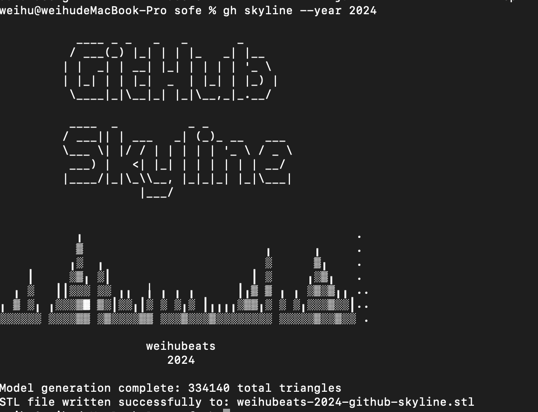

##  github/gh-skyline

`github`官方最近开源了一个好玩的3D模型生成项目`gh-skyline`

主要用来生成你的`github`历史活跃度3D图

还是挺有意思的，我们具体来看看怎么使用


## 前置条件

使用`gh-skyline`需要先安装`github`官方提供的命令行工具`gh`

安装方式很简单

```shell
brew install gh or 
```

也可以手动安装


手动下载的文件可以直接移动到`/usr/local/bin`路径

```shell
sudo mv ~/Downloads/gh_2.64.0_macOS_amd64/bin/gh /usr/local/bin/
```

验证是否安装成功

```shell
gh --version
```

打印版本信息证明安装成功
```
gh version 2.64.0 (2024-12-20)
```

### 登入github gh

`gh`安装好后，需要登入`github`账号

```shell
gh auth login
```

然后按照提示登入即可


## 安装gh-skyline

安装`gh-skyline`也很简单

```shell
gh extension install github/gh-skyline
```

安装完成后我们就可以生成我们的历史活跃度3D图了

## 生成3D图

比如我们要生成2024年的活跃3D图 只需要执行如下命令

```shell
gh skyline --year 2024
```



3D图github支出预览，我们可以使用一些在线的3D模型查看器查看


如果家里有3D打印机就可以自己着色打印出来了

## 参考

- [github/gh-skyline](https://github.com/github/gh-skyline?tab=readme-ov-file)