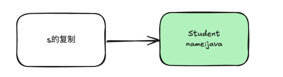

## java

### 基本类型

在 Java 中，基本数据类型（如 int, float, boolean 等）是值传递

```java
public class ValuePassExample {
    public static void main(String[] args) {
        int x = 10;
        changeValue(x);
        System.out.println(x); // 输出 10，x 的值没有改变
    }

    static void changeValue(int num) {
        num = 20;
    }
}
```

### 引用类型(对象)

在 Java 中，引用类型是引用传递,我们来看看几个例子

#### jdk提供的对象

```java
public class ReferencePassExample {
    
    public static void main(String[] args) {
        
        StringBuilder sb = new StringBuilder("Hello");
        changeValue(sb);
        
        System.out.println(sb); // 输出 "Hello XiaoZou"，sb 被修改了
    }

    static void changeValue(StringBuilder s) {
        s.append(" XiaoZou");
    }
}
```

这里可以看到通过改变引用对象的值，原始对象也被改变了

#### 自定义对象

```java
class Student {
    
    String name;
    
    Student(String name) {
        this.name = name;
    }
}

public class Main {
    public static void main(String[] args) {
        
        Student s = new Student("xiaozou");
        
        // 情况 1: 修改对象的字段
        updateName(s);
        System.out.println(s.name);  // 输出 java

        // 情况 2: 尝试重新赋值对象
        updateStudent(s);
        System.out.println(s.name);  // java
    }

    public static void updateName(Student student) {
        student.name = "java";  // 修改成功
    }

    public static void updateStudent(Student student) {
        student = new Student("xiaozou");  // 不会影响原对象
    }
}
```

这里分两种情况
1. 我们通过引用修改对象的字段，原始对象也被修改了
2. 我们尝试重新赋值对象，但是原始对象并没有被改变

为什么会这样呢？我们简单通过图片理解一下

首先在`main`方法中 我们创建了一个s对象，s指向了一个Student对象


然后我们调用`updateName`方法，s的引用被复制并传递给方法，但是main方法中的`s`还是指向原来的Student对象

然后我们通过修改引用的`Student`实际对象的值，外面的`Student`对象也会发生变化



因为现在我们指向的是同一个`Student`对象

然后我们调用`updateStudent`方法，s的引用被复制并传递给方法，但是我们在方法中将s的引用修改为指向新的`Student`对象，但是main方法中的`s`还是指向原来的Student对象

所以即使修改了引用的`Student`对象，外面的`Student`对象并不会发生变化


## GO

Go 语言只有值传递，但是可以通过指针来模拟引用传递的效果

### 值传递

```go
package main

import "fmt"

func main() {
    x := 10
    changeValue(x)
    fmt.Println(x)  // 输出 10
}

func changeValue(num int) {
    num = 20
}
```

### 使用指针模拟引用传递

```go
package main

import "fmt"

type Student struct {
    Name string
}

func main() {
    s := Student{Name: "Alice"}

    // 情况 1: 传递指针，修改结构体字段
    updateName(&s)
    fmt.Println(s.Name)  // 输出 "Bob"

    // 情况 2: 传递指针，尝试重新赋值
    updateStudent(&s)
    fmt.Println(s.Name)  // 输出 "Charlie"
}

func updateName(student *Student) {
    student.Name = "Bob"  // 修改成功
}

func updateStudent(student *Student) {
    *student = Student{Name: "Charlie"}  // 修改成功
}
```

在 Go 中，如果你想在函数内部修改传入的对象，你需要传递该对象的指针。通过指针，你可以修改对象的字段，甚至可以完全替换该对象。

## 总结

在`Java`中弱化了指针的概念，已经没有指针了。所以有时候我们进行一些对象的update操作会感觉很奇怪

比如像上面的例子，明明都是修改s，一个影响到了原对象，一个却没有影响到原对象

实际我们要区分这两种情况，虽然都是复制了一个引用

`golang`中就不一样，如果你不定义指针，那么你就只能进行值传递，不管你如何修改，都改变不了原对象

想要修改原对象，你就必须需要传递指针，方法定义中的参数就必须是指针比如`*Student`

