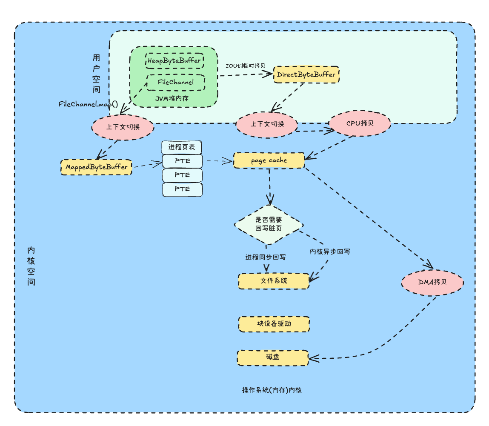

## java nio文件读写

我们使用java nio进行文件的读写操作时，会涉及到`MappedByteBuffer`、`HeapByteBuffer`、`DirectByteBuffer`这三种`ByteBuffer`.

我们首先看看三个`buffer`进行文件写入的代码

### HeapByteBuffer

```java
    private static void writeFileByHeapByteBuffer() throws Exception {
    HeapByteBuffer heapBuffer = ByteBuffer.allocate(1024);
    heapBuffer.put(MESSAGE.getBytes());
    heapBuffer.flip();
    try (RandomAccessFile raf = new RandomAccessFile(createFile("heap-file.txt"), "rw")) {
        FileChannel channel = raf.getChannel();
        int write = channel.write(heapBuffer);
    }
}
```


### DirectByteBuffer

```java
    private static void writeFileByDirectByteBuffer() throws Exception {
        ByteBuffer heapBuffer = ByteBuffer.allocateDirect(1024);
        heapBuffer.put(MESSAGE.getBytes());
        heapBuffer.flip();
        try (RandomAccessFile raf = new RandomAccessFile(createFile("direct-file.txt"), "rw")) {
            FileChannel channel = raf.getChannel();
            int write = channel.write(heapBuffer);
        }
    }
```


### MappedByteBuffer

```java
    private static void writeFileByMappedByteBuffer() throws Exception {
        try (RandomAccessFile raf = new RandomAccessFile(createFile("mapped-file.txt"), "rw")) {
            FileChannel channel = raf.getChannel();
            MappedByteBuffer buffer = channel.map(FileChannel.MapMode.READ_WRITE, 0, MESSAGE.getBytes(StandardCharsets.UTF_8).length);
            buffer.put(MESSAGE.getBytes());
        }
    }
```


代码没有太多的区别，核心区别就是
1. HeapByteBuffer是通过`ByteBuffer.allocate`创建的
2. DirectByteBuffer是通过`ByteBuffer.allocateDirect`创建的
3. MappedByteBuffer是通过`channel.map`创建的

接下来我们看看这三个`buffer`在操作系统中的区别

## 所在区域


### HeapByteBuffer

首先我们的所有内存都在操作系统的虚拟内存中。

然后JVM会向操作系统申请一大块内存。


我们创建的`HeapByteBuffer`也就是堆内存，是创建在JVM堆中的。属于用户空间


### DirectByteBuffer

然后我们创建的`DirectByteBuffer`是直接内存，是创建在操作系统的内存中的，不属于JVM内存。但是也属于用户空间

### MappedByteBuffer

`MappedByteBuffer`也是在操作系统内存中,不同于`DirectByteBuffer`的是`MappedByteBuffer`是直接映射到`pageCache`。所以算是直接写内核态的`pageCache`，不像`DirectByteBuffer`需要拷贝到`pageCache`，还要进行上下文切换

现在知道了这三种`buffer`的所在区域，我们来看看他们是如何读写的，然后聊聊会涉及几次上下文切换、几次数据拷贝


## 数据读写过程



先上一张图，然后我们来具体分析

### HeapByteBuffer


`HeapByteBuffer`由于是在JVM中，所以首先要通过`IOUtil`临时拷贝到一个临时的堆外内存`DirectByteBuffer`中

代码里面有判断，具体我们可以看源码


这里为什么要拷贝一次呢？因为`HeapByteBuffer`是在JVM中的，受GC影响，GC会移动内存

导致`HeapByteBuffer` 在 `GC` 之后它背后的内存地址可能已经发生了变化。所以不能直接操作`HeapByteBuffer`，需要拷贝到一个临时的堆外内存`DirectByteBuffer`中

### 读文件
1. 用户调用`read`方法进行文件读取，JVM进程会进行一次上下文切换进入内核空间
2. 内核空间查看`pagecache`是否有文件数据，如果有，则直接将文件通过`CPU`拷贝到`DirectByteBuffer`中，然后由`DirectByteBuffer`拷贝到`HeapByteBuffer`中。 这里涉及两次数据拷贝，一次上下文切换
3. 如果`pageche`没有数据，则通过DMA拷贝将磁盘的数据拷贝到`pagecache`中

所以如果文件没有命中`pagecache`。

总过涉及3次数据拷贝，2次上下文切换
1. 磁盘数据通过DMA拷贝到`pagecache`中
2. `pagecache`中的数据通过CPU拷贝到`DirectByteBuffer`中
3. `DirectByteBuffer`中的数据拷贝到`HeapByteBuffer`中

上下文切换就进入内核一次，出内核一次。共两次

### 写文件

所以整体的流程是

1. 在JVM分配一个堆内存`HeapByteBuffer`
2. 将`HeapByteBuffer`拷贝到一个临时的堆外内存`DirectByteBuffer`, 进行一次数据拷贝
3. 上下文切换进入到内核空间，同时这里进行一次CPU拷贝，将`DirectByteBuffer`拷贝到`pageCache`中
4. `pageCache`再通过DMA拷贝到磁盘中，再次进行数据拷贝
5. 然后再次上下文切换回到用户空间


所以`HeapByteBuffer`进行文件写入的时候涉及3次数据拷贝，2次上下文切换


### DirectByteBuffer

`DirectByteBuffer`相比`HeapByteBuffer`流程相同，主要是少了`JVM`堆内存拷贝到临时的堆外内存`DirectByteBuffer`这一步

### MappedByteBuffer

#### 读取文件

1. `MappedByteBuffer`初次创建需要将文件的某个区域映射到 `JVM` 进程的虚拟内存空间中，从而获得一段文件映射的虚拟内存区域 `MappedByteBuffer`
所以在初始化的时候就会进行两次上下文切换
2. 第一次对`MappedByteBuffer`进行读取时，会触发缺页中断，内核将文件的内容从磁盘加载到pageCache中.由于这里涉及到了缺页中断的处理，因此也会有两次上下文切换的开销，同时这里是由于DMA将磁盘的数据拷贝到pageCache中，所以也会有一次数据拷贝

所以整个过程是4次上下文切换，1次数据拷贝

但是实际我们在计算`MappedByteBuffer`的时候，主要是计算`MappedByteBuffer`已经文件预热了。

完整的文件读取流程是4次上下午切换、一次数据拷贝(DMA拷贝)，少了CPU拷贝

### 写入文件

1. `MappedByteBuffer`初次创建需要将文件的某个区域映射到 `JVM` 进程的虚拟内存空间中，从而获得一段文件映射的虚拟内存区域 `MappedByteBuffer`
   所以在初始化的时候就会进行两次上下文切换
2. 第一次对`MappedByteBuffer`进行写入时候直接写入pageCache，然后通过DMA拷贝到磁盘中，所以只有一次数据拷贝


## 总结

可以看到如果`MappedByteBuffer`进行文件映射后，不需要cpu拷贝，不需要上下文切换

这么看`MappedByteBuffer`好像最牛逼，还要`DirectByteBuffer`干嘛，全部无脑用`MappedByteBuffer`进行文件读写不就好了？

实际`MappedByteBuffer`受缺页中断的性能影响，并不是一定是性能最优的

实际的性能还是看具体文件写入的大小


- 小文件（< 1MB）：使用`HeapByteBuffer`。分配快，适合临时操作
- 中等大小文件（1MB - 100MB）：使用`DirectByteBuffer`，可以重复使用同一个buffer
- 大文件（> 100MB）：使用`MappedByteBuffer`。特别是需要随机访问时

实际生产使用可以多做一些性能测试，也有博主对`MappedByteBuffer`和`DirectByteBuffer`对不同文件的读写做过性能测试，感兴趣的可以自己去看看


## 参考

- [MappedByteBuffer VS FileChannel：从内核层面对比两者的性能差异](https://mp.weixin.qq.com/s/HBh8oROdDh1UWyC-Ym7UdQ)