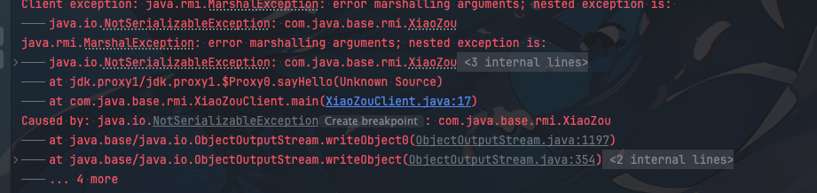
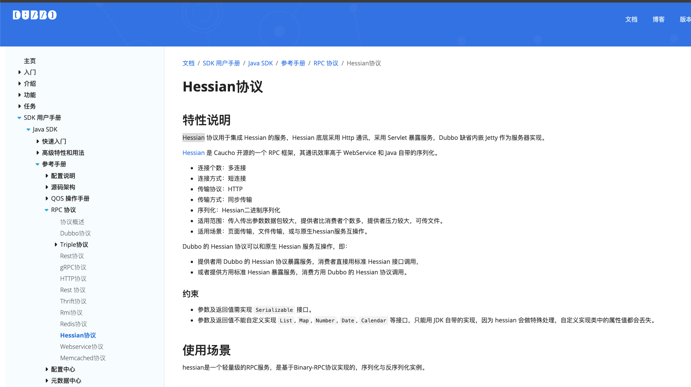

## 背景

其他大家在初学java的时候肯定是接触过`Serializable`接口的，这个接口是一个标记接口，没有任何方法，只是一个标记，用来标记一个类可以被序列化，可以被网络传输，可以被持久化。


```java
public interface Serializable {
}
```

一些传统的草台班子的解释就是，你要网络传输就要实现`Serializable`接口，但是这个解释并不准确

因为有时候我们发现不实现`Serializable`接口进行网络传输也不会报错，但是有时候又需要实现`Serializable`接口，否则会报错，那么底什么时候需要实现`Serializable`接口呢？

比如我们使用`spring boot`框架在`controller`层返回一个`json`数据，这个时候我们并不需要实现`Serializable`接口

比如我们使用`redisson`的发布订阅功能传输的对象又需要实现`Serializable`接口(使用默认的序列化`MarshallingCodec`)


如果是抱着能用就行的态度也是很简单，一把梭，只要网络传输就实现`Serializable`接口

如果想深入了解我们就可以继续向下看下去

## 什么情况下的网络传输需要实现`Serializable`接口

大家都知道`Serializable`接口是`java`原生提供的接口，那么就说明如果是使用`java`原生的网络传输方式就需要实现`Serializable`接口

使用java原生的网络传输对象就需要实现`Serializable`，如果只是基本类型或者字符串则不需要

这里我们以`RMI`为例 ，使用`RMI`传输java对象的的时候就需要需要实现`Serializable`接口

## RMI传输demo

这里我们简单基于`RMI`传输一个对象，来看看效果，演示下不实现`Serializable`接口的情况


首先我们实现一个远程接口`RemoteInterface`

- RemoteInterface

```java
public interface RemoteInterface extends Remote {
    
    String sayHello(XiaoZou xiaoZou) throws RemoteException;
}
```

之后提供一个远程接口调用的实现类

- RemoteImpl

```java
public class RemoteImpl extends UnicastRemoteObject implements RemoteInterface {
    
    protected RemoteImpl() throws RemoteException {
        super();
    }

    @Override
    public String sayHello(XiaoZou xiaoZou) throws RemoteException {
        return "Hello, " + xiaoZou.getName() + "!";
    }
}
```

注意这里我们传输的对象是`XiaoZou`

- XiaoZou

```java
public class XiaoZou implements Serializable {
    
    private String name;
    
    private String age;

    public XiaoZou() {
    }

    public XiaoZou(String name, String age) {
        this.name = name;
        this.age = age;
    }

    public String getName() {
        return name;
    }

    public void setName(String name) {
        this.name = name;
    }

    public String getAge() {
        return age;
    }

    public void setAge(String age) {
        this.age = age;
    }
}
```

> 这就是我们要传输的对象，这个对象我们会进行演示实现`Serializable`接口和不实现`Serializable`接口的区别


### 创建一个`RMI`服务端
- XiaoZouServer
```java
public class XiaoZouServer {

    public static void main(String[] args) {
        try {
            RemoteInterface stub = new RemoteImpl();
            Registry registry = LocateRegistry.createRegistry(1099);
            registry.rebind("RemoteInterface", stub);
            System.out.println("Server is ready");
        } catch (Exception e) {
            System.err.println("Server exception: " + e);
            e.printStackTrace();
        }
    }
}
```
### 创建一个`RMI`客户端

```java
public class XiaoZouClient {

    public static void main(String[] args) {
        try {
            Registry registry = LocateRegistry.getRegistry("localhost", 1099);
            RemoteInterface stub = (RemoteInterface) registry.lookup("RemoteInterface");
            String response = stub.sayHello(new XiaoZou("小奏", "18岁"));
            System.out.println("Response from server: " + response);
        } catch (Exception e) {
            System.err.println("Client exception: " + e.toString());
            e.printStackTrace();
        }
    }
}

```
### 结果

- 正常实现`Serializable`接口的情况

`client`运行结果: Response from server: Hello, 小奏!

- 不实现`Serializable`接口的情况




可以看到直接报错`java.io.NotSerializableException`


## 为什么spring boot网络传输对象不用实现`Serializable`接口


到这里我们已经非常清楚的知道了如果使用`java`原生的序列化方式就需要实现`Serializable`接口，然后`spring boot`中编写接口默认使用的是`json`序列化方式，所以不需要实现`Serializable`接口

## 为什么dubbo默认不是java原生序列化方式也需要实现`Serializable`接口

`dubbo` 3.x默认使用的序列化方式是`hessian2`，`Hessian`不是`java`原生的，为什么也要实现`Serializable`接口呢？否者就会报错



> https://cn.dubbo.apache.org/zh-cn/overview/mannual/java-sdk/reference-manual/protocol/hessian/

如果默认我们不实现`Serializable`
就会报错
```java
ause: org.apache.dubbo.common.serialize.SerializationException: com.alibaba.fastjson2.JSONException: not support none serializable class com.xiaozoudubbo.dto.XiaoZou
```

原因很简单，因为`dubbo`存在`Serializable`接口检查机制

> https://cn.dubbo.apache.org/zh-cn/overview/mannual/java-sdk/advanced-features-and-usage/security/class-check/

`Serializable`接口检查模式分为两个级别：true 开启，false 关闭。开启检查后会拒绝反序列化所有未实现 Serializable 的类。

Dubbo 中默认配置为`true`开启检查。


所以如果我们想要在`dubbo`不用实现`Serializable`接口，我们可以关闭`dubbo`的`Serializable`接口检查机制

`spring boot`中我们仅仅需要添加配置`dubbo.application.check-serializable=true`即可


## 总结

如果使用`java`原生的网络传输方式(原生序列化方式)传输java对象就需要实现`Serializable`接口

其他的更现代化的序列化方式一般都不需要实现`Serializable`接口，比如`json`、`protobuf`、`hessian2`等等

我们使用`dubbo`的时候默认是需要实现`Serializable`接口的，因为`dubbo`存在`Serializable`接口检查机制，可以通过关闭`dubbo`的`Serializable`接口检查机制来解决这个问题


