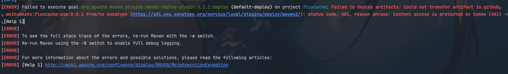
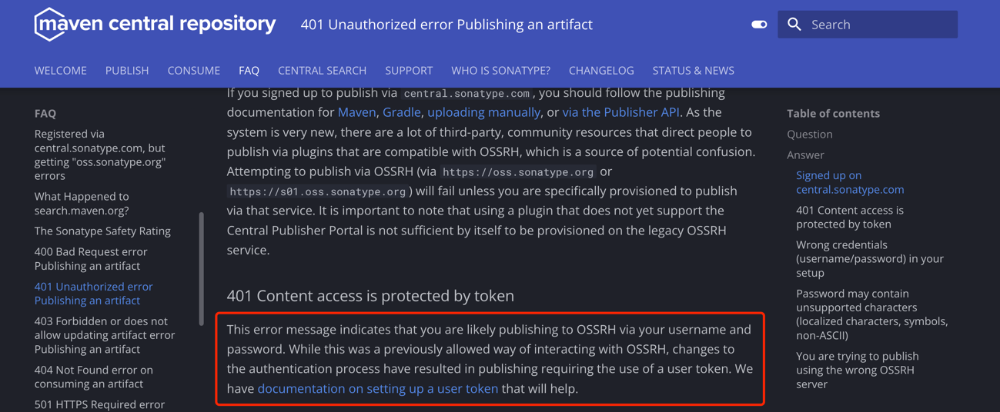
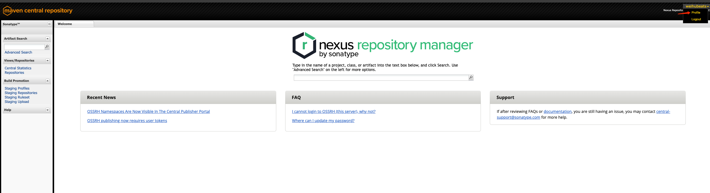
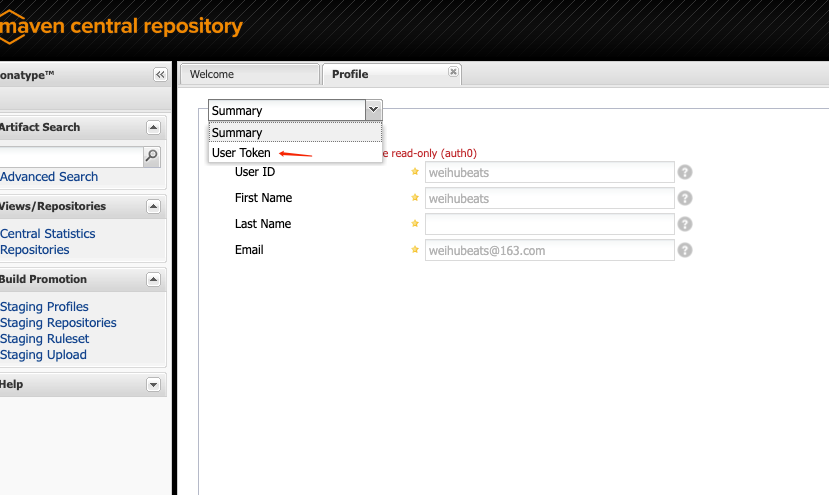
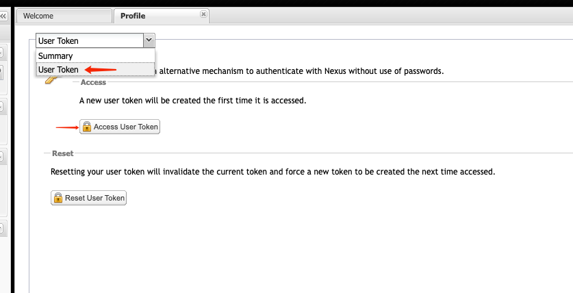
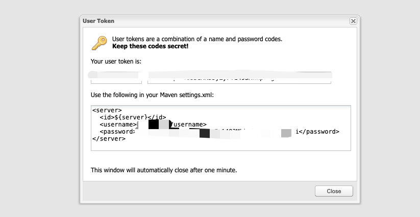

https://s01.oss.sonatype.org/#welcome

## 背景

之前发布一些自己的开源sdk到中央仓库使用的方式都是在`maven`中的`settings.xml`中配置`username`和`password`，

然后在`pom.xml`中配置`distributionManagement`，这样就可以使用`mvn deploy`命令将`jar`包发布到中央仓库了。

`settings.xml`中的`username`和`password`一直没变过, 但是最近突然发现执行`mvn deploy`命令会报错，提示`401`。

> status code:401, reason phrase: Content access is protected by token (401)

## 原因

我们去[官网](https://central.sonatype.org/faq/401-error/#signed-up-on-centralsonatypecom)查看`401`相关的异常提示

就能找到`Content access is protected by token`的原因

大致意思是身份验证的方式改了，需要使用`token`来验证身份了，而不是之前的`username`和`password`了。

那么我们就去重新生成一个`token`就行

## token生成

直接登入[sonatype官网](https://s01.oss.sonatype.org/)

然后找到`profile`选项点进去

然后找到`user token`

生成一个`token`

生成后的`token`保存下来

之后将生成加密后的`username`和`password`替换掉`settings.xml`中的`username`和`password`重新上传即可

## 总结

`sonatype`中央仓库主要是做了验证方式的升级，以前是明文的`username`和`password`，现在是`token`的方式来验证身份了。

相比之前应该是更安全了。但是如果不知道这个变化的话，就会很懵。

明明以前一直没变过`username`和`password`，现在突然就不行了

这时候重新去官网生成一个`token`就行了，然后替换掉`settings.xml`中的`username`和`password`重新上传即可。
