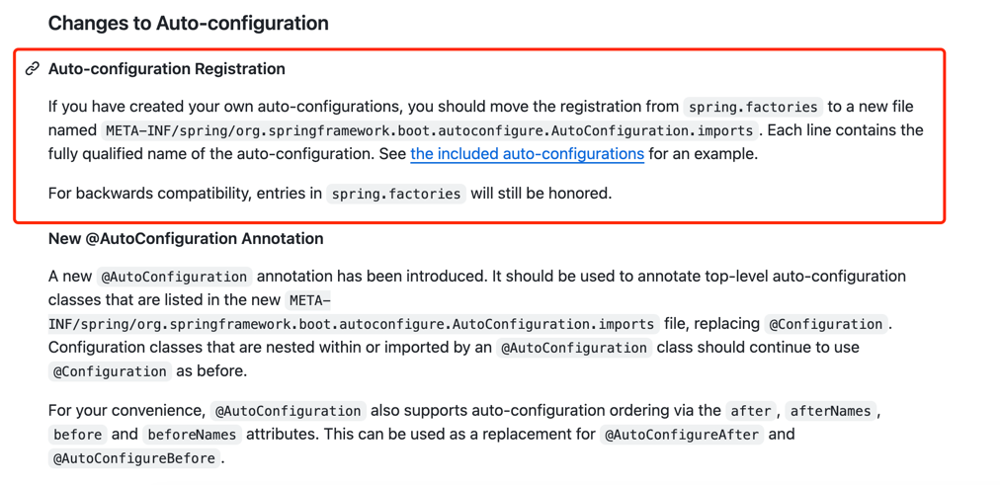
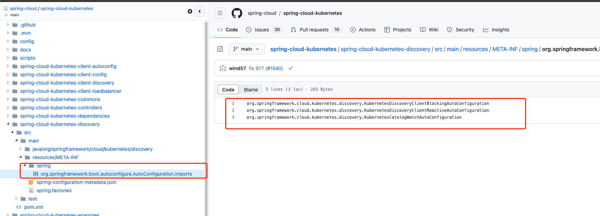

如果我们打开`spring boot` github的发版记录。

在`spring boot` `2.7.0-M2-Release`的发版记录会发现如下说明



> [原文地址](https://github.com/spring-projects/spring-boot/wiki/Spring-Boot-2.7.0-M2-Release-Notes)

大致意思就是`spring boot` 2.7之后不再推荐使用`spring.factories`自动装配。

推荐使用`META-INF/spring/org.springframework.boot.autoconfigure.AutoConfiguration.imports`来自动装配。

当然为了向后兼容，`spring.factories`还是会继续支持


## spring.factories使用方式

如果经常写`spring boot`相关的自定义sdk，对`spring.factories`应该不陌生。

很简单的一个使用场景。

比如我们现在要编写一个`sdk` 我需要自动装配一些`bean`。那么如何使用`spring.factories`实现自动装配呢？

因为我是`sdk`所以不会被`spring boot`扫描到，所以我需要在`spring.factories`中指定`bean`的全路径。来加载我们的bean

使用方式很简单
1. 创建配置类


```java
@Configuration(proxyBeanMethods = false)
public class NebulaDistributedLockAutoConfiguration {
    
    @Bean
    public RedissonDistributedLockTemplate redissonDistributedLockTemplate(RedissonClient redissonClient) {
        RedissonDistributedLockTemplate template = new RedissonDistributedLockTemplate(redissonClient);
        return template;
    }

    
}
```

然后在`resources`目录下创建`META-INF/spring.factories`文件，并添加如下内容

```properties
org.springframework.boot.autoconfigure.EnableAutoConfiguration=\
  com.nebula.distribute.lock.autoconfigure.NebulaDistributedLockAutoConfiguration
```


1. `org.springframework.boot.autoconfigure.EnableAutoConfiguration=\`是固定格式
2. `com.nebula.distribute.lock.autoconfigure.NebulaDistributedLockAutoConfiguration`是我们的配置类全路径

这样我们的`NebulaDistributedLockAutoConfiguration`即使不在`spring boot`的扫描路径下，也会被自动装配

## spring boot 2.7之后推荐的使用方式

`spring boot` 2.7之后不再推荐使用`spring.factories`自动装配。

推荐使用`META-INF/spring/org.springframework.boot.autoconfigure.AutoConfiguration.imports`来自动装配。

所以我们上面的代码要改成如下

1. 再`resources`新建`/META-INF/spring/org.springframework.boot.autoconfigure.AutoConfiguration.imports`文件

然后在文件中添加如下内容

```properties
com.nebula.distribute.lock.autoconfigure.NebulaDistributedLockAutoConfiguration
```

如果我们查看一些开源项目，就可以看到他们的`spring.factories`文件已经被替换成了`org.springframework.boot.autoconfigure.AutoConfiguration.imports`文件

比如我们随便看看`spirng cloud kubernetes`源码



不过值得注意的是他们项目好像也保留了`spring.factories`文件，可能是为了兼容低版本的`spring boot`吧

## 总结

总的来说`spring.factories`和`org.springframework.boot.autoconfigure.AutoConfiguration.imports`都是用来自动装配`bean`的。

`spring.factories`是`spring boot` 2.7之前的推荐使用方式

`org.springframework.boot.autoconfigure.AutoConfiguration.imports`是`spring boot` 2.7之后的推荐使用方式

所以如果你的项目是`spring boot` `2.7`及之后的版本，建议使用`org.springframework.boot.autoconfigure.AutoConfiguration.imports`来自动装配`bean`

可以明显的看到使用`org.springframework.boot.autoconfigure.AutoConfiguration.imports`更加直观，不需要再去指定`EnableAutoConfiguration`这个固定的字符串

然后多个配置之间也不用再用`,\`来换行，直接换行即可