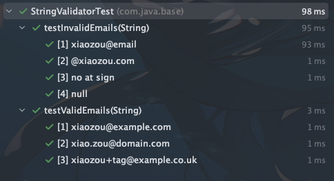
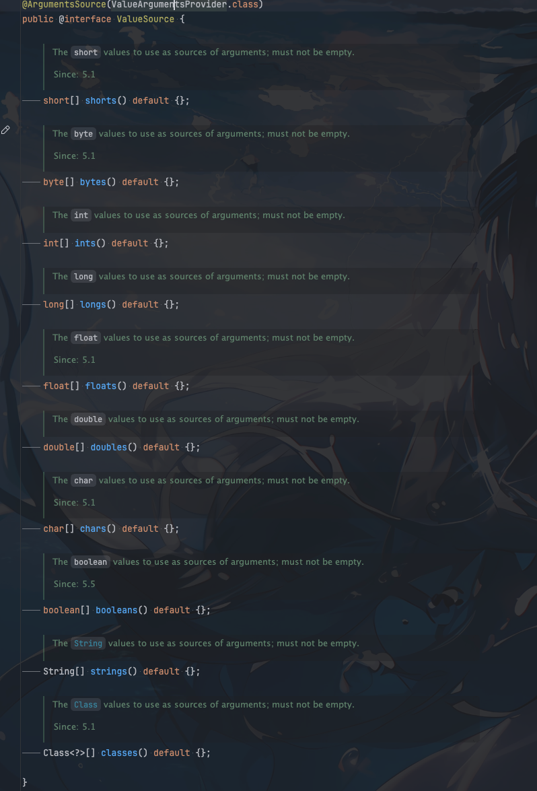
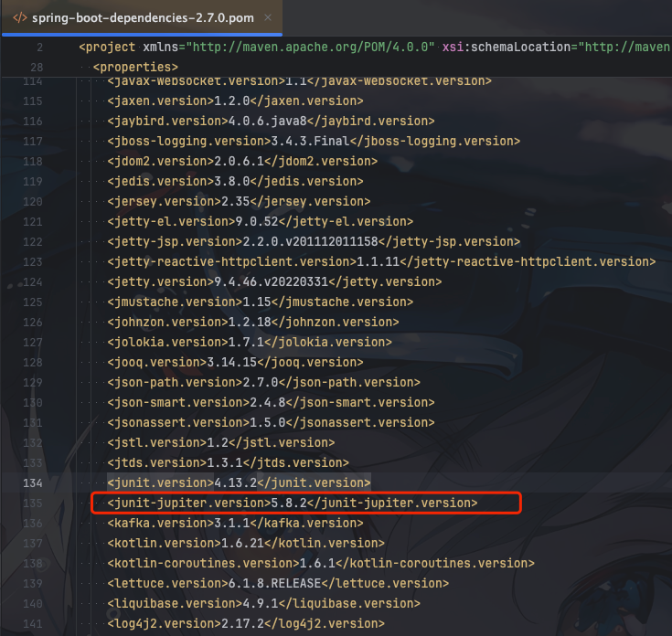

## junit5之前的单元测试

为了更好的说明`junit5`的参数化测试，我们先来看看junit5之前不使用参数测试后的的单元测试是怎么写的。


比如我们现在编写了一个邮箱验证的工具类，

```java
public class StringValidator {
    
    public static boolean isValidEmail(String email) {
        return email != null && email.matches("(?:[a-z0-9!#$%&'*+/=?^_`{|}~-]+(?:\.[a-z0-9!#$%&'*+/=?^_`{|}~-]+)*|"(?:[\x01-\x08\x0b\x0c\x0e-\x1f\x21\x23-\x5b\x5d-\x7f]|\\[\x01-\x09\x0b\x0c\x0e-\x7f])*")@(?:(?:[a-z0-9](?:[a-z0-9-]*[a-z0-9])?\.)+[a-z0-9](?:[a-z0-9-]*[a-z0-9])?|\[(?:(?:25[0-5]|2[0-4][0-9]|[01]?[0-9][0-9]?)\.){3}(?:25[0-5]|2[0-4][0-9]|[01]?[0-9][0-9]?|[a-z0-9-]*[a-z0-9]:(?:[\x01-\x08\x0b\x0c\x0e-\x1f\x21-\x5a\x53-\x7f]|\\[\x01-\x09\x0b\x0c\x0e-\x7f])+)\])");
    }
}
```

### 不使用参数化测试

我们需要对这个工具类进行单元测试，我们可以这样写：

```java
import org.junit.jupiter.api.Test;
import static org.junit.jupiter.api.Assertions.*;

public class StringUtilsTest {

    @Test
    void testIsValidEmail() {
        assertTrue(StringValidator.isValidEmail("xiaozou@example.com"));
        assertTrue(StringValidator.isValidEmail("xiao.zou@domain.com"));
        assertTrue(StringValidator.isValidEmail("xiaozou+tag@example.co.uk"));

        assertFalse(StringValidator.isValidEmail("xiaozou@email"));
        assertFalse(StringValidator.isValidEmail("@xiaozou.com"));
        assertFalse(StringValidator.isValidEmail("no at sign"));
        assertFalse(StringValidator.isValidEmail(null));
    }
}

```

> 可以看到这么多测试用例就只有一个运行结果

运行结果



### 使用参数化测试

首先引入`junut5`的依赖：

```xml
        <dependency>
            <groupId>org.junit.jupiter</groupId>
            <artifactId>junit-jupiter</artifactId>
            <version>5.8.2</version>
            <scope>test</scope>
        </dependency>
```


然后我们使用`junit5`中的参数化测试功能来编写单元测试，我们可以将上面的测试用例改写成如下形式：

```java
import org.junit.jupiter.params.ParameterizedTest;
import org.junit.jupiter.params.provider.ValueSource;
import org.junit.jupiter.params.provider.NullSource;
import static org.junit.jupiter.api.Assertions.*;

public class StringValidatorTest {

    @ParameterizedTest
    @ValueSource(strings = {
        "xiaozou@example.com",
        "xiao.zou@domain.com",
        "xiaozou+tag@example.co.uk"
    })
    void testValidEmails(String email) {
        assertTrue(StringValidator.isValidEmail(email));
    }

    @ParameterizedTest
    @ValueSource(strings = {
        "xiaozou@email",
        "@xiaozou.com",
        "no at sign"
    })
    @NullSource
    void testInvalidEmails(String email) {
        assertFalse(StringValidator.isValidEmail(email));
    }
}
```


运行结果


可以看到使用参数化测试后，我们仅需要将自己需要测试的参数写入到注解中即可运行多次，而不再需要写多个测试用例

而且测试报告相比之前更加清晰，可以看到每个测试用例的执行结果

## 参数化测试常用注解说明

### ParameterizedTest

 `@ParameterizedTest`注解用于指定一个参数化测试方法，该方法将会被多次调用，每次调用时传入不同的参数。和`@Test`效果类似，主要是用于标记。
 

### @ValueSource

`@ValueSource`注解用于指定一个或多个常量值，这些值将会被传入到测试方法中。

`@ValueSource`支持8中基本的数据类型，以及String类型，Class类型。



如果要使用枚举参数我们可以使用`@EnumSource`注解

### @EnumSource

```java

@ParameterizedTest
@EnumSource(TimeUnit.class)
void testWithEnumSource(TimeUnit timeUnit) {
    assertNotNull(timeUnit);
}

@ParameterizedTest
@EnumSource(value = TimeUnit.class, names = { "DAYS", "HOURS" })
void testWithEnumSourceInclude(TimeUnit timeUnit) {
    assertTrue(EnumSet.of(TimeUnit.DAYS, TimeUnit.HOURS).contains(timeUnit));
}

```

`@EnumSource`中的`names`属性用于指定枚举类型中的枚举值，如果不指定，则默认使用所有的枚举值。


> 更多用法可以参考 https://doczhcn.gitbook.io/junit5/index/index-2/parameterized-tests


### @CsvSource

`@CsvSource`主要用于传入多个参数。

比如我们可以传入输入和预期结果进行校验

```java
@ParameterizedTest
@CsvSource({"test,TEST", "tEst,TEST", "Java,JAVA"})
void toUpperCase_ShouldGenerateTheExpectedUppercaseValue(String input, String expected) {
    String actualValue = input.toUpperCase();
    assertEquals(expected, actualValue);
}

```

当然也可以就正常传入多个参数测试

```java
@ParameterizedTest
@CsvSource({ "foo, 1", "bar, 2", "'baz, qux', 3" })
void testWithCsvSource(String first, int second) {
    assertNotNull(first);
    assertNotEquals(0, second);
}
```

### @CsvFileSource

@CsvFileSource让你使用classpath中的CSV文件。CSV文件中的每一行都会导致参数化测试的一次调用。

```java
@ParameterizedTest
@CsvFileSource(resources = "/two-column.csv")
void testWithCsvFileSource(String first, int second) {
    assertNotNull(first);
    assertNotEquals(0, second);
}
```

> 类似读取`excel`. 如果有表头，可以使用`numLinesToSkip = 1`来跳过表头


## 总结

参数化测试是`junit5`中的一个非常有用的特性，使用参数化测试(`@ParameterizedTest`)有如下好处

1. 代码更简洁：每个测试方法只需编写一次断言逻辑，减少了重复代码
2. 更易于维护：添加新的测试用例只需在 @ValueSource 中添加新的值，而不需要编写新的测试方法
3. 更好的可读性：测试用例和测试逻辑分离，使得测试意图更加清晰
4. 更好的测试报告：每个参数都作为单独的测试用例运行，在测试报告中可以清楚地看到每个用例的结果。

`junit5`提供了非常多的新特性，我们推荐大家使用`junit5`来编写单元测试，更多`junit5`的特性可以参考官方文档。

如果我们是在`spring-boot`中进行编写单元测试，`spring-boot-test`中默认是引入了`junit5`依赖的，所以我们可以直接使用`junit5`的特性。



## 参考

- https://doczhcn.gitbook.io/junit5/index/index-2/parameterized-tests