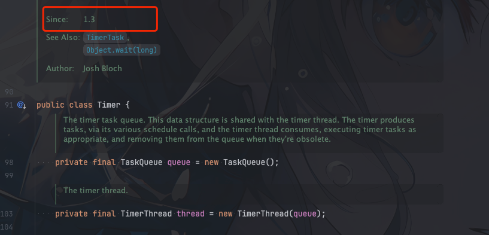
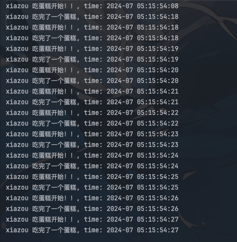
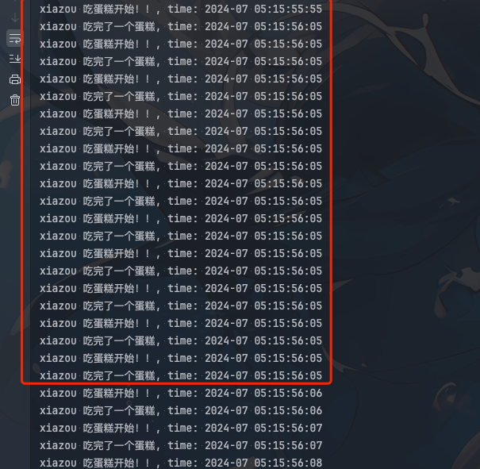
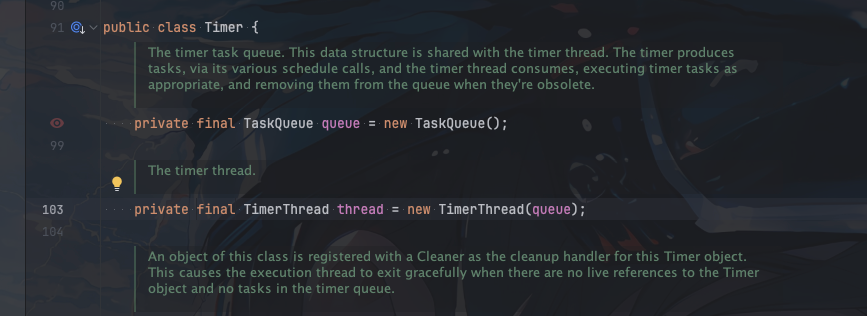
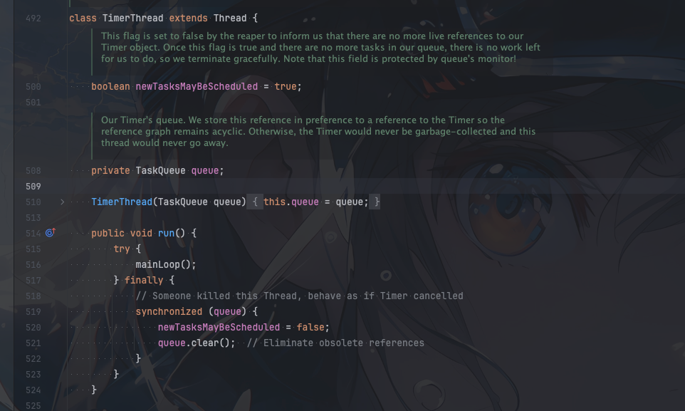
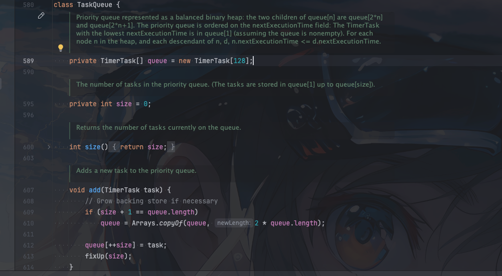

## Timer介绍

如果你想要定时执行任务，那么jdk早期提供给你的定时器类就只有`Timer`

`Timer`是jdk1.3引入的用来执行定时任务的类.它可以在指定的时间执行任务,也可以周期性的执行任务.




## 使用方式

这里我直接通过代码演示

```java
		DateTimeFormatter formatter = DateTimeFormatter.ofPattern("yyyy-MM dd:HH:mm:ss");
		java.util.Timer jdkTimer = new java.util.Timer();
		jdkTimer.scheduleAtFixedRate(new java.util.TimerTask() {
			@Override
			public void run() {
				// do something
				System.out.println("time: " + LocalDateTime.now().format(formatter) + " xiao zou jdk timer task");
			}
		}, 2000, 1000);  // 2s 后调度 周期为 1s
```

这里创建了一个`Timer`对象,然后调用`scheduleAtFixedRate`方法,传入一个`TimerTask`对象,然后指定了延迟时间和周期时间.

就可以进行定时调度了

`scheduleAtFixedRate`方法有三个参数

```java
public void scheduleAtFixedRate(TimerTask task, long delay, long period) {}
```
- TimerTask 定时任务
- delay 延迟时间
- period 周期时间

如果`period`为0,那么就是执行一次。调用`schedule`的下面这个方法即可

```java
public void schedule(TimerTask task, long delay) {}
```


`Timer`执行定时任务主要有四个方法

- `public void schedule(TimerTask task, long delay, long period)` 延迟`delay`毫秒后执行`task`，之后每隔`period`毫秒执行一次`task`
- `public void schedule(TimerTask task, Date firstTime, long period)` 在`firstTime`时间执行`task`，之后每隔`period`毫秒执行一次`task`
- `public void scheduleAtFixedRate(TimerTask task, long delay, long period)` 延迟`delay`毫秒后执行`task`，之后每隔`period`毫秒执行一次`task`
- `public void scheduleAtFixedRate(TimerTask task, Date firstTime, long period)` 在`firstTime`时间执行`task`，之后每隔`period`毫秒执行一次`task`


方法1和方法3实现功能一样，方法2和方法4功能一样

不同的如果前面任务延时了，后面任务到达指定间隔时间`period`后任务的处理方式不一样

下面我们来基于例子来详细看看

## schedule和scheduleAtFixedRate区别

举个简单例子
比如你1s要吃一个蛋糕，但是你有一次吃一个蛋糕吃了10s，那么接下来10s之后，你又两个选择
- 你继续每秒吃一个蛋糕
- 把浪费的10s内应该吃的的蛋糕补回来呢，应该延期内要吃11个蛋糕，所以你要在1s内吃11个蛋糕


### schedule
```java
		DateTimeFormatter formatter = DateTimeFormatter.ofPattern("yyyy-MM dd:HH:mm:ss");
java.util.Timer jdkTimer = new java.util.Timer();
AtomicInteger count = new AtomicInteger(0);
		
		jdkTimer.schedule(new java.util.TimerTask() {
    @Override
    public void run() {
        System.out.println("xiazou 吃蛋糕开始！！, time: " + LocalDateTime.now().format(formatter));
        try {
            if (count.get() == 0) {
                TimeUnit.SECONDS.sleep(10);
                count.incrementAndGet();
            }
        } catch (InterruptedException e) {
            throw new RuntimeException(e);
        }
        System.out.println("xiazou 吃完了一个蛋糕, time: " + LocalDateTime.now().format(formatter));
    }

}, 1000, 1000);
```

运行结果


可以看到`schedule`属于第一种，不管你前面任务延时了多久，后面任务都是按照指定的周期时间执行

### scheduleAtFixedRate
```java
		DateTimeFormatter formatter = DateTimeFormatter.ofPattern("yyyy-MM dd:HH:mm:ss");
		java.util.Timer jdkTimer = new java.util.Timer();

		AtomicInteger count = new AtomicInteger(0);
		
		jdkTimer.scheduleAtFixedRate(new java.util.TimerTask() {
			@Override
			public void run() {
				// do something
				System.out.println("xiazou 吃蛋糕开始！！, time: " + LocalDateTime.now().format(formatter));
				try {
					if (count.get() == 0) {
						TimeUnit.SECONDS.sleep(10);
						count.incrementAndGet();
					}
				} catch (InterruptedException e) {
					throw new RuntimeException(e);
				}
				System.out.println("xiazou 吃完了一个蛋糕, time: " + LocalDateTime.now().format(formatter));
			}

		}, 1000, 1000);
```

运行结果


可以看到`scheduleAtFixedRate`属于第二种，如果前面任务延时了，那么后面任务会在延时的基础上继续执行

## Timer源码分析



其实上面有一个疑问，如果任务执行延期，后面的任务到了指定时间，为什么不继续开个线程来执行接下来的任务呢？

因为`Timer`内部只有一个线程，只有一个`TimerThread`线程

### TimerThread




任务存储使用的是`TaskQueue`

### TaskQueue

`TaskQueue`底层存储就只有一个数组。但实际是一个二叉堆(小顶堆)




新增数据会进行`fixUp`操作

- add
```java
    void add(TimerTask task) {
        // Grow backing store if necessary
        if (size + 1 == queue.length)
            queue = Arrays.copyOf(queue, 2*queue.length);

        queue[++size] = task;
        fixUp(size);
    }
```
#### fixUp
```java
    private void fixUp(int k) {
        while (k > 1) {
            // 找到父节点
            int j = k >> 1;
            // 如果父节点的执行时间小于当前节点的执行时间，那么就不需要调整
            if (queue[j].nextExecutionTime <= queue[k].nextExecutionTime)
                break;
            // 交换父节点和当前节点
            TimerTask tmp = queue[j];  queue[j] = queue[k]; queue[k] = tmp;
            // 继续向上调整
            k = j;
        }
    }
```

这里主要是找到新加入节点的位置，维持小顶堆的性质


- removeMin
```java
    void removeMin() {
        queue[1] = queue[size];
        queue[size--] = null;  // Drop extra reference to prevent memory leak
        fixDown(1);
    }
```
数据删除会进行`fixDown`操作

#### fixDown

```java
    private void fixDown(int k) {
        int j;
        // 从上往下调整
        while ((j = k << 1) <= size && j > 0) {
            // 找到左孩子和右孩子中最小的那个
            if (j < size && queue[j].nextExecutionTime > queue[j+1].nextExecutionTime)
                j++; // j indexes smallest kid
            // 如果当前节点的执行时间小于孩子节点的执行时间，那么就不需要调整
            if (queue[k].nextExecutionTime <= queue[j].nextExecutionTime)
                break;
            // 交换当前节点和孩子节点
            TimerTask tmp = queue[j];  queue[j] = queue[k]; queue[k] = tmp;
            // 继续向下调整
            k = j;
        }
    }
```


## Timer缺点

- 单线程执行任务，如果任务执行时间过长，会影响后续任务的执行
- 底层数据存储是二叉堆,添加任务和删除任务的时间复杂度是`O(logn)`,不是特别高效
- API相对简单，不够灵活

## 总结
`Timer`作为jdk原生的定时器，功能相对简单。

是单线程的，耗时任务会影响后续任务的执行

存储任务数据结构为二叉堆，添加和删除任务的时间复杂度为`O(logn)`，不是特别高效