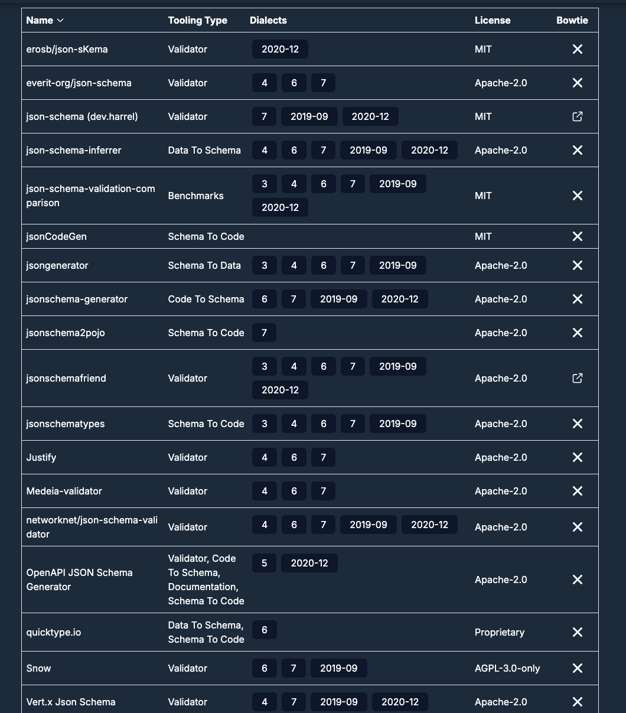
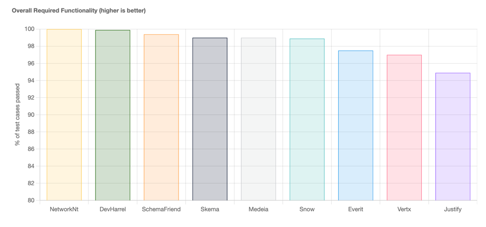
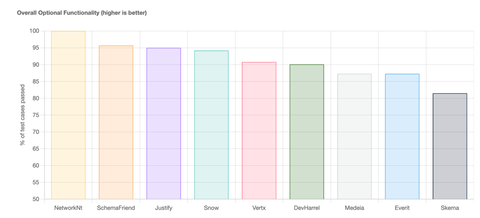
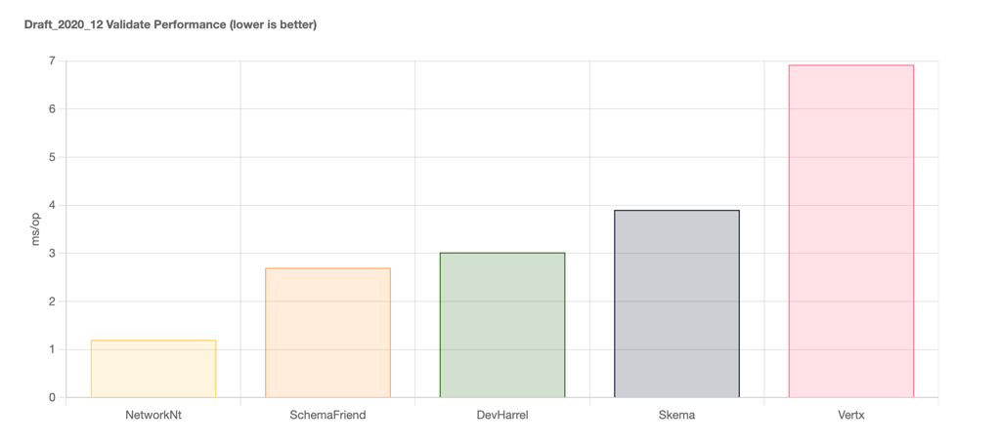
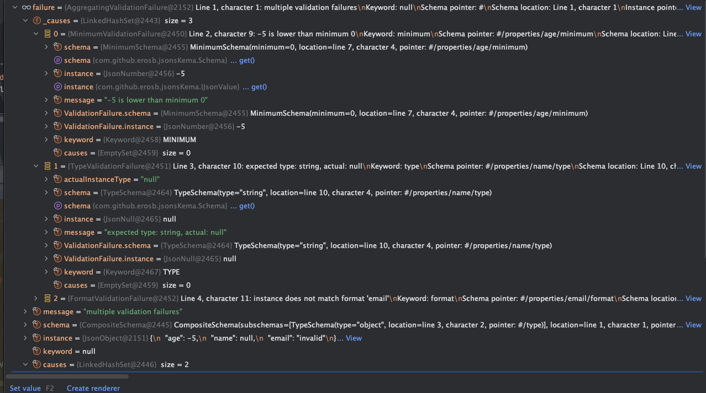
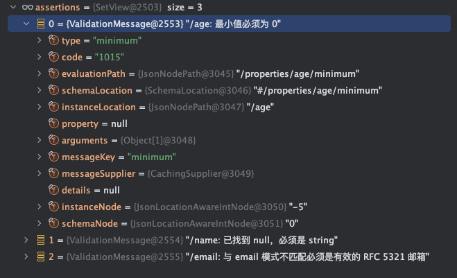

## 什么是 json schema

`json schema` 是一种用于描述 json 数据结构的语言，它可以用来定义 json 数据的类型、格式、约束等信息。

`json schema` 本身是一个也是json数据

## 主要用途

- 数据校验
- 数据结构定义
- API文档生成
- 代码生成


## github地址

- [json-schema-spec](https://github.com/json-schema-org/json-schema-spec)

## 文档

- [json-schema-doc](https://json-schema.org/docs#welcome)
- [json-schema-中文](https://json-schema.apifox.cn/)


## java相关sdk选型

json schema推荐了各个语言相关`sdk`

- [链接](https://json-schema.org/tools?query=&sortBy=name&sortOrder=ascending&groupBy=languages&licenses=&languages=&drafts=&toolingTypes=&environments=)

这里我们主要看看java相关的sdk有哪些




简单对上面的一些进行调研分析

|                                 项目地址 |start数量|项目活跃情况|备注
|:-------------------------------------:|:---:|:---:|:---:|
https://github.com/everit-org/json-schema|861|基本不维护|这个是最早的json-schema的java实现,推荐使用json-sKema
  https://github.com/erosb/json-sKema |49|活跃|与json-schema是同一个作者，不同的是这个是最新的
https://github.com/networknt/json-schema-validator|848|活跃|jackson官方使用的是这个库，目前主流的json序列化库也是使用的这个库，所以推荐使用这个库


这里推荐是使用`json-schema-validator`

`json-schema-validator`也给了一份详细的对比文档


### 总体功能对比（越高越好） 

 

### 整体可选功能（越高越好）



### 性能对比(越低越好)


更多对比参考文档 https://www.creekservice.org/json-schema-validation-comparison/functional#summary-results-table

## json schema数据校验格式

这里我们主要探讨的是`json schema`如何对json数据如何进行数据校验

### 语法

中文文档其实说的已经很全面了，我们这里就主要对几种常用的对象类型的数据格式校验进行说明

#### 必须包含某些属性

```json
{
  "type": "object",
  "properties": {
    "name": { "type": "string" },
    "email": { "type": "string" },
    "address": { "type": "string" },
    "telephone": { "type": "string" }
  },
  "required": ["name", "email"]
}
```

主要使用`required`关键字

这里代表json中必须包含`name`和`email`属性

```json
// OK
{
  "name": "William Shakespeare",
  "email": "bill@stratford-upon-avon.co.uk"
}

// OK，提供额外的属性是可以的，即使是架构中没有定义的属性：
{
  "name": "William Shakespeare",
  "email": "bill@stratford-upon-avon.co.uk",
  "address": "Henley Street, Stratford-upon-Avon, Warwickshire, England",
  "authorship": "in question"
}

 // not OK，缺少必需的“email”属性会使 JSON 文档无效
{
  "name": "William Shakespeare",
  "address": "Henley Street, Stratford-upon-Avon, Warwickshire, England",
}

 // not OK，在 JSON 中，具有值的属性null不等同于不存在的属性。这失败，因为null不是“字符串”类型，而是“空”类型
{
  "name": "William Shakespeare",
  "address": "Henley Street, Stratford-upon-Avon, Warwickshire, England",
  "email": null
}
```


#### 不能包含额外属性

```json
{
  "type": "object",
  "properties": {
    "number": { "type": "number" },
    "street_name": { "type": "string" },
    "street_type": { "enum": ["Street", "Avenue", "Boulevard"] }
  },
  "additionalProperties": false
}
```

主要是通过`additionalProperties`控制

```json
// OK
{ "number": 1600, "street_name": "Pennsylvania", "street_type": "Avenue" }

 // not OK，额外属性“direction”使对象无效
{ "number": 1600, "street_name": "Pennsylvania", "street_type": "Avenue", "direction": "NW" }
```

当然，也可以使用非布尔类型进行更灵活的限制 比如 所有额外属性必须是字符串

```json
{
  "type": "object",
  "properties": {
    "number": { "type": "number" },
    "street_name": { "type": "string" },
    "street_type": { "enum": ["Street", "Avenue", "Boulevard"] }
  },
  "additionalProperties": { "type": "string" }
}
```

```json
// OK
{ "number": 1600, "street_name": "Pennsylvania", "street_type": "Avenue" }

// OK，这是有效的，因为附加属性的值是一个字符串
{ "number": 1600, "street_name": "Pennsylvania", "street_type": "Avenue", "direction": "NW" }

 // not OK，这是无效的，因为附加属性的值不是字符串：
{ "number": 1600, "street_name": "Pennsylvania", "street_type": "Avenue", "office_number": 201 }
```

#### 对所有属性进行正则校验

我们也可以通过正则对所有属性进行更灵活的正则匹配校验

```json
{
  "type": "object",
  "propertyNames": {
    "pattern": "^[A-Za-z_][A-Za-z0-9_]*$"
  }
}
```

```json
// OK
{
  "_a_proper_token_001": "value"
}
 // not OK
{
  "001 invalid": "value"
}
```

#### 属性数量限制

我们可以通过`minProperties`和`maxProperties`来限制属性的数量

```json
{
  "type": "object",
  "minProperties": 2,
  "maxProperties": 3
}
```

```json
{}  // not OK
{ "a": 0 }  // not OK
{ "a": 0, "b": 1 } // OK
{ "a": 0, "b": 1, "c": 2 } // OK
{ "a": 0, "b": 1, "c": 2, "d": 3 }  // not OK 
```


## java sdk初体验

这里我们以`json-sKema`和`json-schema-validator`进行举例

- jdk 17

### json-sKema

1. 引入依赖


```xml
        <dependency>
            <groupId>com.github.erosb</groupId>
            <artifactId>json-sKema</artifactId>
            <version>0.18.0</version>
        </dependency>

        <dependency>
        <groupId>org.jetbrains.kotlin</groupId>
        <artifactId>kotlin-stdlib</artifactId>
        <version>1.8.0</version>
        </dependency>
```

2. 代码使用

```java
public class JsonsKemaTest {

    private static final Validator validator;

    static {
        JsonValue schemaJson = new JsonParser("""
            {
            	"$schema": "https://json-schema.org/draft/2020-12/schema",
            	"type": "object",
            	"properties": {
            		"age": {
            			"type": "number",
            			"minimum": 0
            		},
            		"name": {
            			"type": "string"
            		},
            		"email": {
            			"type": "string",
            			"format": "email"
            		}
            	}
            }
            """).parse();
        Schema schema = new SchemaLoader(schemaJson).load();
        validator = Validator.create(schema, new ValidatorConfig(FormatValidationPolicy.ALWAYS));
    }

    @Test
    public void testJsonSchemaFailure() {
        JsonValue instance = new JsonParser("""
            {
            	"age": -5,
            	"name": null,
            	"email": "invalid"
            }
            """).parse();
        ValidationFailure failure = validator.validate(instance);
        if (Objects.nonNull(failure)) {
            failure.getCauses().forEach(System.out::println);

        }

    }

    @Test
    public void testJsonSchemaSuccess() {
        JsonValue success = new JsonParser("""
            {
            	"age": 3,
            	"name": "xiaozou",
            	"email": "111423@qq.com"
            }
            """).parse();

        ValidationFailure validateSuccess = validator.validate(success);
        if (Objects.isNull(validateSuccess)) {
            System.out.println(" validate json success");
        }
    }

}
```

校验失败运行结果




### json-sKema

1. 引入依赖

```xml
        <dependency>
            <groupId>com.networknt</groupId>
            <artifactId>json-schema-validator</artifactId>
            <version>1.5.2</version>
        </dependency>
```

2. 代码使用


```java
class JsonSchemaDemoTest {

    private static final JsonSchema jsonSchema;

    static {

        String schemaData = """
            {
            	"$schema": "https://json-schema.org/draft/2020-12/schema",
            	"type": "object",
            	"properties": {
            		"age": {
            			"type": "number",
            			"minimum": 0
            		},
            		"name": {
            			"type": "string"
            		},
            		"email": {
            			"type": "string",
            			"format": "email"
            		}
            	}
            }
            """;

        JsonSchemaFactory factory = JsonSchemaFactory.getInstance(SpecVersion.VersionFlag.V202012,
            builder -> builder.jsonNodeReader(JsonNodeReader.builder().locationAware().build()));

        SchemaValidatorsConfig config = SchemaValidatorsConfig.builder().build();

        jsonSchema = factory.getSchema(schemaData, InputFormat.JSON, config);

    }

    @Test
    public void testValidationSuccess() {

        String input = """
            {
            	"age": 3,
            	"name": "xiaozou",
            	"email": "111423@qq.com"
            }
            """;
        Set<ValidationMessage> assertions = jsonSchema.validate(input, InputFormat.JSON, executionContext -> {
            // By default since Draft 2019-09 the format keyword only generates annotations and not assertions
            executionContext.getExecutionConfig().setFormatAssertionsEnabled(true);
        });

        System.out.println(assertions);

    }

    @Test
    public void testJsonSchemaFailure() {

        String input = """
            {
            	"age": -5,
            	"name": null,
            	"email": "invalid"
            }
            """;
        Set<ValidationMessage> assertions = jsonSchema.validate(input, InputFormat.JSON, executionContext -> {
            // By default since Draft 2019-09 the format keyword only generates annotations and not assertions
            executionContext.getExecutionConfig().setFormatAssertionsEnabled(true);
        });

        System.out.println(assertions);

    }
}    
```

校验失败运行结果

> [/age: 最小值必须为 0, /name: 已找到 null，必须是 string, /email: 与 email 模式不匹配必须是有效的 RFC 5321 邮箱]




可以看到相比于`json-sKema`，`json-schema-validator`的校验结果使用起来更方便、简洁


## 总结

总的来说如果需要进行json数据校验，推荐使用`json-schema-validator`，它的校验结果更加简洁，使用起来更加方便

在官方的对比文档中也可以看出来`json-schema-validator`的功能更加全面，性能也更好，可扩展性也是非常强的

同时`json-schema-validator`也是目前主流的json序列化库使用的校验库