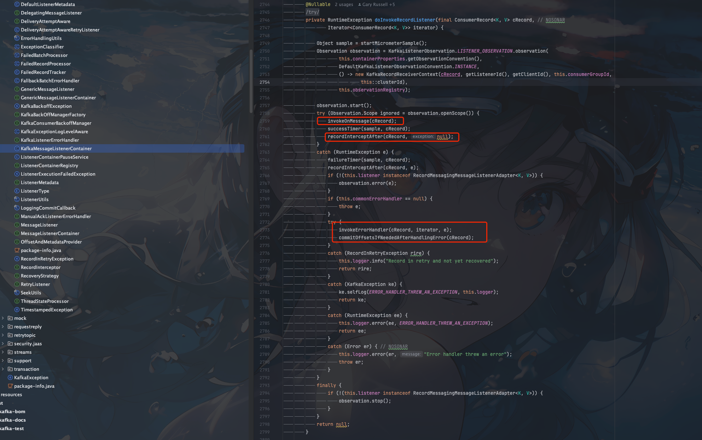

## 背景

如果你习惯了使用`RocketMQ`这种自动挡管理消费位点，消息失败重试的方式。你再来使用`kafka`，会发现`kafka`这种手动挡的消费位点管理就没那么容易了

熟悉`RocketMQ`的小伙伴都知道`RocketMQ`已经默认帮我实现好了消息消费失败重试，消费位点自动提交，死信队列等功能，那么`kafka`是否也是如此呢?

## kafka消费位点管理

kafka消费位点有两种管理方式

1. 手动提交消费位点
2. 自动提交消费位点

### 自动提交消费位点


想要设置自动提交消费位点我们只需要设置两个属性
1. `ConsumerConfig.ENABLE_AUTO_COMMIT_CONFIG` 自动提交消费位点
2. `ConsumerConfig.AUTO_COMMIT_INTERVAL_MS_CONFIG` 自动提交消费位点的时间间隔

一个简单的消费代码如下

```java

    Properties props = new Properties();
    props.put(ConsumerConfig.BOOTSTRAP_SERVERS_CONFIG, BOOTSTRAP_SERVERS);
    props.put(ConsumerConfig.GROUP_ID_CONFIG, GROUP_ID);
    props.put(ConsumerConfig.KEY_DESERIALIZER_CLASS_CONFIG, IntegerDeserializer.class);
    props.put(ConsumerConfig.VALUE_DESERIALIZER_CLASS_CONFIG, StringDeserializer.class);
    props.put(ConsumerConfig.ENABLE_AUTO_COMMIT_CONFIG, true);
    // 自动提交消费位点的时间间隔
    props.put(ConsumerConfig.AUTO_COMMIT_INTERVAL_MS_CONFIG, 5000);

    KafkaConsumer<String, String> consumer = new KafkaConsumer<>(props);
    consumer.subscribe(Collections.singletonList(TOPIC_NAME));

    while (true) {
        ConsumerRecords<String, String> records = consumer.poll(100);
        for (ConsumerRecord<String, String> record : records) {
            try {
                handlerMessage(record);
            } catch (Exception e) {
                log.error("处理消息异常: {}", record, e);
                // 循环继续
            }

        }
    }
```

自动提交消费位点有几个缺点

1. 会出现重复消费:比如Consumer每5秒自动提交一次位移，如果在第4秒时，消费了消息，但是还没有提交位移，此时Consumer挂掉了，那么下次Consumer启动时，会从上次提交的位移开始消费，这样就会导致消息重复消费。
当然比如出现`Rebalance`也是会出现重复消费的情况
2. 无法精准控制消费位点

### 手动提交消费位点

手动提交消费位点又分两种

1. 同步提交(commitSync)
2. 异步提交(commitAsync)

#### 同步提交(commitSync)

同步提交的方式很简单，就是每次消费完通过调用`API` `consumer.commitSync`

相关的代码如下

```java
        Properties props = new Properties();
        props.put(ConsumerConfig.BOOTSTRAP_SERVERS_CONFIG, BOOTSTRAP_SERVERS);
        props.put(ConsumerConfig.GROUP_ID_CONFIG, GROUP_ID);
        props.put(ConsumerConfig.KEY_DESERIALIZER_CLASS_CONFIG, StringDeserializer.class);
        props.put(ConsumerConfig.VALUE_DESERIALIZER_CLASS_CONFIG, StringDeserializer.class);
        props.put(ConsumerConfig.ENABLE_AUTO_COMMIT_CONFIG, false);

        KafkaConsumer<String, String> consumer = new KafkaConsumer<>(props);
        consumer.subscribe(Collections.singletonList(TOPIC_NAME));

        while (true) {
            ConsumerRecords<String, String> records =
                    consumer.poll(Duration.ofSeconds(1));
            // 注意这里消费业务逻辑上消费失败后的消息处理
            handlerMessage(records);
            try {
                // 消费成功后手动提交位点
                consumer.commitSync();
            } catch (CommitFailedException e) {
                // 消费位点提交失败异常处理
                handleError(e); 
            }
        }
```

同步提交的方式有一个缺点，调用`commitSync()`时，`Consumer`会处于阻塞状态，直到`broker`返回提交成功，严重影响消费性能


### 异步提交(commitAsync)

异步提交的方式很简单，就是每次消费完通过调用`API` `consumer.commitAsync`

```java
        Properties props = new Properties();
        props.put(ConsumerConfig.BOOTSTRAP_SERVERS_CONFIG, BOOTSTRAP_SERVERS);
        props.put(ConsumerConfig.GROUP_ID_CONFIG, GROUP_ID);
        props.put(ConsumerConfig.KEY_DESERIALIZER_CLASS_CONFIG, StringDeserializer.class);
        props.put(ConsumerConfig.VALUE_DESERIALIZER_CLASS_CONFIG, StringDeserializer.class);
        props.put(ConsumerConfig.ENABLE_AUTO_COMMIT_CONFIG, false);

        KafkaConsumer<String, String> consumer = new KafkaConsumer<>(props);
        consumer.subscribe(Collections.singletonList(TOPIC_NAME));

        while (true) {
            ConsumerRecords<String, String> records =
                    consumer.poll(Duration.ofSeconds(1));
            handlerMessage(records); // 处理消息
            consumer.commitAsync((offsets, exception) -> {
                if (exception != null)
                    handleError(exception);
            });
        }
```

`commitAsync`主要是提供了异步回调，通过回调来通知消费位点是否提交成功

异步提交消费位点也有一些缺点，比如消费位点不能重复提交。因为提交位点失败后，重新提交位点可能更晚的消费位点已经提交了，这里提交已经是没有意义的了

## spring-kafka消息消费

可以看到不管是同步提交消费位点还是异步提交消费位点，都有一些问题，想要写出生产可用的消费代码，需要注意的细节非常多。

比如消费失败后的消息如何处理，是停止消费跳出循环，还是说记录消费失败的消息，人工处理等

这里我们可以简单看看`spring-kafka`是如何消费消息的。

我们简单看看主流程代码




这里我们忽略源码的一些其他细节。只分析主要的消费流程


1. `invokeOnMessage(cRecord);` 处理消息

可以看到`invokeOnMessage`是被整个`try-catch`包裹的，这样就保证了消费失败后不会影响整个消费流程

具体我们先看看消息正常处理的逻辑


```java
		private void invokeOnMessage(final ConsumerRecord<K, V> cRecord) {

			if (cRecord.value() instanceof DeserializationException ex) {
				throw ex;
			}
			if (cRecord.key() instanceof DeserializationException ex) {
				throw ex;
			}
			if (cRecord.value() == null && this.checkNullValueForExceptions) {
				checkDeser(cRecord, SerializationUtils.VALUE_DESERIALIZER_EXCEPTION_HEADER);
			}
			if (cRecord.key() == null && this.checkNullKeyForExceptions) {
				checkDeser(cRecord, SerializationUtils.KEY_DESERIALIZER_EXCEPTION_HEADER);
			}
			doInvokeOnMessage(cRecord);
			if (this.nackSleepDurationMillis < 0 && !this.isManualImmediateAck) {
				ackCurrent(cRecord);
			}
			if (this.isCountAck || this.isTimeOnlyAck) {
				doProcessCommits();
			}
		}
```

这里主要是一些异常校验，然后就是判断是否可以提交消费位点。如果可以则调用`doProcessCommits()`进行正常的消费位点提交

2. `doProcessCommits()` 消费位点处理

如果消费位点提交失败也会进行一些异常处理

```java
		private void doProcessCommits() {
			if (!this.autoCommit && !this.isRecordAck) {
				try {
					processCommits();
				}
				catch (CommitFailedException cfe) {
					if (this.remainingRecords != null && !this.isBatchListener) {
						ConsumerRecords<K, V> pending = this.remainingRecords;
						this.remainingRecords = null;
						List<ConsumerRecord<?, ?>> records = new ArrayList<>();
						for (ConsumerRecord<K, V> kvConsumerRecord : pending) {
							records.add(kvConsumerRecord);
						}
						this.commonErrorHandler.handleRemaining(cfe, records, this.consumer,
								KafkaMessageListenerContainer.this.thisOrParentContainer);
					}
				}
			}
		}
```
如果消费位点提交失败则会调用`commonErrorHandler`进行异常处理。

`commonErrorHandler`有多个实现类，有一个默认实现`DefaultErrorHandler`


2. 消息消费失败异常处理

如果消息消费失败，也提供了一个异常处理扩展`invokeErrorHandler(cRecord, iterator, e);`

里面实际使用的也是`DefaultErrorHandler`

核心的处理逻辑主要还是在`SeekUtils`中封装

- `DefaultErrorHandler`

```java
	public void handleRemaining(Exception thrownException, List<ConsumerRecord<?, ?>> records,
			Consumer<?, ?> consumer, MessageListenerContainer container) {

		SeekUtils.seekOrRecover(thrownException, records, consumer, container, isCommitRecovered(), // NOSONAR
				getFailureTracker(), this.logger, getLogLevel());
	}
```

- `SeekUtils`

```java
	public static void seekOrRecover(Exception thrownException, @Nullable List<ConsumerRecord<?, ?>> records,
    Consumer<?, ?> consumer, MessageListenerContainer container, boolean commitRecovered,
    RecoveryStrategy recovery, LogAccessor logger, Level level) {}
```

可以看到有一个`RecoveryStrategy`参数，这个是消息消费失败如何恢复，比如我们需要手动增加一个类似死信队列的topic，这里消息消费失败就会自动发送到我们的死信队列

死信队列的`topic`名字生成规则主要是`topicName` + `-dlt`
```java
	private static final BiFunction<ConsumerRecord<?, ?>, Exception, TopicPartition>
		DEFAULT_DESTINATION_RESOLVER = (cr, e) -> new TopicPartition(cr.topic() + "-dlt", cr.partition());

```

## 总结

可以看到如果我们单纯的使用`kafka-client`原生的sdk来进行消息消费，是非常容易出现问题的。

我们需要很多细节，比如
1. 消息消费失败了如何处理，是否需要重试，如果重试还是失败怎么办？丢掉还是手动处理丢到自己创建的死信队列中
2. 消费位点提交失败了如何处理
3. 消费位点是使用同步提交还是异步提交？或者混合提交

所以如果`spring boot`项目还是建议使用`spring`相关已经封装好的`kafka` sdk

非必要尽量不要使用原生的`kafka-client` sdk

