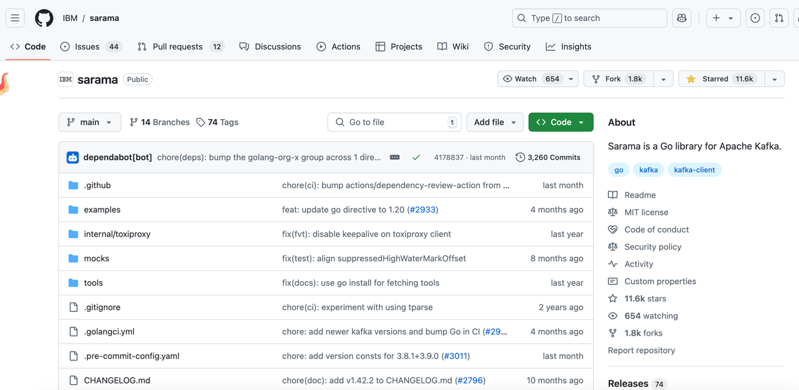
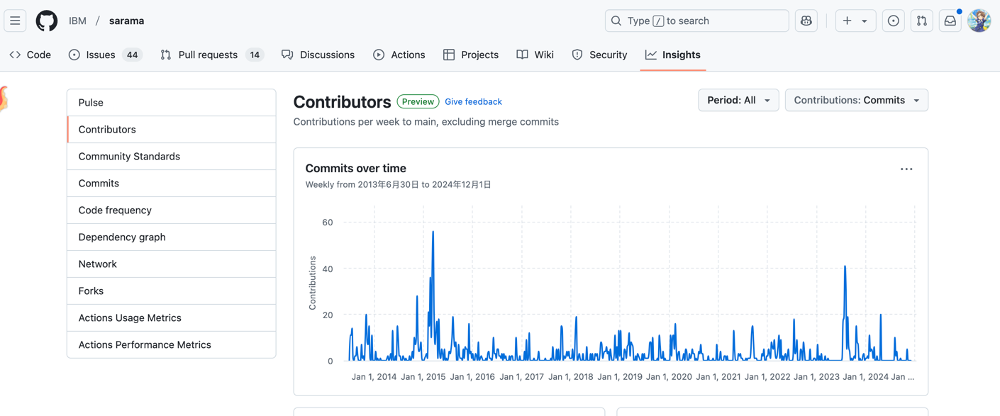
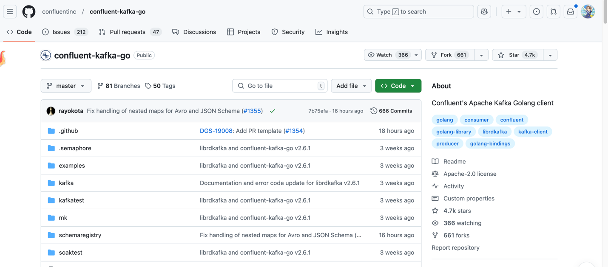
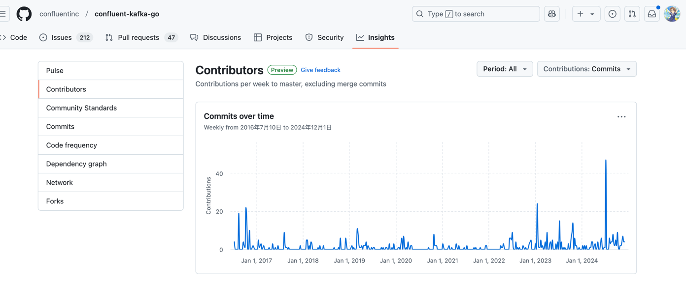
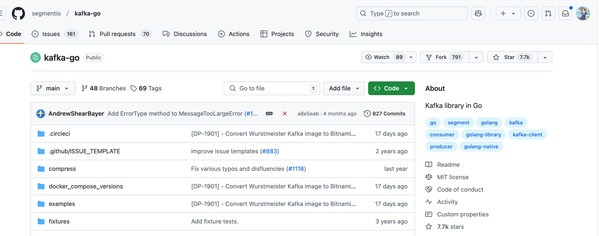

## 背景

之前搭建基于`danielqsj/kafka-exporter`搭建了`kafka`相关的监控

发现部分监控指标不满足自己的需求，就打算基于`kafka-exporter`二开一下。

简单看了一下`danielqsj/kafka-exporter`源码发现`danielqsj/kafka-exporter`使用的`kafka` `golang` `sdk`竟然不是官方的,是`Shopify`的`sarama`

>我还以为`kafka`官方会有一个`golang`的`sdk`，但是竟然完全没有，全是三方组织自己开源出来的


## Shopify sarama

之前说过`danielqsj/kafka-exporter`使用的是`Shopify`的`sarama`

不过这个仓库不知道什么时候给移动到`IBM`组织下了

所以你这里就算点击`https://github.com/Shopify/sarama` 链接也会自动跳转到`IBM`的`sarama`下





## IBM sarama

`IBM` `sarama`和`Shopify` `sarama`本质来说是同一个，所以上面没有详细讨论`Shopify` `sarama`

这里重点来看看`IBM` `sarama`的项目情况


`IBM` `sarama`的`star`数量目前是所有开源`kafka` `golang` `sdk`中最多的，有11.6k


已知在`github`上使用了该`sdk`的有3.5k左右

项目维护非常活跃




### 使用

首先引入依赖
```bash
go get github.com/IBM/sarama
```

#### 发送消息

```go
func TestKafkaSendMessage(t *testing.T) {

	// 生产者配置
	config := sarama.NewConfig()
	config.Producer.Return.Successes = true
	config.Producer.Return.Errors = true
	config.Producer.RequiredAcks = sarama.WaitForAll
	config.Producer.Retry.Max = 5

	// 创建生产者
	producer, err := sarama.NewSyncProducer(kafkaBrokers, config)
	if err != nil {
		log.Fatalf("Error creating producer: %v", err)
	}
	defer producer.Close()

	// 创建消息
	msg := &sarama.ProducerMessage{
		Topic: "xiao-zou-topic",
		Value: sarama.StringEncoder("Hello, Kafka!"),
	}

	// 发送消息
	partition, offset, err := producer.SendMessage(msg)
	if err != nil {
		log.Printf("Error sending message: %v", err)
	} else {
		log.Printf("Message sent successfully! Partition: %d, Offset: %d", partition, offset)
	}

}

```

#### 消费消息

```go
 func TestKafkaConsumerMessage(t *testing.T) {

	keepRunning := true
	log.Println("Starting a new Sarama consumer")

	config := sarama.NewConfig()

	config.Consumer.Group.Rebalance.GroupStrategies = []sarama.BalanceStrategy{sarama.NewBalanceStrategyRoundRobin()}
	// 消费最早的消息
	config.Consumer.Offsets.Initial = sarama.OffsetOldest

	consumer := Consumer{
		ready: make(chan bool),
	}

	ctx, cancel := context.WithCancel(context.Background())
	client, err := sarama.NewConsumerGroup(kafkaBrokers, group, config)
	if err != nil {
		log.Panicf("Error creating consumer group client: %v", err)
	}

	consumptionIsPaused := false
	wg := &sync.WaitGroup{}
	wg.Add(1)
	go func() {
		defer wg.Done()
		for {

			if err := client.Consume(ctx, strings.Split(topics, ","), &consumer); err != nil {
				if errors.Is(err, sarama.ErrClosedConsumerGroup) {
					return
				}
				log.Panicf("Error from consumer: %v", err)
			}
			// check if context was cancelled, signaling that the consumer should stop
			if ctx.Err() != nil {
				return
			}
			consumer.ready = make(chan bool)
		}
	}()

	<-consumer.ready
	log.Println("Sarama consumer up and running!...")

	sigusr1 := make(chan os.Signal, 1)
	signal.Notify(sigusr1, syscall.SIGUSR1)

	sigterm := make(chan os.Signal, 1)
	signal.Notify(sigterm, syscall.SIGINT, syscall.SIGTERM)

	for keepRunning {
		select {
		case <-ctx.Done():
			log.Println("terminating: context cancelled")
			keepRunning = false
		case <-sigterm:
			log.Println("terminating: via signal")
			keepRunning = false
		case <-sigusr1:
			toggleConsumptionFlow(client, &consumptionIsPaused)
		}
	}
	cancel()
	wg.Wait()
	if err = client.Close(); err != nil {
		log.Panicf("Error closing client: %v", err)
	}

}

func toggleConsumptionFlow(client sarama.ConsumerGroup, isPaused *bool) {
	if *isPaused {
		client.ResumeAll()
		log.Println("Resuming consumption")
	} else {
		client.PauseAll()
		log.Println("Pausing consumption")
	}

	*isPaused = !*isPaused
}

type Consumer struct {
	ready chan bool
}

func (consumer *Consumer) Setup(sarama.ConsumerGroupSession) error {
	close(consumer.ready)
	return nil
}

func (consumer *Consumer) Cleanup(sarama.ConsumerGroupSession) error {
	return nil
}

func (consumer *Consumer) ConsumeClaim(session sarama.ConsumerGroupSession, claim sarama.ConsumerGroupClaim) error {
	for {
		select {
		case message, ok := <-claim.Messages():
			if !ok {
				log.Printf("message channel was closed")
				return nil
			}
			log.Printf("Message claimed: value = %s, timestamp = %v, topic = %s", string(message.Value), message.Timestamp, message.Topic)
			session.MarkMessage(message, "")

		case <-session.Context().Done():
			return nil
		}
	}
}
```

#### 管理kafka集群

如果我们想要管理kafka集群，也可以创建一个admin client

```go
admin, err := sarama.NewClusterAdmin(kafkaBrokers, config)
```

## confluent-kafka-go

`confluent-kafka-go`是`confluent`公司开发的`kafka` `golang` `sdk`，由于`confluent`公司维护

`star`数量在4.7k左右, github公开仓库使用该sdk的数量在6.2k左右



项目维护也是比较活跃的



`confluent-kafka-go`的`star`数量比`IBM` `sarama`少，但是使用量比`IBM` `sarama`多

`IBM` `sarama`是纯golang编写的，`confluent-kafka-go`底层是`cgo`的方式实现的，所以`confluent-kafka-go`的性能更好

### 使用

首先引入依赖

```bash
go get github.com/confluentinc/confluent-kafka-go
```

#### 发送消息

```go
	p, err := kafka.NewProducer(&kafka.ConfigMap{"bootstrap.servers": "localhost"})
	if err != nil {
		panic(err)
	}

	defer p.Close()

	// Delivery report handler for produced messages
	go func() {
		for e := range p.Events() {
			switch ev := e.(type) {
			case *kafka.Message:
				if ev.TopicPartition.Error != nil {
					fmt.Printf("Delivery failed: %v\n", ev.TopicPartition)
				} else {
					fmt.Printf("Delivered message to %v\n", ev.TopicPartition)
				}
			}
		}
	}()

	// Produce messages to topic (asynchronously)
	topic := topics
	for _, word := range []string{"Welcome", "to", "the", "Confluent", "Kafka", "Golang", "client"} {
		p.Produce(&kafka.Message{
			TopicPartition: kafka.TopicPartition{Topic: &topic, Partition: kafka.PartitionAny},
			Value:          []byte(word),
		}, nil)
	}

	// Wait for message deliveries before shutting down
	p.Flush(15 * 1000)
```

#### 消费消息

```go
	c, err := kafka.NewConsumer(&kafka.ConfigMap{
		"bootstrap.servers": "localhost",
		"group.id":          group,
		"auto.offset.reset": "earliest",
	})

	if err != nil {
		panic(err)
	}

	err = c.SubscribeTopics([]string{topics}, nil)

	if err != nil {
		panic(err)
	}

	run := true

	for run {
		msg, err := c.ReadMessage(time.Second)
		if err == nil {
			fmt.Printf("Message on %s: %s\n", msg.TopicPartition, string(msg.Value))
		} else if !err.(kafka.Error).IsRetriable() {
			fmt.Printf("Consumer error: %v (%v)\n", err, msg)
		}
	}
	c.Close()
```

## segmentio/kafka-go

`segmentio/kafka-go`是`segmentio`公司开发的`kafka` `golang` `sdk`

目前star数量是`7.7k`，公开的github使用仓库是7.8k。也是纯golang编写



项目活跃情况相比前面两个要低一点


具体的使用方式大同小异，这里就不演示了


## 总结

目前主流的`kafka` `golang` `sdk`有两个，一个是`IBM` `sarama`，一个是`confluent-kafka-go`

这里个个表格对比一下

| 项目 | star | github仓库公开使用量| 语言实现           | 优点                   | 缺点                                      |
| --- | --- |---------------|----------------|----------------------|-----------------------------------------|
| IBM sarama | 11.6k | 3.5k          | 纯golang编写| 跨平台能力更强，不依赖c语言，纯开源项目 | 性能不如`confluent-kafka-go`，使用相对更复杂，因为更偏底层 |
| confluent-kafka-go | 4.7k | 6.2k   | 底层是`cgo`实现(即c)   | 性能更好，学习使用成本更低        | 商业化团队维护                                 |
| segmentio/kafka-go | 7.7k | 7.8k   | 纯golang编写| 使用更简洁、简单             | 没有太明显的缺点                                |


总的来说三个库各有千秋，还是要结合实际的生产情况来选择

比如需要最佳性能可以选择`confluent-kafka-go`，如果想要最简单入手使用可以选择`segmentio/kafka-go`。
如果想要更灵活更定制化，跨平台，可以选择`IBM sarama`


## 参考

- https://github.com/IBM/sarama
- https://github.com/segmentio/kafka-go
- https://github.com/IBM/sarama