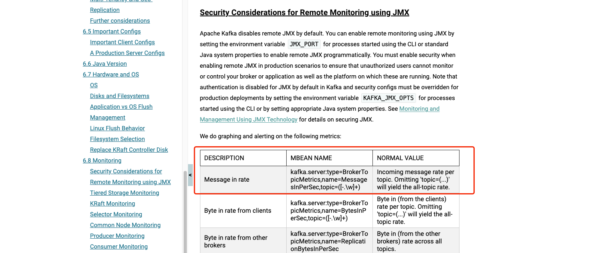

## 背景

有时候我们想要统计某个`topic`一天的消息量大小，在监控不完善的情况下我们可以如何统计呢？


## java实现

我们可以基于`kafka`提供的`client`自己去实现

首先引入`client`依赖

```xml
        <dependency>
            <groupId>org.apache.kafka</groupId>
            <artifactId>kafka-clients</artifactId>
            <version>3.5.0</version>
        </dependency>
```


具体实现代码

```java
    public static void main(String[] args) {
    
        String bootstrapServers = "kafka-小奏技术-001.com:9092,kafka-小奏技术-002.com:9092,kafka-小奏技术-003.com:9092";
        String topicName = "小奏技术-topic";

        Properties props = new Properties();
        props.put(AdminClientConfig.BOOTSTRAP_SERVERS_CONFIG, bootstrapServers);

        try (AdminClient adminClient = AdminClient.create(props)) {
            long endTime = System.currentTimeMillis();
            // 24 hours ago
            long startTime = endTime - 24 * 60 * 60 * 1000; 

            // Get topic partitions
            List<TopicPartition> partitions = getTopicPartitions(adminClient, topicName);

            // Get offsets for start time
            Map<TopicPartition, Long> startOffsets = getOffsetsForTime(adminClient, partitions, startTime);

            // Get offsets for end time (current time)
            Map<TopicPartition, Long> endOffsets = getOffsetsForTime(adminClient, partitions, endTime);

            // Calculate total message count
            long totalMessages = calculateMessageCount(startOffsets, endOffsets);

            System.out.println("Total messages in the last 24 hours for topic '" + topicName + "': " + totalMessages);

        } catch (Exception e) {
            e.printStackTrace();
        }
    }

    private static List<TopicPartition> getTopicPartitions(AdminClient adminClient, String topicName) throws ExecutionException, InterruptedException {
        DescribeTopicsResult describeTopicsResult = adminClient.describeTopics(Collections.singletonList(topicName));
        Map<String, TopicDescription> topicDescriptionMap = describeTopicsResult.all().get();
        TopicDescription topicDescription = topicDescriptionMap.get(topicName);

        List<TopicPartition> partitions = new ArrayList<>();
        for (TopicPartitionInfo partitionInfo : topicDescription.partitions()) {
            partitions.add(new TopicPartition(topicName, partitionInfo.partition()));
        }
        return partitions;
    }

    private static Map<TopicPartition, Long> getOffsetsForTime(AdminClient adminClient, List<TopicPartition> partitions, long timestamp) throws ExecutionException, InterruptedException {
        Map<TopicPartition, OffsetSpec> timestampsToSearch = new HashMap<>();
        for (TopicPartition partition : partitions) {
            timestampsToSearch.put(partition, OffsetSpec.forTimestamp(timestamp));
        }

        ListOffsetsResult offsetsForTimes = adminClient.listOffsets(timestampsToSearch);
        Map<TopicPartition, ListOffsetsResult.ListOffsetsResultInfo> offsetsResultMap = offsetsForTimes.all().get();

        Map<TopicPartition, Long> resultOffsets = new HashMap<>();
        for (Map.Entry<TopicPartition, ListOffsetsResult.ListOffsetsResultInfo> entry : offsetsResultMap.entrySet()) {
            resultOffsets.put(entry.getKey(), entry.getValue().offset());
        }

        return resultOffsets;
    }

    private static long calculateMessageCount(Map<TopicPartition, Long> startOffsets, Map<TopicPartition, Long> endOffsets) {
        long totalMessages = 0;
        for (TopicPartition partition : startOffsets.keySet()) {
            Long startOffset = startOffsets.get(partition);
            Long endOffset = endOffsets.get(partition);

            if (startOffset != null && endOffset != null) {
                totalMessages += endOffset - startOffset;
            }
        }
        return totalMessages;
    }

```


具体的实现逻辑大致如下
1. 获取`topic`的所有`partition`
2. 获取`partition`在开始时间点的`offset`
3. 获取`partition`在结束时间点的`offset`
4. 计算`offset`差值即为当前时间段的消息量

## 总结

代码实现还是比较简单的，就是获取到`topic`的所有`partition`的偏移量，然后累加就行

我们也可以基于`kafka`暴露的`JMX`指标˙中`kafka.server:type=BrokerTopicMetrics,name=MessagesInPerSec,topic=([-.\w]+)	`来计算

