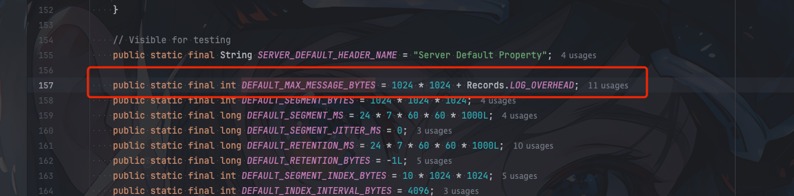
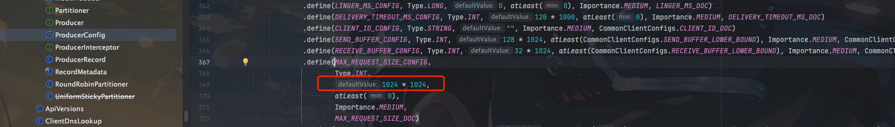
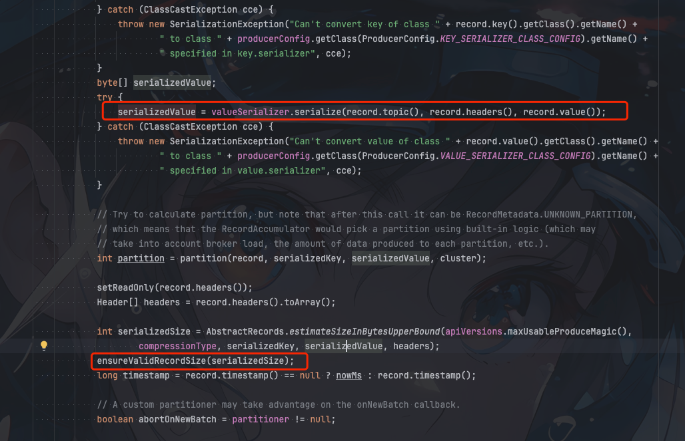

## kafka版本

- 3.5.0

## 背景

线上自建kafka集群业务小伙伴发送消息出现了如下错误

```java
java.util.concurrent.ExecutionException: org.apache.kafka.common.errors.RecordTooLargeException: The message is 5242975 bytes when serialized which is larger than 1048576, which is the value of the max.request.size configuration.
at org.apache.kafka.clients.producer.KafkaProducer$FutureFailure.<init>(KafkaProducer.java:1442)
at org.apache.kafka.clients.producer.KafkaProducer.doSend(KafkaProducer.java:1084)
at org.apache.kafka.clients.producer.KafkaProducer.send(KafkaProducer.java:962)
at org.apache.kafka.clients.producer.KafkaProducer.send(KafkaProducer.java:847)
at com.xiaozou.kafka.examples.KafkaProducer.produceMessage(KafkaProducer.java:41)
at com.xiaozou.kafka.examples.KafkaProducer.main(KafkaProducer.java:23)
Caused by: org.apache.kafka.common.errors.RecordTooLargeException: The message is 5242975 bytes when serialized which is larger than 1048576, which is the value of the max.request.size configuration.
```

看报错就知道是消息大小超过了限制的`1048576` bytes 即 1M


## broker消息大小限制

`kafka`消息大小限制有两个，一个是`broker`级别的，一个是`topic`级别的

创建topic如果不指定`max.message.bytes`则会使用`broker`的`max.message.bytes`，如果指定了`max.message.bytes`则会使用`topic`的`max.message.bytes`

### topic级别

指定`topic`级别的`max.message.bytes`可以通过如下命令

```shell
$ bin/kafka-topics.sh --bootstrap-server localhost:9092 --create --topic my-topic --partitions 1 --replication-factor 1 --config max.message.bytes=10240000
```

### broker级别

如果创建`topic`没有指定`max.message.bytes`则会使用`broker`的`max.message.bytes`

`broker`的配置在`broker.properties`配置文件中默认是`1048588` bytes

这里我们可以看到源码进行验证


1024 * 1024 + 12 = 1048588

默认刚好是1M + 8字节的消息头

如果我们要修改这个默认值，进需要修改`broker`配置文件`broker.properties`的`message.max.bytes`值即可

值得注意的是`broker`中的`max.message.bytes`是对单个批次的消息大小进行限制，而不是单条消息

这里可以参考官方文档:

The largest record batch size allowed by Kafka (after compression if compression is enabled). 

If this is increased and there are consumers older than 0.10.2, the consumers' fetch size must also be increased so that they can fetch record batches this large. 

In the latest message format version, records are always grouped into batches for efficiency. 

In previous message format versions, uncompressed records are not grouped into batches and this limit only applies to a single record in that case.

This can be set per topic with the topic level max.message.bytes config.

>Kafka 允许的最大记录批量大小（如果启用压缩，则压缩后的大小）。
> 
> 如果增大了这一大小，而消费者的年龄又大于 0.10.2，那么消费者的获取大小也必须增大，这样才能获取这么大的记录批次。
> 
> 在最新的报文格式版本中，记录总是按批次分组，以提高效率。
> 
>在以前的信息格式版本中，未压缩的记录不会分组成批，在这种情况下，该限制只适用于单条记录。
> 
> 这可以通过主题级别的 max.message.bytes 配置为每个主题设置。


```shell
message.max.bytes=10485760
```

> 修改为10M

## producer消息大小限制

实际如果你在`broker`的`broker.properties`中修改了`message.max.bytes` 在实际发送消息的时候还是会报错

```java
```java
java.util.concurrent.ExecutionException: org.apache.kafka.common.errors.RecordTooLargeException: The message is 5242975 bytes when serialized which is larger than 1048576, which is the value of the max.request.size configuration.
at org.apache.kafka.clients.producer.KafkaProducer$FutureFailure.<init>(KafkaProducer.java:1442)
at org.apache.kafka.clients.producer.KafkaProducer.doSend(KafkaProducer.java:1084)
at org.apache.kafka.clients.producer.KafkaProducer.send(KafkaProducer.java:962)
at org.apache.kafka.clients.producer.KafkaProducer.send(KafkaProducer.java:847)
at com.xiaozou.kafka.examples.KafkaProducer.produceMessage(KafkaProducer.java:41)
at com.xiaozou.kafka.examples.KafkaProducer.main(KafkaProducer.java:23)
Caused by: org.apache.kafka.common.errors.RecordTooLargeException: The message is 5242975 bytes when serialized which is larger than 1048576, which is the value of the max.request.size configuration.
```

这是因为`producer`发送消息的时候也有一个`max.request.size`的限制, 默认也是1M




我们需要在创建`producer`的时候指定`max.request.size`的值

```java
        Properties props = new Properties();
        props.put(ProducerConfig.BOOTSTRAP_SERVERS_CONFIG, KafkaConstant.BOOTSTRAP_SERVERS_PRD);
        props.put(ProducerConfig.KEY_SERIALIZER_CLASS_CONFIG, StringSerializer.class);
        props.put(ProducerConfig.VALUE_SERIALIZER_CLASS_CONFIG, StringSerializer.class);
        props.put(ProducerConfig.MAX_REQUEST_SIZE_CONFIG, 10240000);

        Producer<String, String> producer = new org.apache.kafka.clients.producer.KafkaProducer<>(props);
```

值得注意的是`max.request.size`相对`broker`而言是对单条消息大小进行限制，我们结合源码可以看到



```java
    private void ensureValidRecordSize(int size) {
        if (size > maxRequestSize)
            throw new RecordTooLargeException("The message is " + size +
                    " bytes when serialized which is larger than " + maxRequestSize + ", which is the value of the " +
                    ProducerConfig.MAX_REQUEST_SIZE_CONFIG + " configuration.");
        if (size > totalMemorySize)
            throw new RecordTooLargeException("The message is " + size +
                    " bytes when serialized which is larger than the total memory buffer you have configured with the " +
                    ProducerConfig.BUFFER_MEMORY_CONFIG +
                    " configuration.");
    }
```

## 总结
kafka对于消息大小的限制分两端，客户端(prodcuer)和服务端(broker)都有限制，如果要发送大消息需要同时修改两端的配置

服务端(broker)主要是`max.message.bytes`，服务端是对单个批次的消息大小限制，而不是单条消息。服务端还分为`topic`级别和`broker`级别

客户端(prodcuer)主要是`max.request.size`，客户端是单条消息的大小限制

需要注意的是`procuer`还有一个参数是`batch.size` 消息大于这个值才会被发送(如果配置了`linger.ms`到达指定时间没满足`batch.size`大小也会发送)，所以`batch.size`的大小设置不能超过`max.request.size`的大小

