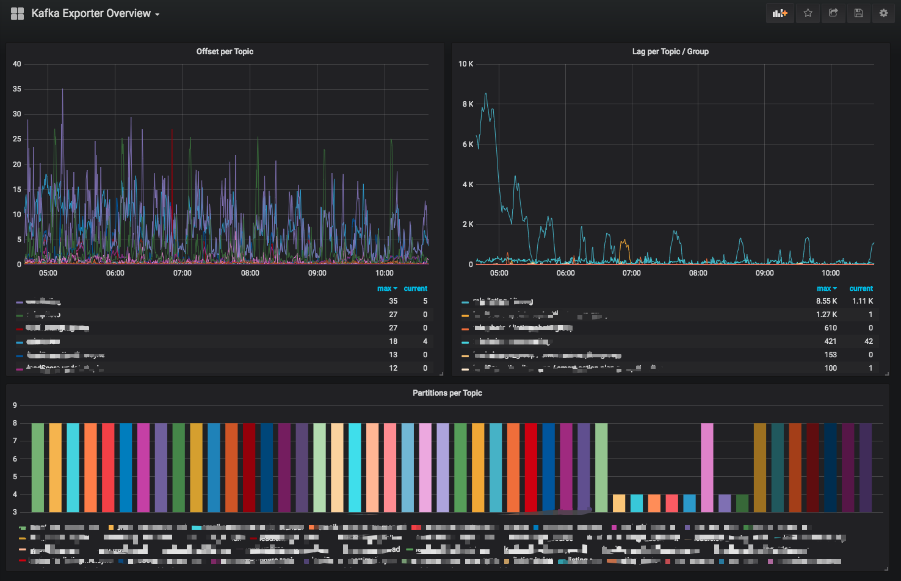

## 简介

kafka默认提供了非常多基于`JMX(Java Management Extensions)`相关的监工指标。

但是如果我们要通过`Prometheus` + `Grafana`进行监控

还需要将`JMX`相关的指标转换为`http`接口，让Prometheus使用

## jmx_exporter

`Prometheus`官方提供了相关的`agent`

[github地址](https://github.com/prometheus/jmx_exporter): https://github.com/prometheus/jmx_exporter

但是还需要配置一些数据规则，比如配置数据格式啥的，比较麻烦。

下面我们考虑使用开箱即用的`docker`容器


## kafka_exporter

社区有伙伴提供了[kafka_exporter](https://github.com/danielqsj/kafka_exporter): https://github.com/danielqsj/kafka_exporter

直接基于`docker compose`启动，非常方便,属于比较无脑的方式，我们基于这种方式试试

### docker compose

```yaml
version: '3.1'
services:
  kafka-exporter-test:
    image: bitnami/kafka-exporter:latest
    command:
      - '--kafka.server=192.168.1.1:9092'
      - '--kafka.server=192.168.1.2:9092'
      - '--kafka.server=192.168.1.3:9092'
      - '--kafka.version=3.5.0'
    restart: always
    ports:
      - 9308:9308
```

这里我们直接运行
```shell
docker-compose up -d
```

之后直接访问接口
```shell
http://192.168.1.1:9308/metrics
```

即可得到相关的指标

## grafana dashboard

至于`grafana`的`dashboard`，可以直接在`grafana`的官方网站搜索`kafka`，有很多现成的`dashboard`可以直接使用

这里可以随便找了几个，自己可以考虑在这个基础上面改一改
- https://grafana.com/grafana/dashboards/21078-kafka-dashboard-cn-20240520-starsl-cn/
- https://grafana.com/grafana/dashboards/18276-kafka-dashboard/
- https://grafana.com/grafana/dashboards/7589-kafka-exporter-overview/

`bitnami`社区官方给出来的dashboard是`https://grafana.com/grafana/dashboards/7589-kafka-exporter-overview/`

监控数据非常简单



这里我们使用`https://grafana.com/grafana/dashboards/21078-kafka-dashboard-cn-20240520-starsl-cn/`这个仪表盘看看

我们启动好`Grafana`+ `Prometheus`

然后配置数据源，好导入`dashboard`

> 不懂可以参考我之前的博文

## 效果


## 总结

总的来说本次对`broker`的监控市面上的选择并不多，也并没有很官方和常用的`dashboard`使用，实际的使用还需要自己多开发研究

对于3.x以上的`kafka`，对于`controller`的监控还是比较少的。

想要监控`controller`可以考虑使用`Bitnami`提供的`dokcer`镜像，就提供了对`controller`的监控

- [github地址](https://github.com/bitnami/containers/blob/main/bitnami/jmx-exporter/README.md): https://github.com/bitnami/containers/blob/main/bitnami/jmx-exporter/README.md

`controller`相关的监控以后有空了深入研究下，今天主要是聊聊`broker`的监控