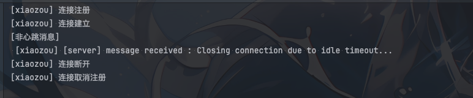
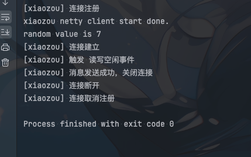

## 心跳分类

一般心跳有两个层面
- 协议层
- 应用层

为什么要分两个心跳呢？全部交给`tcp`的心跳(keepLive)不就行了吗？应用还自己发送心跳干嘛?

这里我们举一个简单例子就说明情况

目前我们有一个`client`和一个`server`

某个时间点`server`虽然没有宕机，端口还在监听，但是`server`比如因为cpu满了或者GC之类的情况，导致`server`无法处理`client`的请求

但是在`tcp`层面的`keepLive`来说还是正常的，这个时候`client`就会一直等待`server`的响应，一直请求这个`server`。

实际这个`server`已经无法处理请求了。类似进入假死状态

## 协议层心跳检测

netty中要开始`tpc`的`keepLive`心跳检测机制使用如下方式即可
```java
ServerBootstrap bootstrap = new ServerBootstrap();
            bootstrap.group(bossGroup, workerGroup) 
                     .channel(NioServerSocketChannel.class) 
                     // 设置TCP Keepalive
                     .childOption(ChannelOption.SO_KEEPALIVE, true)
```

核心就是`ChannelOption.SO_KEEPALIVE, true`

## 应用层心跳检测

应用层心跳检测`netty`提供了开箱即用的心跳检测类`IdleStateHandler`，这个类可以用来检测`channel`的空闲状态，如果超过一定时间没有读写操作，就会触发`userEventTriggered`方法，我们可以在这个方法中处理心跳逻辑

`IdleStateHandler`的核心构造函数就一个
```java
 public IdleStateHandler(boolean observeOutput,
    long readerIdleTime, long writerIdleTime, long allIdleTime,
    TimeUnit unit) {}
```

其他的构造都是对这个构造的重载

我们来看看这个几个参数
- observeOutput 默认`false`,这个参数控制是否观察出站数据，以决定一个连接是否处于空闲状态。如果设置为true，当有出站数据时（即数据从Netty的出站缓冲区写入到操作系统的socket发送缓冲区），则认为这个连接不是写空闲的。
这对于那些有潜在的写操作，但数据可能会在Netty的出站缓冲区里停留较长时间的情况很有用。设置为false时，只考虑用户代码层面的写操作
- readerIdleTime 读空闲时间，即多长时间没有读操作，就会触发`userEventTriggered`方法
- writerIdleTime 写空闲时间，即多长时间没有写操作，就会触发`userEventTriggered`方法
- allIdleTime 读写空闲时间，即多长时间没有读写操作，就会触发`userEventTriggered`方法
- unit 时间单位


## 实战

纸上得来终觉浅，绝知此事要躬行

我们基于`IdleStateHandler`来检测管理我们连接试试。

### 连接管理Handler NettyConnectManageHandler
- NettyConnectManageHandler
```java
@ChannelHandler.Sharable
public class NettyConnectManageHandler extends ChannelDuplexHandler {

    @Override
    public void userEventTriggered(ChannelHandlerContext ctx, Object evt) throws Exception {
        if (evt instanceof IdleStateEvent) {
            IdleStateEvent event = (IdleStateEvent) evt;
            if (event.state().equals(IdleState.ALL_IDLE)) {
                System.out.println("[xiaozou] 触发 读写空闲事件");
                ctx.writeAndFlush("Closing connection due to idle timeout...")
                    .addListener((ChannelFutureListener) future -> {
                        if (future.isSuccess()) {
                            System.out.println("[xiaozou] 消息发送成功，关闭连接");
                            future.channel().close();
                        } else {
                            System.out.println("[xiaozou] 消息发送失败");
                            future.cause().printStackTrace();
                        }
                    });
            }
        }
        ctx.fireUserEventTriggered(evt);

    }

    @Override
    public void channelInactive(ChannelHandlerContext ctx) throws Exception {
        System.out.println("[xiaozou] 连接断开");
        super.channelInactive(ctx);
        ctx.channel().close();
    }

    @Override
    public void channelActive(ChannelHandlerContext ctx) throws Exception {
        System.out.println("[xiaozou] 连接建立");
        super.channelActive(ctx);
    }

    @Override
    public void channelUnregistered(ChannelHandlerContext ctx) throws Exception {
        System.out.println("[xiaozou] 连接取消注册");
        super.channelUnregistered(ctx);
    }

    @Override
    public void channelRegistered(ChannelHandlerContext ctx) throws Exception {
        System.out.println("[xiaozou] 连接注册");
        super.channelRegistered(ctx);
    }

}
```

这里我们主要是对触发了`IdleStateEvent`事件进行处理，如果是`ALL_IDLE`，我们就关闭连接


### Server

```java
public class XiaoZouHeartBeatServer {

    public static void main(String[] args) throws Exception {
        EventLoopGroup bossGroup = new NioEventLoopGroup();
        EventLoopGroup workerGroup = new NioEventLoopGroup();
        try {
            ServerBootstrap bootstrap = new ServerBootstrap();
            NettyConnectManageHandler manageHandler = new NettyConnectManageHandler();
            bootstrap.group(bossGroup, workerGroup).channel(NioServerSocketChannel.class).childHandler(new ChannelInitializer<SocketChannel>() {
                @Override
                protected void initChannel(SocketChannel ch) {
                    ch.pipeline()
                        .addLast(StringDecoder.class.getSimpleName(), new StringDecoder())
                        .addLast(StringEncoder.class.getSimpleName(), new StringEncoder())
                        .addLast(new IdleStateHandler(0, 0, 10))
                        .addLast(manageHandler)
                        .addLast(new ReadMsgHandler());

                }
            });
            ChannelFuture future = bootstrap.bind(9000).sync();
            System.out.println("xiaozou netty server start done.");
            future.channel().closeFuture().sync();
        } finally {
            bossGroup.shutdownGracefully();
            workerGroup.shutdownGracefully();
        }
    }
}
```

`server`主要添加了`IdleStateHandler`，这里我们使用的是读写空闲时间为10秒，如果10秒没有读写操作，我们就关闭连接

### Client

```java
public class XiaoZouHeartBeatClient {

    public static void main(String[] args) throws Exception {
        EventLoopGroup eventLoopGroup = new NioEventLoopGroup();
        try {
            Bootstrap bootstrap = new Bootstrap();
            NettyConnectManageHandler handler = new NettyConnectManageHandler();
            bootstrap.group(eventLoopGroup).channel(NioSocketChannel.class)
                .handler(new ChannelInitializer<SocketChannel>() {
                    @Override
                    protected void initChannel(SocketChannel ch) {
                        ch.pipeline()
                            .addLast(StringDecoder.class.getSimpleName(), new StringDecoder())
                            .addLast(StringEncoder.class.getSimpleName(), new StringEncoder())
                            .addLast(new IdleStateHandler(0, 0, 5))
                            .addLast(handler)
                            .addLast(new ReadMsgHandler());
                    }
                });
            Channel channel = bootstrap.connect("127.0.0.1", 9000).sync().channel();
            System.out.println("xiaozou netty client start done.");
            Random random = new Random();
            while (channel.isActive()) {
                int i = random.nextInt(8);
                System.out.println("random value is " + i);
                TimeUnit.SECONDS.sleep(i);
                channel.writeAndFlush(HeartBeatConstant.HEART_BEAT);
            }

        } finally {
            eventLoopGroup.shutdownGracefully();
        }

    }
}
```

`client`我们也添加了`IdleStateHandler`，这里我们使用的是读写空闲时间为5秒，如果5秒没有读写操作，我们就关闭连接

## 运行结果

- server



- client



## 总结

上面的代码我们主要是客户端触发了空闲读写事件，然后进行了连接关闭。

可以看到`IdleStateHandler`心跳是一个单向的心跳。

这里我们演示的是`client`和`server`都有心跳检测。
比如`client` 5s没有读写操作，就会关闭连接，`server`10s没有读写操作，也会关闭连接。