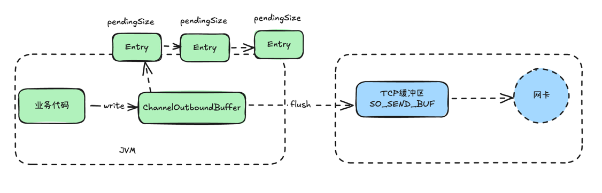
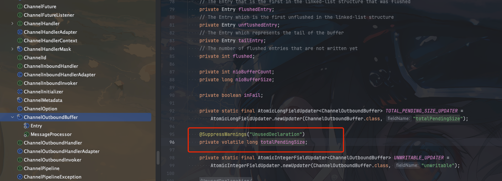
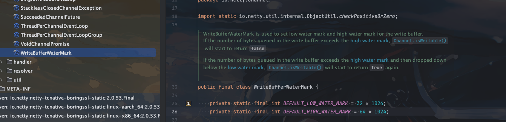

## Netty发送消息流程

我们先来了解一下`Netty`发送消息的流程，再谈`Netty`中的高水位和低水位





首先我们知道`Netty`写数据的时候都有两个流程
1. `write`: 将数据写入到`ChannelOutboundBuffer`中
2. `flush`: 将`ChannelOutboundBuffer`中的数据写入到`SocketChannel`中,也就是真正的发送数据，即发送到TCP缓冲区，再通过网卡发送到对端

这里我们再来理解一下操作系统内核的两个缓冲区

- `SO_SEND_BUF`: `SO_SEND_BUF`是操作系统内核的写缓冲区，所有应用程序需要发送到对端的信息，都会放到该缓冲区中，等待发往对端
- `SO_REC_BUFF`: `SO_REC_BUFF`是操作系统内核的读缓冲区，所有从对端接收到的信息，都会放到该缓冲区中，等待应用程序读取

所以我们发送消息的一般流程是

业务 -> write -> ChannelOutboundBuffer -> flush -> SO_SEND_BUF -> 网卡


## 高低水位

我们想象这么一个场景

当网络出现阻塞或者`Netty`客户端负载很高的时候，客户端接收速度和处理速度越来越慢。 会出现什么情况

1. TCP的滑动窗口不断缩小，以减少网络数据的发送，直到为0
2. `Netty`服务端有大量频繁的写操作，不断写入到`ChannelOutboundBuffer`中
3. 但是`ChannelOutboundBuffer`中的数据flush不到`SO_SEND_BUF`中，导致`ChannelOutboundBuffer`中的数据不断增加，最终撑爆`ChannelOutboundBuffer`导致OOM

所以为了解决这个问题，`Netty`定义了高低水位，用来表示`ChannelOutboundBuffer`中的待发送数据的内存占用量的上限和下限

当待发送数据的内存占用总量(totalPendingSize)超过高水位线的时候，`Netty` 就会将 `NioSocketChannel` 的状态标记为不可写状态，并触发`ChannelWritabilityChanged`事件

当待发送数据的内存占用总量(totalPendingSize)低于低水位线的时候，`Netty` 会再次将 `NioSocketChannel` 的状态标记为可写状态，并触发`ChannelWritabilityChanged`事件

`ChannelWritabilityChanged`数据量有两个计数器，一个是`pendingSize`、一个是`totalPendingSize`

由于`ChannelWritabilityChanged`是由许多个`Entry`组成的，每个`Entry`都有一个`pendingSize`，`pendingSize`记录了堆外内存(待发送数据) + 堆内内存(Entry对象自身占用内存)

`pendingSize` = 堆外内存(待发送数据) + 堆内内存(Entry对象自身占用内存)


`ChannelWritabilityChanged` 自身还有一个`totalPendingSize`属性，用来记录所有的`pendingSize`之和

`totalPendingSize` = 所有的pendingSize之和




`Netty`的高低水位就是通过判断`totalPendingSize`大小来进行判断的


## Netty高低水位设置及默认大小

`Netty`中的高低水位是通过`ChannelOption.WRITE_BUFFER_WATER_MARK`来设置的，`WRITE_BUFFER_WATER_MARK`是一个`WriteBufferWaterMark`对象，它包含两个属性`low`和`high`，分别表示低水位和高水位

设置高低水位的代码如下

```java
bootstrap.option(ChannelOption.WRITE_BUFFER_WATER_MARK, new WriteBufferWaterMark(32 * 1024, 64 * 1024));
```



netty中低水位默认是32KB，高水位默认是64KB,是每个`Channel`独享的

## 注意事项

如果仅仅只是设置了高低水位参数，但是在写代码中没有对`channel.isWritable()`进行判断，那么高低水位还是不会生效

所以一般会在`ChannelWritabilityChanged`事件中添加如下判断

```java
        @Override
        public void channelWritabilityChanged(ChannelHandlerContext ctx) throws Exception {
            Channel channel = ctx.channel();
            if (channel.isWritable()) {
                if (!channel.config().isAutoRead()) {
                    channel.config().setAutoRead(true);
                    log.info("Channel[{}] turns writable, bytes to buffer before changing channel to un-writable: {}",
                        RemotingHelper.parseChannelRemoteAddr(channel), channel.bytesBeforeUnwritable());
                }
            } else {
                channel.config().setAutoRead(false);
                log.warn("Channel[{}] auto-read is disabled, bytes to drain before it turns writable: {}",
                    RemotingHelper.parseChannelRemoteAddr(channel), channel.bytesBeforeWritable());
            }
            super.channelWritabilityChanged(ctx);
        }
```

> 来源于`RocketMQ`的`NettyRemotingAbstract`类

1. 当写缓冲区快满时,`channel`变为不可写,关闭自动读取，停止从socket读取数据
2. 当写缓冲区有空间时,`channel`变为可写,打开自动读取，继续从socket读取数据

这样可以实现背压机制,当下游处理慢时,自动降低上游发送速度。同时防止出现OOM

我们查看开源框架会发现都有类似的做法

## 开源框架中的高低水位设置

- RocketMQ
> 上面的演示代码就是

- Pulsar

```java
        @Override
        public void channelWritabilityChanged(ChannelHandlerContext ctx) throws Exception {
            // handle backpressure
            // stop/resume reading input from connection between the client and the proxy
            // when the writability of the connection between the proxy and the broker changes
            inboundChannel.config().setAutoRead(ctx.channel().isWritable());
            super.channelWritabilityChanged(ctx);
        }
```


## 总结

1. Netty中的高低水位是通过`ChannelOption.WRITE_BUFFER_WATER_MARK`来设置的，`WRITE_BUFFER_WATER_MARK`是一个`WriteBufferWaterMark`对象，它包含两个属性`low`和`high`，分别表示低水位和高水位
2. 如果待发送数据的内存占用总量超过高水位线的时候，`Netty` 就会将 `Channel` 的状态标记为不可写状态，并触发`ChannelWritabilityChanged`事件
3. 如果待发送数据的内存占用总量低于低水位线的时候，`Netty` 会再次将 `Channel` 的状态标记为可写状态，并触发`ChannelWritabilityChanged`事件
4. 如果仅仅只是设置了高低水位参数，但是在写代码中没有对`channel.isWritable()`进行判断，那么高低水位还是不会生效
5. 高低水位主要是为了防止`ChannelOutboundBuffer`中的数据不断增加，最终撑爆`ChannelOutboundBuffer`导致OOM