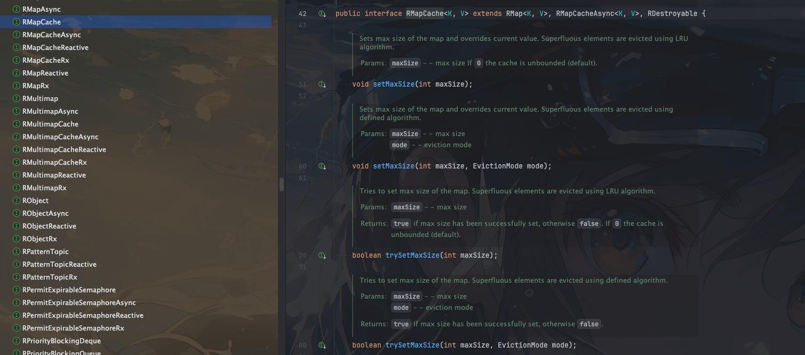
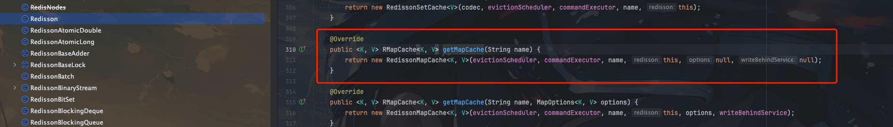
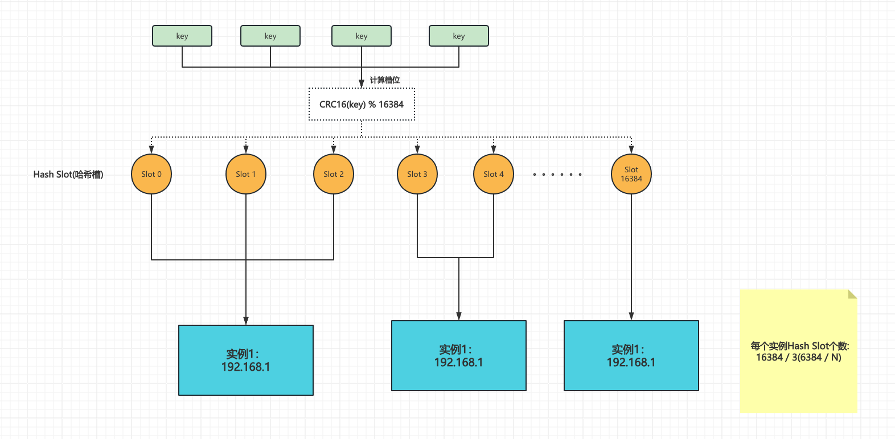

## 背景

最近自研的多级缓存框架线上出现了`redis`数据倾斜的问题。而自研多级缓存框架中`redis`使用的`client`是`Redisson`，

缓存底层封装使用的数据结构是`RMapCache`

## RMapCache使用

`RMapCache`的使用其实很简单

```java
public class XiaoZou {


    private final RedissonClient redissonClient;
    
    
    public void test() {
        RMapCache<String, String> mapCache = redissonClient.getMapCache("xiaozou");
        mapCache.put("key", "value", 10, TimeUnit.SECONDS);
        String value = mapCache.get("key");
        System.out.println(value);}
}

```

## 疑惑

实际可以看到`RMapCache`的api设计还是非常简单的，但是有一个疑问就是`redis`默认的数据结构就那么几种，`String`、`List`、`Set`、`ZSet`、`Hash`，那么`RMapCache`底层是啥呢？看着四不像啊

## 源码分析



`RMapCache` 本身仅是一个接口，如果我们要查看底层原理，我们还是需要看看具体的实现类

好消息是`RMapCache`的实现类只有两个，要是像`spring`一个类很多个实现类估计又要封了

两个实现类如下
- RedissonMapCache
- RedissonTransactionalMapCache

我们这里需要研究的实现类主要是`RedissonMapCache`

因为通过` redissonClient.getMapCache("xiaozou");`我们可以看看具体创建的实现类是`RedissonMapCache`



获取缓存的核心方法是`getOperationAsync`，我们看看这个方法的实现

```java
    public RFuture<V> getOperationAsync(K key) {
        String name = getRawName(key);
        return commandExecutor.evalWriteAsync(name, codec, RedisCommands.EVAL_MAP_VALUE,
                "local value = redis.call('hget', KEYS[1], ARGV[2]); "
                        + "if value == false then "
                            + "return nil; "
                        + "end; "
                        + "local t, val = struct.unpack('dLc0', value); "
                        + "local expireDate = 92233720368547758; " +
                        "local expireDateScore = redis.call('zscore', KEYS[2], ARGV[2]); "
                        + "if expireDateScore ~= false then "
                            + "expireDate = tonumber(expireDateScore) "
                        + "end; "
                        + "if t ~= 0 then "
                            + "local expireIdle = redis.call('zscore', KEYS[3], ARGV[2]); "
                            + "if expireIdle ~= false then "
                                + "if tonumber(expireIdle) > tonumber(ARGV[1]) then "
                                    + "redis.call('zadd', KEYS[3], t + tonumber(ARGV[1]), ARGV[2]); "
                                + "end; "
                                + "expireDate = math.min(expireDate, tonumber(expireIdle)) "
                            + "end; "
                        + "end; "
                        + "if expireDate <= tonumber(ARGV[1]) then "
                            + "return nil; "
                        + "end; "
                        + "local maxSize = tonumber(redis.call('hget', KEYS[5], 'max-size')); " +
                        "if maxSize ~= nil and maxSize ~= 0 then " +
                            "local mode = redis.call('hget', KEYS[5], 'mode'); " +
                            "if mode == false or mode == 'LRU' then " +
                                "redis.call('zadd', KEYS[4], tonumber(ARGV[1]), ARGV[2]); " +
                            "else " +
                                "redis.call('zincrby', KEYS[4], 1, ARGV[2]); " +
                            "end; " +
                        "end; "
                        + "return val; ",
                Arrays.asList(name, getTimeoutSetName(name), getIdleSetName(name), getLastAccessTimeSetName(name), getOptionsName(name)),
                System.currentTimeMillis(), encodeMapKey(key));
    }
```

可以看到核心逻辑都是基于`lua`脚本实现的。我们来分析分析这段lua脚本的逻辑

1. 获取并检查缓存值
```lua
local value = redis.call('hget', KEYS[1], ARGV[2]); 
if value == false then 
    return nil; 
end;
```
可以看到缓存的存储主要用的数据结构是`hash`

2. 解析缓存值
```lua
local t, val = struct.unpack('dLc0', value);
```
如果值存在，解包获取时间戳t和实际值val。

3. 检查过期时间
```lua
local expireDate = 92233720368547758; 
local expireDateScore = redis.call('zscore', KEYS[2], ARGV[2]); 
if expireDateScore ~= false then 
    expireDate = tonumber(expireDateScore) 
end;
```
设置一个初始的极大过期时间，然后尝试从过期时间集合中获取实际的过期时间。

4. 处理空闲时间
```lua
if t ~= 0 then 
    local expireIdle = redis.call('zscore', KEYS[3], ARGV[2]); 
    if expireIdle ~= false then 
        if tonumber(expireIdle) > tonumber(ARGV[1]) then 
            redis.call('zadd', KEYS[3], t + tonumber(ARGV[1]), ARGV[2]); 
        end; 
        expireDate = math.min(expireDate, tonumber(expireIdle)) 
    end; 
end;
```
如果启用了空闲时间检查（t != 0），获取空闲过期时间，更新空闲时间，并取最小的过期时间。
5. 检查是否过期
```lua
if expireDate <= tonumber(ARGV[1]) then 
    return nil; 
end;
```
如果已过期，返回nil。

6. 处理缓存大小限制和淘汰策略
```lua
local maxSize = tonumber(redis.call('hget', KEYS[5], 'max-size')); 
if maxSize ~= nil and maxSize ~= 0 then 
    local mode = redis.call('hget', KEYS[5], 'mode'); 
    if mode == false or mode == 'LRU' then 
        redis.call('zadd', KEYS[4], tonumber(ARGV[1]), ARGV[2]); 
    else 
        redis.call('zincrby', KEYS[4], 1, ARGV[2]); 
    end; 
end;
```

如果设置了最大大小限制，根据淘汰策略（LRU或LFU）更新访问时间或频率。
7. 返回缓存值
```lua
return val;
```

可以看到用到的reids数据结构有`hash`、`zset`，`hash`主要用来存储缓存值，`zset`主要用来存储过期时间和空闲时间

既然后用到了hash，那么在`redis`集群模式下面就容易出现数据倾斜

## 数据倾斜

如果我们的reids是集群模式，现在主流的集群模式应该还是切片集群的方式

对于一个key，在存储的时候会进行hash计算，然后存储在某个分片中




所以这里一个`RMapCache`只有一个`name`，只会被分配到一个分片中，如果我们只有一个`name`，然后下面很多个key，就会导致整个系统只会使用一个分片，出现数据倾斜，导致redis被打爆。

## 如何解决数据倾斜

两种解决方式
1. 缓存底层存储使用`String`，即`redisson`中的`RBucket`
2. 对`RMapCache`的`name`进行分片
```java
public class ShardedMapCache {

    private final int shardCount;

    private final RedissonClient redissonClient;

    private final String name;

    public ShardedMapCache(RedissonClient redissonClient, String name, int shardCount) {
        this.redissonClient = redissonClient;
        this.name = name;
        this.shardCount = shardCount;
    }

    public RMapCache<K, Object> getRMapCache(String key) {
        return redissonClient.getMapCache(getShardName(key));
    }

    private String getShardName(String key) {
        int shard = Math.abs(key.hashCode() % shardCount);
        return "cache:" + shard;
        
    }
}

```

这种方式能够缓解单个缓存数据倾斜的问题。如果系统存储的缓存很大，需要更省内存，可以使用`RBucket`存储，如果系统缓存数据量不大，可以使用`RMapCache`存储


## 总结

`RMapCache`底层实现只要是`hash`+`zset`，所以相对单纯的`RBucket`来说更耗费内存，但是也多了一些对缓存的高级操作，比如全量清除
如果使用`RMapCache`存储单`name`大量数据，需要注意数据倾斜问题

出现数据倾斜可以考虑使用`RBucket`存储或者对`RMapCache`的`name`进行手动分片

无论是使用`RBucket`还是`RMapCache`，根据自己的业务场景选择合适的存储方式

如果是缓存框架可以考虑两者都支持，让用户自己选择合适的存储方式


