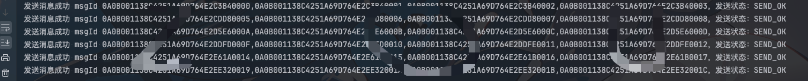
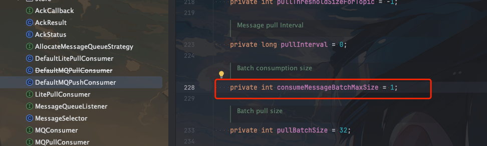
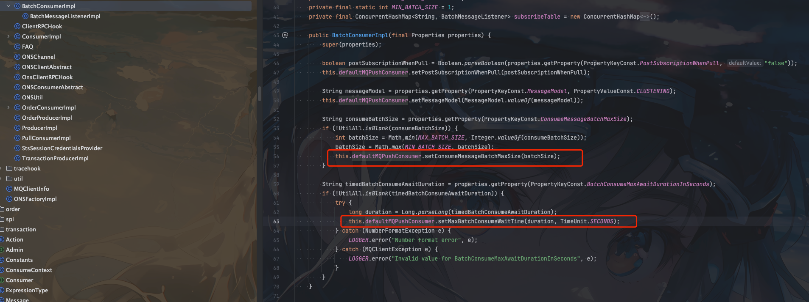

## 背景

有时候为了一些效率方面的考虑，我们可能会需要批量发送消息，或者批量消费消息。这里我们主要讨论批量发送消息的问题。


## 消息批量发送

消息批量发送很简单，官方文档也有例子，这里我们直接看代码

```java
public class BatchProducer {

    public static final String TOPIC = "xiaozou-batch-topic";

    public static void main(String[] args) throws Exception {

        System.setProperty("rocketmq.namesrv.domain", "xiaozou.com:80");
        System.setProperty("rocketmq.namesrv.domain.subgroup", "nsaddr-1");

        DefaultMQProducer producer = new DefaultMQProducer("BatchProducerGroupName");
        producer.start();

        while (true) {
            List<Message> messages = new ArrayList<>();
            messages.add(new Message(TOPIC, "Tag", "OrderID001", "Hello world 0".getBytes()));
            messages.add(new Message(TOPIC, "Tag", "OrderID002", "Hello world 1".getBytes()));
            messages.add(new Message(TOPIC, "Tag", "OrderID003", "Hello world 2".getBytes()));
            messages.add(new Message(TOPIC, "Tag", "OrderID003", "Hello world 4".getBytes()));
            SendResult send = producer.send(messages);
            System.out.println("发送消息成功 msgId " + send.getMsgId() + "，发送状态：" + send.getSendStatus());
            TimeUnit.SECONDS.sleep(2);
        }
    }

}

```

这里`Nameserve`地址采用的dns服务发现的方式，如果要切换成指定`Nameserve`地址也可以删除环境变量的设置，直接在代码中指定

运行结果如下:




可以返回到的消息id通过`,`隔开,返回的多个`MsgId`还是一个`String`

## 批量消费消息

批量消费消息官方文档并未给出具体的代码。

但是我们在创建消费者的时候可以注意到一个属性`consumeMessageBatchMaxSize`，这个属性就是用来设置批量消费消息的大小的。

默认是1



然后可以看到`MessageListenerConcurrently`接口在设计的时候就是一个`List<MessageExt>`的参数，这个参数就是用来接收批量消息的。

```java
public interface MessageListenerConcurrently extends MessageListener {
    /**
     * It is not recommend to throw exception,rather than returning ConsumeConcurrentlyStatus.RECONSUME_LATER if
     * consumption failure
     *
     * @param msgs msgs.size() >= 1<br> DefaultMQPushConsumer.consumeMessageBatchMaxSize=1,you can modify here
     * @return The consume status
     */
    ConsumeConcurrentlyStatus consumeMessage(final List<MessageExt> msgs,
        final ConsumeConcurrentlyContext context);
}
```

所以最简单的批量消费方式就是如下方式:

```java
public class BatchConsumer {

    public static final String CONSUMER_GROUP = "gid-xiaozou-batch";

    public static final String TOPIC = "xiaozou-batch-topic";

    public static void main(String[] args) throws Exception {

        System.setProperty("rocketmq.namesrv.domain", "xiaozou.com:80");
        System.setProperty("rocketmq.namesrv.domain.subgroup", "nsaddr-1");

        DefaultMQPushConsumer consumer = new DefaultMQPushConsumer(CONSUMER_GROUP);
        consumer.setConsumeMessageBatchMaxSize(32); 
        consumer.subscribe(TOPIC, "*");
        consumer.registerMessageListener((MessageListenerConcurrently) (msgs, context) -> {
            // 批量处理消息
            for (MessageExt msg : msgs) {
                // 处理单条消息
                System.out.println("messageId" + msg.getMsgId() + "接受到的消息body: " + new String(msg.getBody()));
            }
            System.out.println("一批消息消费完成");
            return ConsumeConcurrentlyStatus.CONSUME_SUCCESS;
        });

        consumer.start();
        System.out.printf("Consumer Started.%n");
    }
}
```

## 阿里云sdk对RocketMQ 批量消费消息的支持

如果我们看阿里云商业版sdk就发现商业版本是支持批量消费消息的

```java
public class SimpleBatchConsumer {

    public static void main(String[] args) {
        Properties consumerProperties = new Properties();
        // 您在云消息队列 RocketMQ 版控制台创建的Group ID。
        consumerProperties.setProperty(PropertyKeyConst.GROUP_ID, MqConfig.GROUP_ID);
        // AccessKey ID，阿里云身份验证标识。获取方式，请参见创建AccessKey。
        consumerProperties.setProperty(PropertyKeyConst.AccessKey, MqConfig.ACCESS_KEY);
        // AccessKey Secret，阿里云身份验证密钥。获取方式，请参见创建AccessKey。
        consumerProperties.setProperty(PropertyKeyConst.SecretKey, MqConfig.SECRET_KEY);
        // 设置TCP接入域名，进入云消息队列 RocketMQ 版控制台实例详情页面的接入点区域查看。
        consumerProperties.setProperty(PropertyKeyConst.NAMESRV_ADDR, MqConfig.NAMESRV_ADDR);

        // 设置批量消费最大消息数量，当指定Topic的消息数量已经攒够128条，SDK立即执行回调进行消费。默认值：32，取值范围：1~1024。
        consumerProperties.setProperty(PropertyKeyConst.ConsumeMessageBatchMaxSize, String.valueOf(128));
        // 设置批量消费最大等待时长，当等待时间达到10秒，SDK立即执行回调进行消费。默认值：0，取值范围：0~450，单位：秒。
        consumerProperties.setProperty(PropertyKeyConst.BatchConsumeMaxAwaitDurationInSeconds, String.valueOf(10));

        BatchConsumer batchConsumer = ONSFactory.createBatchConsumer(consumerProperties);
        batchConsumer.subscribe(MqConfig.TOPIC, MqConfig.TAG, new BatchMessageListener() {

             @Override
            public Action consume(final List<Message> messages, ConsumeContext context) {
                System.out.printf("Batch-size: %d\n", messages.size());
                // 批量消息处理。
                return Action.CommitMessage;
            }
        });
        //启动batchConsumer。
        batchConsumer.start();
        System.out.println("Consumer start success.");

        //等待固定时间防止进程退出。
        try {
            Thread.sleep(200000);
        } catch (InterruptedException e) {
            e.printStackTrace();
        }
    }
}  
```

可以看到主要是多了两个类一个是`BatchConsumer`，一个是`BatchMessageListener`，这两个类是阿里云sdk对RocketMQ的扩展。

我们简单对这一快的源码进行分析一下

### BatchMessageListener

`BatchMessageListener`就是一个接口，和`MessageListenerConcurrently`类似

```java
public interface BatchMessageListener {
    /**
     * 批量消费消息接口，由应用来实现<br>
     * 需要注意网络抖动等不稳定的情形可能会带来消息重复，对重复消息敏感的业务可对消息做幂等处理
     *
     * @param messages 一批消息
     * @param context 消费上下文
     * @return {@link Action} 消费结果，如果应用抛出异常或者返回Null等价于返回Action.ReconsumeLater
     * @see <a href="https://help.aliyun.com/document_detail/44397.html">如何做到消费幂等</a>
     */
    Action consume(final List<Message> messages, final ConsumeContext context);
}
```

我们来看看`BatchConsumer`，`BatchConsumer`也是一个接口
```java
public interface BatchConsumer extends Admin {

    /**
     * 订阅消息
     *
     * @param topic 消息主题
     * @param subExpression 订阅过滤表达式字符串，ONS服务器依据此表达式进行过滤。只支持或运算<br> eg: "tag1 || tag2 || tag3"<br>
     * 如果subExpression等于null或者*，则表示全部订阅
     * @param listener 消息回调监听器
     */
    void subscribe(final String topic, final String subExpression, final BatchMessageListener listener);

    /**
     * 取消某个topic订阅
     *
     * @param topic 消息主题
     */
    void unsubscribe(final String topic);
}

```

相比开源中`MQPushConsumer`接口做了精简，仅包含两个方法

`BatchConsumer`的实现类有两个

- BatchConsumerBean 用于将`BatchConsumer`集成至`Spring Bean`中
- BatchConsumerImpl ONSFactory 默认创建的`BatchConsumer`实现类

`spring`中的我们先不管，直接看看`BatchConsumerImpl`的实现

通过`createBatchConsumer`方法我们直接看看`BatchConsumerImpl`的构造函数

```java
    public BatchConsumer createBatchConsumer(final Properties properties) {
        return new BatchConsumerImpl(ONSUtil.extractProperties(properties));
    }
```

- `BatchConsumerImpl` 构造函数

```java
    public BatchConsumerImpl(final Properties properties) {
        super(properties);

        boolean postSubscriptionWhenPull = Boolean.parseBoolean(properties.getProperty(PropertyKeyConst.PostSubscriptionWhenPull, "false"));
        this.defaultMQPushConsumer.setPostSubscriptionWhenPull(postSubscriptionWhenPull);

        String messageModel = properties.getProperty(PropertyKeyConst.MessageModel, PropertyValueConst.CLUSTERING);
        this.defaultMQPushConsumer.setMessageModel(MessageModel.valueOf(messageModel));

        String consumeBatchSize = properties.getProperty(PropertyKeyConst.ConsumeMessageBatchMaxSize);
        if (!UtilAll.isBlank(consumeBatchSize)) {
            int batchSize = Math.min(MAX_BATCH_SIZE, Integer.valueOf(consumeBatchSize));
            batchSize = Math.max(MIN_BATCH_SIZE, batchSize);
            this.defaultMQPushConsumer.setConsumeMessageBatchMaxSize(batchSize);
        }

        String timedBatchConsumeAwaitDuration = properties.getProperty(PropertyKeyConst.BatchConsumeMaxAwaitDurationInSeconds);
        if (!UtilAll.isBlank(timedBatchConsumeAwaitDuration)) {
            try {
                long duration = Long.parseLong(timedBatchConsumeAwaitDuration);
                this.defaultMQPushConsumer.setMaxBatchConsumeWaitTime(duration, TimeUnit.SECONDS);
            } catch (NumberFormatException e) {
                LOGGER.error("Number format error", e);
            } catch (MQClientException e) {
                LOGGER.error("Invalid value for BatchConsumeMaxAwaitDurationInSeconds", e);
            }
        }
    }
```

可以看到还是使用的`this.defaultMQPushConsumer`,而`defaultMQPushConsumer`也是我们开源版本使用的`DefaultMQPushConsumer`


然后对`consumeMessageBatchMaxSize`和`maxBatchConsumeWaitTime`属性做了一些参数校验




## rocketmq-clients对批量消费的支持

如果我们使用最新的5.x的新客户端，也可以通过grpc的方式进行批量消费。相关消费代码如下

```xml
<dependency>
    <groupId>org.apache.rocketmq</groupId>
    <artifactId>rocketmq-client-java</artifactId>
    <version>${rocketmq.version}</version>
</dependency>
```

```java
public class SimpleConsumerExample {
    private static final Logger log = LoggerFactory.getLogger(SimpleConsumerExample.class);

    private SimpleConsumerExample() {
    }

    @SuppressWarnings({"resource", "InfiniteLoopStatement"})
    public static void main(String[] args) throws ClientException {
        final ClientServiceProvider provider = ClientServiceProvider.loadService();

        // Credential provider is optional for client configuration.
        String accessKey = "yourAccessKey";
        String secretKey = "yourSecretKey";
        SessionCredentialsProvider sessionCredentialsProvider =
            new StaticSessionCredentialsProvider(accessKey, secretKey);

        String endpoints = "foobar.com:8080";
        ClientConfiguration clientConfiguration = ClientConfiguration.newBuilder()
            .setEndpoints(endpoints)
            // On some Windows platforms, you may encounter SSL compatibility issues. Try turning off the SSL option in
            // client configuration to solve the problem please if SSL is not essential.
            // .enableSsl(false)
            .setCredentialProvider(sessionCredentialsProvider)
            .build();
        String consumerGroup = "yourConsumerGroup";
        Duration awaitDuration = Duration.ofSeconds(30);
        String tag = "yourMessageTagA";
        String topic = "yourTopic";
        FilterExpression filterExpression = new FilterExpression(tag, FilterExpressionType.TAG);
        // In most case, you don't need to create too many consumers, singleton pattern is recommended.
        SimpleConsumer consumer = provider.newSimpleConsumerBuilder()
            .setClientConfiguration(clientConfiguration)
            // Set the consumer group name.
            .setConsumerGroup(consumerGroup)
            // set await duration for long-polling.
            .setAwaitDuration(awaitDuration)
            // Set the subscription for the consumer.
            .setSubscriptionExpressions(Collections.singletonMap(topic, filterExpression))
            .build();
        // Max message num for each long polling.
        int maxMessageNum = 16;
        // Set message invisible duration after it is received.
        Duration invisibleDuration = Duration.ofSeconds(15);
        // Receive message, multi-threading is more recommended.
        do {
            final List<MessageView> messages = consumer.receive(maxMessageNum, invisibleDuration);
            log.info("Received {} message(s)", messages.size());
            for (MessageView message : messages) {
                final MessageId messageId = message.getMessageId();
                try {
                    consumer.ack(message);
                    log.info("Message is acknowledged successfully, messageId={}", messageId);
                } catch (Throwable t) {
                    log.error("Message is failed to be acknowledged, messageId={}", messageId, t);
                }
            }
        } while (true);
        // Close the simple consumer when you don't need it anymore.
        // You could close it manually or add this into the JVM shutdown hook.
        // consumer.close();
    }
}
```

> 代码可以参考官方[github 仓库代码](https://github.com/apache/rocketmq-clients/blob/master/java/client/src/main/java/org/apache/rocketmq/client/java/example/SimpleConsumerExample.java)
> https://github.com/apache/rocketmq-clients/blob/master/java/client/src/main/java/org/apache/rocketmq/client/java/example/SimpleConsumerExample.java

## 总结

RocketMQ批量发送消息直接发送一个`List<Message>`就可，无需改动什么

如果是需要批量消费消息就需要注意设置两个参数，一个是`consumeMessageBatchMaxSize`，一个是`maxBatchConsumeWaitTime`

`maxBatchConsumeWaitTime`代表每次批量消费的条数

`maxBatchConsumeWaitTime`代表最多等待的时间，比如`maxBatchConsumeWaitTime`设置了批量消费100条，`maxBatchConsumeWaitTime`设置为10s，10s消息量没有达到100条也会消费