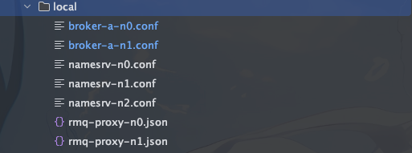
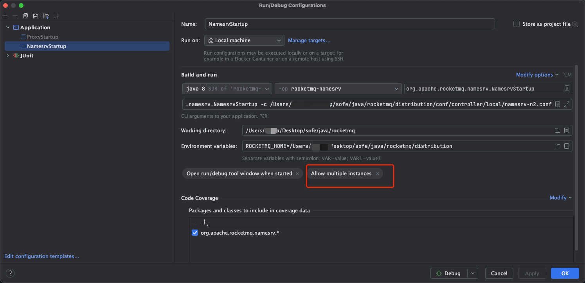
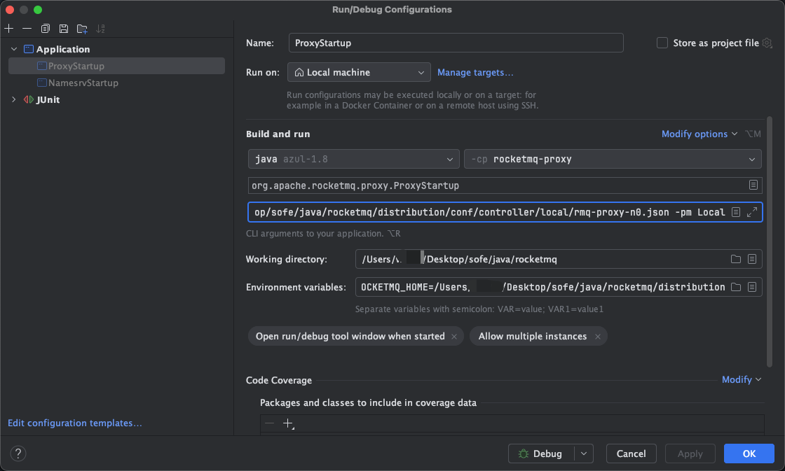

## 集群配置

本次启动 3个`nameserver`(内置3个`controller`), 2个`broker`(内置proxy)，2个broker一主一从


## 配置信息


### 配置目录结构



下面给出给出了`nameserver`和`broker`的配置信息

### nameserver

- n0
```shell
enableControllerInNamesrv = true

#controller config
controllerDLegerGroup = group1
enableElectUncleanMaster = true
controllerDLegerPeers = n0-127.0.0.1:9870;n1-127.0.0.1:9871;n2-127.0.0.1:9872
controllerDLegerSelfId = n0
listenPort = 9000

```

- n1
```shell
enableControllerInNamesrv = true

#controller config
controllerDLegerGroup = group1
enableElectUncleanMaster = true
controllerDLegerPeers = n0-127.0.0.1:9870;n1-127.0.0.1:9871;n2-127.0.0.1:9872
controllerDLegerSelfId = n1
listenPort = 9001
```
- n2
```shell
enableControllerInNamesrv = true

#controller config
controllerDLegerGroup = group1
enableElectUncleanMaster = true
controllerDLegerPeers = n0-127.0.0.1:9870;n1-127.0.0.1:9871;n2-127.0.0.1:9872
controllerDLegerSelfId = n2
listenPort = 9002
```

### broker

- n0
```shell
brokerClusterName = xiaozou
brokerName = broker-a
brokerId = -1
brokerRole = SLAVE
deleteWhen = 04
fileReservedTime = 48
enableControllerMode = true

#fetchNamesrvAddrByAddressServer = true
#fetchControllerAddrByDnsLookup = true
controllerAddr = 127.0.0.1:9870;127.0.0.1:9871;127.0.0.1:9872
namesrvAddr = 127.0.0.1:9000;127.0.0.1:9001;127.0.0.1:9002

allAckInSyncStateSet=true
listenPort=30911

storePathRootDir=/Users/xiaozou/Desktop/sofe/rocketmq-file/rmqstore/node00/store
storePathEpochFile = /Users/xiaozou/Desktop/sofe/rocketmq-file/rmqstore/node00/store

autoCreateTopicEnable=true
autoCreateSubscriptionGroup=false
enablePropertyFilter=true
slaveReadEnable=true
waitTimeMillsInSendQueue=1000
traceTopicEnable=true
useEpollNativeSelector = true
serverSelectorThreads = 5
serverWorkerThreads = 12
```

- n1
```shell
brokerClusterName = xiaozou
brokerName = broker-a
brokerId = -1
brokerRole = SLAVE
deleteWhen = 04
fileReservedTime = 48
enableControllerMode = true

#fetchNamesrvAddrByAddressServer = true
#fetchControllerAddrByDnsLookup = true
controllerAddr = 127.0.0.1:9870;127.0.0.1:9871;127.0.0.1:9872
namesrvAddr = 127.0.0.1:9000;127.0.0.1:9001;127.0.0.1:9002
enableElectUncleanMaster = true

allAckInSyncStateSet=true
listenPort=30916

storePathRootDir=/Users/xiaozou/Desktop/sofe/rocketmq-file/rmqstore/node01/store
storePathEpochFile = /xiaozou/weihu/Desktop/sofe/rocketmq-file/rmqstore/node01/store


autoCreateTopicEnable=false
autoCreateSubscriptionGroup=false
enablePropertyFilter=true
slaveReadEnable=true
waitTimeMillsInSendQueue=1000
traceTopicEnable=true
useEpollNativeSelector = true
serverSelectorThreads = 5
serverWorkerThreads = 12
```

### proxy

- n0
```shell
{
  "rocketMQClusterName": "xiaozou",
  "namesrvAddr": "127.0.0.1:9000;127.0.0.1:9001;127.0.0.1:9002",
  "grpcServerPort": 8081,
  "remotingListenPort": 8080

}
```

- n1
```shell
{
  "rocketMQClusterName": "xiaozou",
  "namesrvAddr": "127.0.0.1:9000;127.0.0.1:9001;127.0.0.1:9002",
  "grpcServerPort": 8082,
  "remotingListenPort": 8083
}
```

## 启动


### nameserver

首先启动三个`nameserver`



#### 第一个nameserver
注意配置两个地方
- Environment variables: `ROCKETMQ_HOME=/Users/xiaozou/Desktop/sofe/java/rocketmq/distribution`
- Program arguments: `org.apache.rocketmq.namesrv.NamesrvStartup -c /Users/xiaozou/Desktop/sofe/java/rocketmq/distribution/conf/controller/local/namesrv-n0.conf`

> 注意勾选`Allow multiple instances`

上面是第一个`nameserver`的配置，第二个`nameserver`主要是改`Program arguments`，把后面的`namesrv-n0.conf`改成`namesrv-n1.conf`

#### 第二个nameserver
- Environment variables: `ROCKETMQ_HOME=/Users/xiaozou/Desktop/sofe/java/rocketmq/distribution`
- Program arguments: `org.apache.rocketmq.namesrv.NamesrvStartup -c /Users/xiaozou/Desktop/sofe/java/rocketmq/distribution/conf/controller/local/namesrv-n1.conf`

#### 第三个nameserver
- Environment variables: `ROCKETMQ_HOME=/Users/xiaozou/Desktop/sofe/java/rocketmq/distribution`
- Program arguments: `org.apache.rocketmq.namesrv.NamesrvStartup -c /Users/xiaozou/Desktop/sofe/java/rocketmq/distribution/conf/controller/local/namesrv-n1.conf`

### broker(proxy)

broker也是类似，实际这里启动的是proxy


#### 第一个proxy
- Environment variables: `ROCKETMQ_HOME=/Users/xiaozou/Desktop/sofe/java/rocketmq/distribution`
- Program arguments: `org.apache.rocketmq.proxy.ProxyStartup -bc /Users/xiaozou/Desktop/sofe/java/rocketmq/distribution/conf/controller/local/broker-a-n0.conf -pc /Users/xiaozou/Desktop/sofe/java/rocketmq/distribution/conf/controller/local/rmq-proxy-n0.json -pm Local`

#### 第二个proxy
- Environment variables: `ROCKETMQ_HOME=/Users/xiaozou/Desktop/sofe/java/rocketmq/distribution`
- Program arguments: `org.apache.rocketmq.proxy.ProxyStartup -bc /Users/xiaozou/Desktop/sofe/java/rocketmq/distribution/conf/controller/local/broker-a-n1.conf -pc /Users/xiaozou/Desktop/sofe/java/rocketmq/distribution/conf/controller/local/rmq-proxy-n1.json -pm Local`
