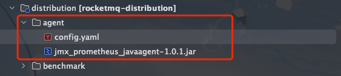
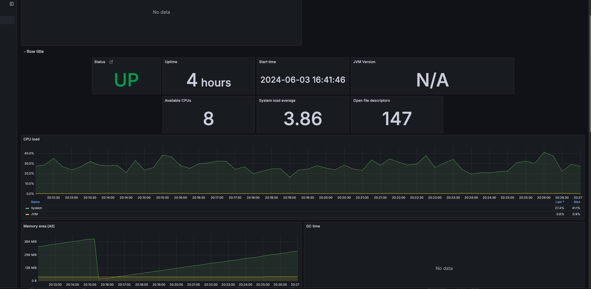

## JVM监控选型

本次JVM监控我们采用`prometheus`官方提供的`jmx_exporter`来实现

## RocketMQJVM开发

整体目录




### 1. 新增`agent`目录

我们在`distribution`目录新增一个`agent`模块，然后添加两个文件
 1. jmx_prometheus_javaagent-1.0.1.jar
 2. 新增`config.yaml`文件

`config.yaml`文件内容如下:
```yaml
lowercaseOutputLabelNames: true
lowercaseOutputName: true
whitelistObjectNames: ["java.lang:type=OperatingSystem"]
blacklistObjectNames: []
rules:
  - pattern: 'java.lang<type=OperatingSystem><>(committed_virtual_memory|free_physical_memory|free_swap_space|total_physical_memory|total_swap_space)_size:'
    name: os_$1_bytes
    type: GAUGE
    attrNameSnakeCase: true
  - pattern: 'java.lang<type=OperatingSystem><>((?!process_cpu_time)\w+):'
    name: os_$1
    type: GAUGE
    attrNameSnakeCase: true
```

### 2. 修改`release.xml`打包脚本

在`release.xml`中新增`agent`模块的打包配置

```xml
            <includes>
                <include>conf/**</include>
                <include>benchmark/*</include>
                <include>agent/*</include>
            </includes>
```

### 3. 修改启动脚本`mqbroker`

在`export ROCKETMQ_HOME`下面新增如下代码
```shell
JMX_PROMETHEUS_AGENT="-javaagent:$ROCKETMQ_HOME/agent/jmx_prometheus_javaagent-1.0.1.jar=9100:$ROCKETMQ_HOME/agent/config.yaml"
```

在`sh ${ROCKETMQ_HOME}/bin/runbroker.sh`后面新增如下代码
```shell
${JMX_PROMETHEUS_AGENT}
```

自此我们的JVM监控`agent`就开发完成了。

### 4.部署

1. 重新编译`RocketMQ`源码
```shell
mvn -Prelease-all -DskipTests -Dspotbugs.skip=true clean install
```

2.  执行启动脚本
3. 通过`ps -ef|grep java`查看`agent`是否在启动脚本中
4. 访问`http://localhost:9100/metrics` 查看监控数据。服务器记得开通9100端口

### 5. 效果

效果和之前说的类似



## 总结

总的来说`java`应用都支持使用`prometheus`官方提供的`jmx_exporter`这个`agent`来实现JVM的监控。我们只需要修改一下脚本把`agent`挂载上去即可