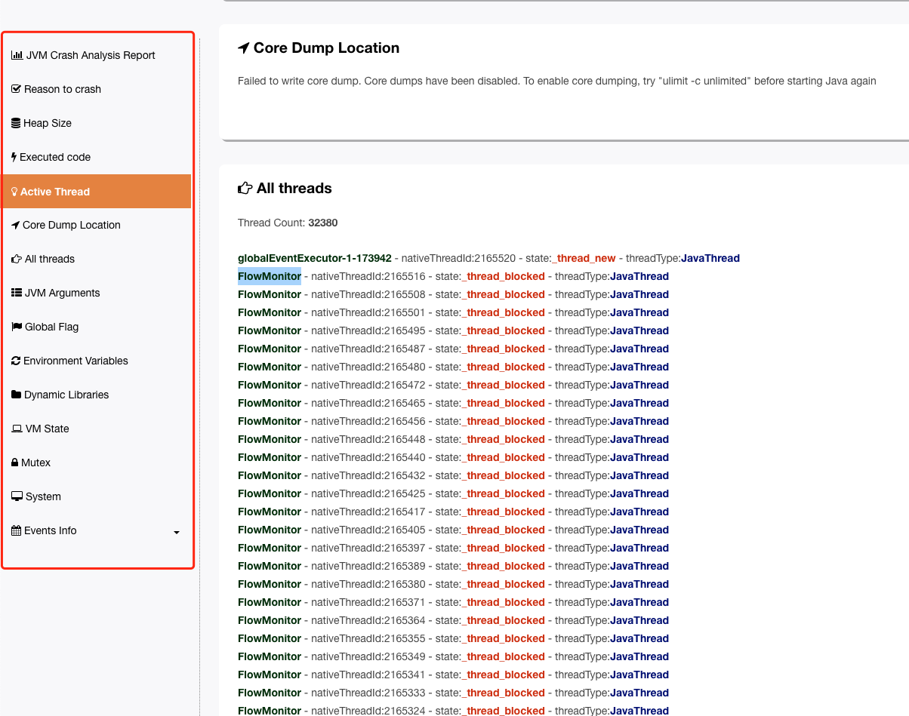

## RocketMQ 版本
- 5.1.0


## 背景
测试环境的`RocketMQ`总会在运行一段时间后，莫名其妙就挂掉，刚开始以为就是简单的内存不够导致的

因为测试环境给的资源不多，但是时间久了总需要重启也麻烦。总会影响测试环境，所以打算排查一下解决掉。


## 增加内存
开始的解决方式是增加内存，由原先的4g增加到8g，结果还是OOM，这里就怀疑可能是`RocketMQ`有bug导致的

## OOM log分析

`RocketMQ`的OOM log默认是保存在`distribution/target/rocketmq-xxx/rocketmq-xxx`目录下

文件名称`hs_err_pid1879893.log`

这里给大家推荐一个OOM的log分析平台，目前是免费的

https://gceasy.io/?tdsourcetag=s_pctim_aiomsg



我们在`Active Thread`中看到所有的线程数有32380个线程，明显是不正常的

看样子还想继续增加，所以很明显就是`RocketMQ`的`bug`

那么为什么会创建如此多的`FlowMonitor`线程呢

## 问题定位
首先我们看看是哪里创建`FlowMonitor`这个线程的


可以看到主要是在创建`AutoSwitchHAConnection`对象的时候对`FlowMonitor`对象进行创建的，这里的`FlowMonitor`线程还没有启动

### 何时创建AutoSwitchHAConnection


跟随代码我们可以很快发现是在`NIO`中`Selector`接受网络请求的时候就会创建一个`AutoSwitchHAConnection`

创建完`AutoSwitchHAConnection`会执行`conn.start();`

其中`start`就会启动`flowMonitor`线程


我们查看`master`和`slave`的log也能看到`master`和`slave`有大量的连接`log`
```shell
grep -C 500 'HAService receive new' store.log
```

- master
```java
2023-09-13 20:31:15 INFO AutoSwitchAcceptSocketService - HAService receive new connection, /192.168.1.172:56700
2023-09-13 20:31:22 INFO AutoSwitchAcceptSocketService - HAService receive new connection, /192.168.1.172:56714
2023-09-13 20:31:29 INFO AutoSwitchAcceptSocketService - HAService receive new connection, /192.168.1.172:59700
2023-09-13 20:31:36 INFO AutoSwitchAcceptSocketService - HAService receive new connection, /192.168.1.172:36956
2023-09-13 20:31:43 INFO AutoSwitchAcceptSocketService - HAService receive new connection, /192.168.1.172:36972
2023-09-13 20:31:50 INFO AutoSwitchAcceptSocketService - HAService receive new connection, /192.168.1.172:48866
2023-09-13 20:31:57 INFO AutoSwitchAcceptSocketService - HAService receive new connection, /192.168.1.172:56400
2023-09-13 20:32:04 INFO AutoSwitchAcceptSocketService - HAService receive new connection, /192.168.1.172:36922
2023-09-13 20:32:11 INFO AutoSwitchAcceptSocketService - HAService receive new connection, /192.168.1.172:36926
```
- slave
```java
2023-09-14 03:17:32 INFO AutoSwitchHAClient - AutoSwitchHAClient connect to master 192.168.1.171:30922
2023-09-14 03:17:39 INFO AutoSwitchHAClient - AutoSwitchHAClient connect to master 192.168.1.171:30922
2023-09-14 03:17:46 INFO AutoSwitchHAClient - AutoSwitchHAClient connect to master 192.168.1.171:30922
2023-09-14 03:17:53 INFO AutoSwitchHAClient - AutoSwitchHAClient connect to master 192.168.1.171:30922
2023-09-14 03:18:00 INFO AutoSwitchHAClient - AutoSwitchHAClient connect to master 192.168.1.171:30922
2023-09-14 03:18:07 INFO AutoSwitchHAClient - AutoSwitchHAClient connect to master 192.168.1.171:30922
2023-09-14 03:18:14 INFO AutoSwitchHAClient - AutoSwitchHAClient connect to master 192.168.1.171:30922
```

## 修复问题
可以看到主要是主从连接断开后没有销毁`flowMonitor`线程。所以我们修改下NIO的连接关闭代码即可

相关代码可以查看这个pr

- [pr](https://github.com/apache/rocketmq/pull/6227):https://github.com/apache/rocketmq/pull/6227

## 总结

目前来看`5.1.0`之前的版本可能都有这个问题。所以大家在实际使用的时候一定要注意自己的`RocketMQ`这个bug是否修复了.

不过影响说大不大，说小不小。因为`master`和`slave`频繁建立连接本身也有问题