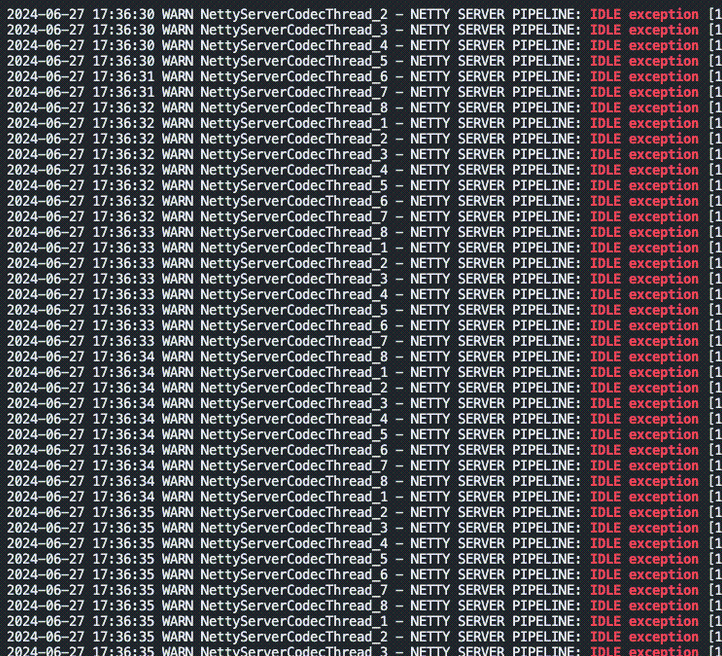
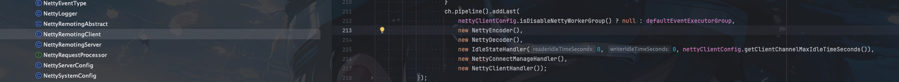
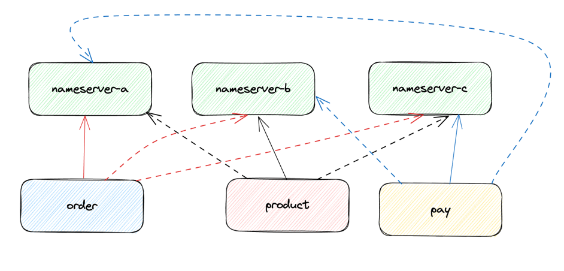
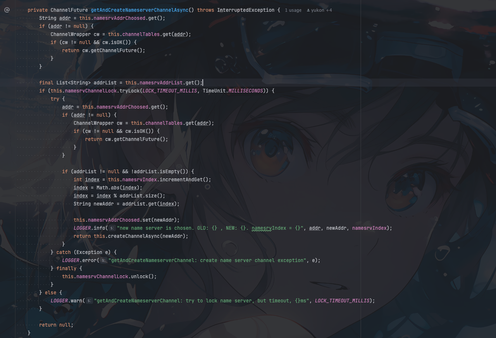

## RocketMQ version
- 5.1.0

## 背景

1. 线上RocketMQ偶尔出现从Nameserve获取元数据TimeOut
```java
TopicPublishInfo topicPublishInfo = this.tryToFindTopicPublishInfo(msg.getTopic());
```
2. 查看Nameserve发现打印大量`NETTY CLIENT PIPELINE: IDLE exception`log



## 初步解决方案

最开想的是既然超时了，那就直接增加超时时间，优先让程序正常运行。

client增加如下配置

```java
producer.setSendMsgTimeout(8000);
```

> 实际早起出现过类似的问题，超时时间由默认3s调整为5s了。现在暂时调整为8s看能不能解决这个问题


实际结果是增加了超时时间还是会出现`TimeOut`问题

由于之前分析过出现`sendDefaultImpl call timeout` 是还没发送消息就超时了，所以这里重点关注`Nameserve`

## 问题排查

通过阅读源码发现几个问题
1. `client`会定时去扫描所有`Nameserve`并与所有`Nameserve`建立连接
```java
            int connectTimeoutMillis = this.nettyClientConfig.getConnectTimeoutMillis();
            TimerTask timerTaskScanAvailableNameSrv = new TimerTask() {
                @Override
                public void run(Timeout timeout) {
                    try {
                        NettyRemotingClient.this.scanAvailableNameSrv();
                    } catch (Exception e) {
                        LOGGER.error("scanAvailableNameSrv exception", e);
                    } finally {
                        timer.newTimeout(this, connectTimeoutMillis, TimeUnit.MILLISECONDS);
                    }
                }
            };
            this.timer.newTimeout(timerTaskScanAvailableNameSrv, 0, TimeUnit.MILLISECONDS);
```


2. 但是`client`并不会主动给`Nameserve`发送心跳
3. netty通信模块`client`和`server`都配置了空闲检测

- client


- server


4. nameserver只会定时30s从单个`Nameserve`获取元数据，这个操作也就是充当了`client`和`Nameserve`的心跳机制

```java
        this.scheduledExecutorService.scheduleAtFixedRate(() -> {
            try {
                MQClientInstance.this.updateTopicRouteInfoFromNameServer();
            } catch (Exception e) {
                log.error("ScheduledTask updateTopicRouteInfoFromNameServer exception", e);
            }
        }, 10, this.clientConfig.getPollNameServerInterval(), TimeUnit.MILLISECONDS);
```

## 问题定位

经过上面的源码分析就很清晰了。我们这里举例说明

现在比如有三个服务`order`、`producer`、`pay`

`nameserver`有三个节点`Nameserve-a`、`Nameserve-b`、`Nameserve-c`

- `order` 连接 `Nameserve-a` ,与 `Nameserve-b`、`Nameserve-c` 频繁触发`NETTY CLIENT PIPELINE: IDLE exception。`, `Nameserve-b`、`Nameserve-c`为此产生大量 `NETTY CLIENT PIPELINE: IDLE exception`，然后触发频繁的断线重连
- `producer` 连接 `Nameserve-b` ,与 `Nameserve-a`、`Nameserve-c` 频繁触发`NETTY CLIENT PIPELINE: IDLE exception。`, `Nameserve-a`、`Nameserve-c`为此产生大量 `NETTY CLIENT PIPELINE: IDLE exception`，然后触发频繁的断线重连
- `pay` 连接 `Nameserve-c` ,与 `Nameserve-a`、`Nameserve-b` 频繁触发`NETTY CLIENT PIPELINE: IDLE exception。`, `Nameserve-a`、`Nameserve-b`为此产生大量 `NETTY CLIENT PIPELINE: IDLE exception`，然后触发频繁的断线重连




## 如何修复

定位到问题之后就很好修复了。

实际我们`client`并不需要与所有`nameserver`建立连接，仅与单个`nameserver`建立连接即可。

如果单个`nameserver`挂了，`client`会自动切换到其他`nameserver`上

相关代码



所以修复方式很简单，我们不让`client`与所有`nameserver`建立连接，仅与单个`nameserver`建立连接即可

相关修复[pr](https://github.com/apache/rocketmq/pull/8359): https://github.com/apache/rocketmq/pull/8359

