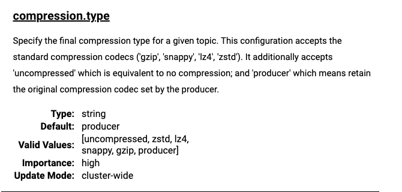

## 在哪里压缩

kafka提供了两个地方可以进行压缩消息

1. 在消息发送之前进消息压缩，也就是生产者端
2. 在消息接收之后进行消息压缩，也就是`broker`端

## 生产者端压缩

生产者端压缩是在消息发送之前进行压缩，这样可以减少网络传输的数据量，提高传输效率

使用方式也很简单，主要是设置启动参数`ProducerConfig.COMPRESSION_TYPE_CONFIG`

目前支持的压缩方式有

- none 不压缩
- gzip 使用`gzip`压缩
- snappy 使用`snappy`压缩
- lz4 使用`lz4`压缩
- zstd 使用`zstd`压缩


使用方式

```java
        Properties props = new Properties();
        props.put(ProducerConfig.BOOTSTRAP_SERVERS_CONFIG, BOOTSTRAP_SERVERS_PRD);
        props.put(ProducerConfig.KEY_SERIALIZER_CLASS_CONFIG, StringSerializer.class);
        props.put(ProducerConfig.VALUE_SERIALIZER_CLASS_CONFIG, StringSerializer.class);
        props.put(ProducerConfig.MAX_REQUEST_SIZE_CONFIG, 14240000);

        props.put(ProducerConfig.COMPRESSION_TYPE_CONFIG, "gzip");

        Producer<String, String> producer = new KafkaProducer<>(props);
```

## broker端压缩

`broker`也可以设置`compression.type`参数



这里的`compression.type`默认值为`producer`，意味着`broker`不设置压缩算法，使用生产者端的压缩算法，设置`producer`和`uncompressed`效果是一样的

这里主要考虑的是一种情况

1. `producer`设置比如`gzip`压缩算法
2. `broker`设置了和`producer`不一样的压缩算法，比如`snappy`

那么这时候会出现什么情况呢？

`Broker`也不会对已经由生产者压缩的消息进行重新压缩。`Broker`会按照`Broker`的配置来存储和处理日志，但消息的压缩状态以生产者端设置为准

## 