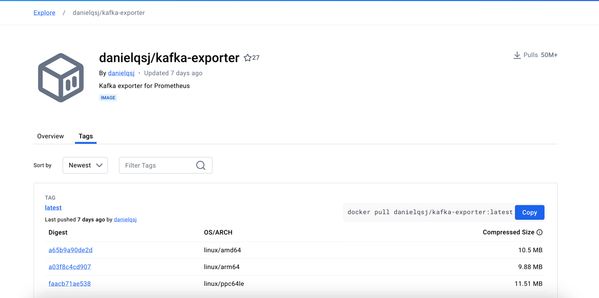
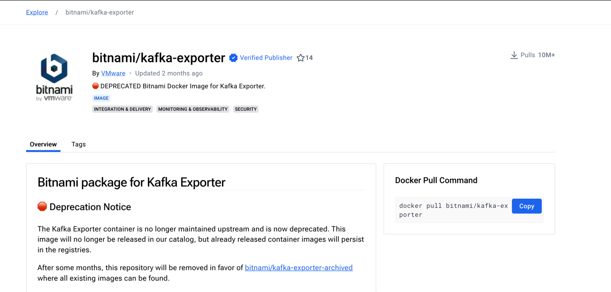
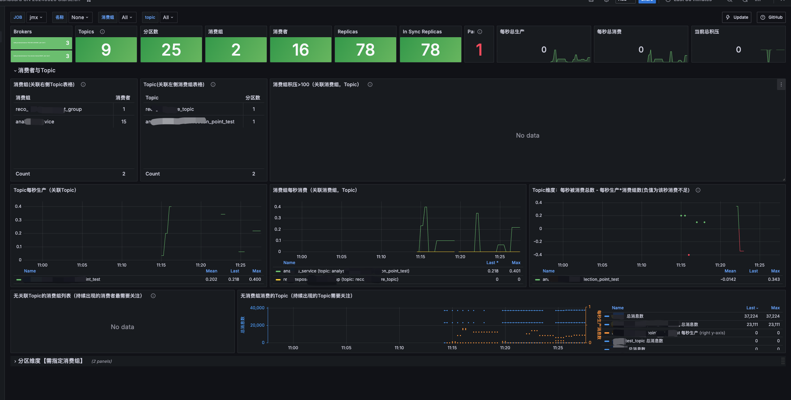

## 简介

kafka默认提供了非常多基于`JMX(Java Management Extensions)`相关的监工指标。

但是如果我们要通过`Prometheus` + `Grafana`进行监控

还需要将`JMX`相关的指标转换为`http`接口，让`Prometheus`使用

## jmx_exporter

`Prometheus`官方提供了相关的`agent`

[github地址](https://github.com/prometheus/jmx_exporter): https://github.com/prometheus/jmx_exporter

但是还需要配置一些数据规则，比如配置数据格式啥的，比较麻烦。

下面我们考虑使用开箱即用的`docker`容器

## 官方 kafka_exporter 讨论
官方早在2020年五月就讨论过提供一个官方的`kafka_exporter`

也就是[KIP-575](https://cwiki.apache.org/confluence/display/KAFKA/KIP-575:+build+a+Kafka-Exporter+by+Java):https://cwiki.apache.org/confluence/display/KAFKA/KIP-575:+build+a+Kafka-Exporter+by+Java

遗憾的是这个`KIP`至今还处于Under Discussion(讨论中)

## kafka_exporter

社区有伙伴提供了基于`docker`部署的`kafka-exporter`

目前主流的有两个镜像
- [danielqsj/kafka_exporter](https://hub.docker.com/r/danielqsj/kafka-exporter): https://hub.docker.com/r/danielqsj/kafka-exporter
> [github地址](https://github.com/danielqsj/kafka_exporter)



> [github地址](https://github.com/danielqsj/kafka_exporter):https://github.com/danielqsj/kafka_exporter

- [bitnami/kafka-exporter](https://hub.docker.com/r/bitnami/kafka-exporter):https://hub.docker.com/r/bitnami/kafka-exporter



> 可以看到`bitnami/kafka-exporter`已经发出了弃用通知，所以只能选择`danielqsj`，实际看简介`bitnami/kafka-exporter`也是基于`[danielqsj/kafka_exporter`的源代码构建的
> 只不过`Bitnami`的镜像通常都会做一些安全检查、性能优化等


这里我就用废弃的`bitnami/kafka-exporter`试试，反正两个都比较简单，先随便试试看


### bitnami/kafka-exporter docker compose

直接基于`docker compose`启动，非常方便,属于比较无脑的方式

vim `docker-compose.yaml`

```yaml
version: '3.1'
services:
  kafka-exporter-test:
    image: bitnami/kafka-exporter:latest
    command:
      - '--kafka.server=192.168.1.1:9092'
      - '--kafka.server=192.168.1.2:9092'
      - '--kafka.server=192.168.1.3:9092'
      - '--kafka.version=3.5.0'
    restart: always
    ports:
      - 9308:9308
```

这里我们直接运行
```shell
docker-compose up -d
```

之后直接访问接口
```shell
http://192.168.1.1:9308/metrics
```

即可得到相关的指标

如果要使用`danielqsj/kafka_exporter`进行部署，也非常简单，这里我给出我的`docker-compose.yaml`配置
```yaml
version: '3.1'
services:
  kafka-exporter-test:
    image: danielqsj/kafka-exporter 
    command: ["--kafka.server=192.168.1.1:9092", "--kafka.server=192.168.1.2:9092", "--kafka.server=192.168.1.3:9092"]
    ports:
      - 9308:9308
    restart: always
```
启动方式和上面一样

## grafana dashboard

至于`grafana`的`dashboard`，可以直接在`grafana`的官方网站搜索`kafka`，有很多现成的`dashboard`可以直接使用

这里可以随便找了几个，自己可以考虑在这个基础上面改一改
- https://grafana.com/grafana/dashboards/21078-kafka-dashboard-cn-20240520-starsl-cn/
- https://grafana.com/grafana/dashboards/18276-kafka-dashboard/
- https://grafana.com/grafana/dashboards/7589-kafka-exporter-overview/

`bitnami`社区官方给出来的dashboard是`https://grafana.com/grafana/dashboards/7589-kafka-exporter-overview/`

监控数据非常简单


这里我们使用`https://grafana.com/grafana/dashboards/21078-kafka-dashboard-cn-20240520-starsl-cn/`这个仪表盘看看

我们启动好`Grafana`+ `Prometheus`

然后配置数据源，好导入`dashboard`

> 不懂可以参考我之前的博文:[Docker compose 部署Grafana+Prometheus实现java应用JVM监控](https://weihubeats.blog.csdn.net/article/details/139432417)

## 效果



## 总结

总的来说本次对`broker`的监控市面上的选择并不多，也并没有很官方和常用的`dashboard`使用，实际的使用还需要自己多开发研究

对于3.x以上的`kafka`，对于`controller`的监控还是比较少的。

## 参考
- https://mp.weixin.qq.com/s/ZG3DjRoJ3IDeln-_KbvTDQ