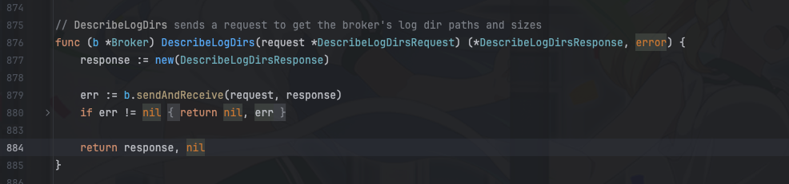

## 背景

目前`kafka`监控的`prometheus`指标主要是基于开源项目[danielqsj/kafka_exporter](https://github.com/danielqsj/kafka_exporter)

遗憾的是，`kafka_exporter`并没有提供`topic`的`size`指标，之前就出现过某个`topic`占用磁盘空间太大而没有监控到的情况。


所以我们对每个`topic`的磁盘使用情况进行监控，以便及时发现问题。


## IBM sarama

[danielqsj/kafka_exporter](https://github.com/danielqsj/kafka_exporter)获取`kafka`的监控指标是通过`IBM sarama`这个`kafka`的`go`客户端实现的。

在早期的时候，`IBM sarama`并没有提供`topic`的`size`指标，所以`kafka_exporter`基本也获取不到

在 [issue-1313](https://github.com/IBM/sarama/issues/1313)中就提出了这个特性


随后[IBM/sarama]社区在 [pull-1520实现了这个功能](https://github.com/IBM/sarama/pull/1520)

但是`danielqsj/kafka_exporter`一直没有增加相关的监控指标


## danielqsj/kafka_exporter 新增topic-size指标

为了实现`topic`的`size`指标，我们需要对`danielqsj/kafka_exporter`源码进行修改

核心api我们基于直接PR也知道是`DescribeLogDirs`



1. 首先我们在`Exporter`结构体中新增两把锁

```go
	sgPartitionsMutex       sync.Mutex
	sgPartitionLeadersMutex sync.Mutex
```