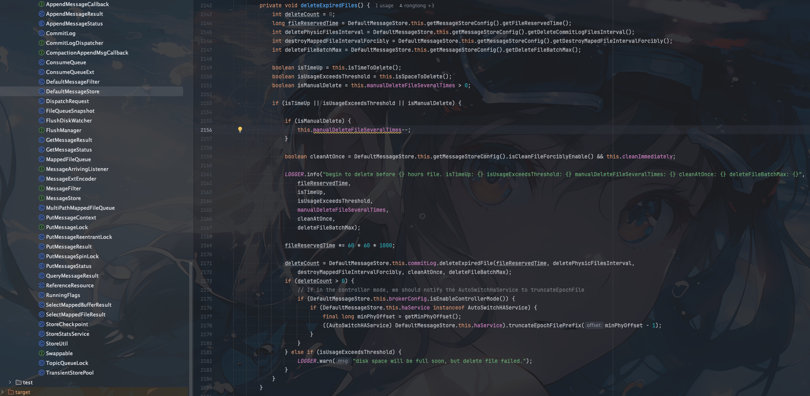

## RocketMQ版本
- 5.1.0

##  文件类型

`RocketMQ`目前主要是三种文件
- commitlog
- consumequeue
- index

## 源码入口

`org.apache.rocketmq.store.DefaultMessageStore#addScheduleTask`

源码入口主要是在`DefaultMessageStore`类中的`addScheduleTask`中

```java
        this.scheduledExecutorService.scheduleAtFixedRate(new AbstractBrokerRunnable(this.getBrokerIdentity()) {
@Override
public void run0() {
    DefaultMessageStore.this.cleanFilesPeriodically();
}
        }, 1000 * 60, this.messageStoreConfig.getCleanResourceInterval(), TimeUnit.MILLISECONDS);
```

这里启动了一个定时任务，延时60s执行，每隔`cleanResourceInterval` 毫秒执行一次`cleanFilesPeriodically`方法，默认10000，即10s执行一次


之前提到主要三种类型的文件，所以在`cleanFilesPeriodically`方法中会对这三种文件进行删除

```java
    private void cleanFilesPeriodically() {
    this.cleanCommitLogService.run();
    this.cleanConsumeQueueService.run();
    this.correctLogicOffsetService.run();
}
```


## commitLog删除

这里我们先看看`cleanCommitLogService`是如何删除`commitLog`的


```java
        public void run() {
            try {
                this.deleteExpiredFiles();
                this.reDeleteHangedFile();
            } catch (Throwable e) {
                DefaultMessageStore.LOGGER.warn(this.getServiceName() + " service has exception. ", e);
            }
        }
```

核心的删除逻辑在`deleteExpiredFiles`方法中

### deleteExpiredFiles



```java
        private void deleteExpiredFiles() {
            int deleteCount = 0;
            // 获取文件保留时间，默认72小时
            long fileReservedTime = DefaultMessageStore.this.getMessageStoreConfig().getFileReservedTime();
            // 获取删除文件的间隔，默认100ms 删除完一个文件后，等待100ms再删除下一个
            int deletePhysicFilesInterval = DefaultMessageStore.this.getMessageStoreConfig().getDeleteCommitLogFilesInterval();
            // 强制删除文件的间隔 默认120s 第一次删除文件，如果文件被其他线程占用则会删除失败，则会等待120s后再次删除
            int destroyMappedFileIntervalForcibly = DefaultMessageStore.this.getMessageStoreConfig().getDestroyMapedFileIntervalForcibly();
            // 一次删除文件的最大数量，默认10
            int deleteFileBatchMax = DefaultMessageStore.this.getMessageStoreConfig().getDeleteFileBatchMax();
            
            // 是到达设置的删除文件的时间（默认凌晨4点）
            boolean isTimeUp = this.isTimeToDelete();
            // 磁盘空间是否不足（75%）
            boolean isUsageExceedsThreshold = this.isSpaceToDelete();
            boolean isManualDelete = this.manualDeleteFileSeveralTimes > 0;

            if (isTimeUp || isUsageExceedsThreshold || isManualDelete) {

                if (isManualDelete) {
                    this.manualDeleteFileSeveralTimes--;
                }

                boolean cleanAtOnce = DefaultMessageStore.this.getMessageStoreConfig().isCleanFileForciblyEnable() && this.cleanImmediately;

                LOGGER.info("begin to delete before {} hours file. isTimeUp: {} isUsageExceedsThreshold: {} manualDeleteFileSeveralTimes: {} cleanAtOnce: {} deleteFileBatchMax: {}",
                    fileReservedTime,
                    isTimeUp,
                    isUsageExceedsThreshold,
                    manualDeleteFileSeveralTimes,
                    cleanAtOnce,
                    deleteFileBatchMax);

                fileReservedTime *= 60 * 60 * 1000;

                deleteCount = DefaultMessageStore.this.commitLog.deleteExpiredFile(fileReservedTime, deletePhysicFilesInterval,
                    destroyMappedFileIntervalForcibly, cleanAtOnce, deleteFileBatchMax);
                if (deleteCount > 0) {
                    // If in the controller mode, we should notify the AutoSwitchHaService to truncateEpochFile
                    if (DefaultMessageStore.this.brokerConfig.isEnableControllerMode()) {
                        if (DefaultMessageStore.this.haService instanceof AutoSwitchHAService) {
                            final long minPhyOffset = getMinPhyOffset();
                            ((AutoSwitchHAService) DefaultMessageStore.this.haService).truncateEpochFilePrefix(minPhyOffset - 1);
                        }
                    }
                } else if (isUsageExceedsThreshold) {
                    LOGGER.warn("disk space will be full soon, but delete file failed.");
                }
            }
        }
```


