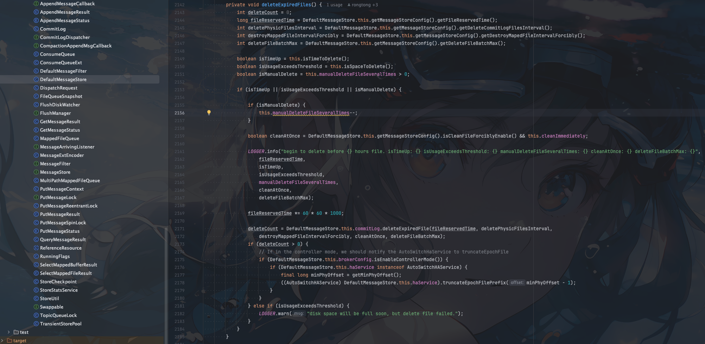

## RocketMQ版本
- 5.1.0

##  文件类型

`RocketMQ`目前主要是三种文件
- commitlog
- consumequeue
- index

## 源码入口

`org.apache.rocketmq.store.DefaultMessageStore#addScheduleTask`

源码入口主要是在`DefaultMessageStore`类中的`addScheduleTask`中

```java
    private void addScheduleTask() {

    this.scheduledExecutorService.scheduleAtFixedRate(new AbstractBrokerRunnable(this.getBrokerIdentity()) {
        @Override
        public void run0() {
            DefaultMessageStore.this.cleanFilesPeriodically();
        }
    }, 1000 * 60, this.messageStoreConfig.getCleanResourceInterval(), TimeUnit.MILLISECONDS);
}
```

这里启动了一个定时任务，延时60s执行，每隔`cleanResourceInterval` 毫秒执行一次`cleanFilesPeriodically`方法，默认10000，即10s执行一次


之前提到主要三种类型的文件，所以在`cleanFilesPeriodically`方法中会对这三种文件进行删除

```java
    private void cleanFilesPeriodically() {
    this.cleanCommitLogService.run();
    this.cleanConsumeQueueService.run();
    this.correctLogicOffsetService.run();
}
```


## commitLog删除

这里我们先看看`cleanCommitLogService`是如何删除`commitLog`的


```java
        public void run() {
            try {
                // 删除过期(或者强制删除)commitLog文件
                this.deleteExpiredFiles();
                // 删除被挂起的文件(删除失败的)
                this.reDeleteHangedFile();
            } catch (Throwable e) {
                DefaultMessageStore.LOGGER.warn(this.getServiceName() + " service has exception. ", e);
            }
        }
```

核心的删除逻辑在`deleteExpiredFiles`方法中

### deleteExpiredFiles



```java
        private void deleteExpiredFiles() {
            int deleteCount = 0;
            // 获取文件保留时间，默认72小时
            long fileReservedTime = DefaultMessageStore.this.getMessageStoreConfig().getFileReservedTime();
            // 获取删除文件的间隔，默认100ms 删除完一个文件后，等待100ms再删除下一个
            int deletePhysicFilesInterval = DefaultMessageStore.this.getMessageStoreConfig().getDeleteCommitLogFilesInterval();
            // 强制删除文件的间隔 默认120s 第一次删除文件，如果文件被其他线程占用则会删除失败，则会等待120s后再次删除
            int destroyMappedFileIntervalForcibly = DefaultMessageStore.this.getMessageStoreConfig().getDestroyMapedFileIntervalForcibly();
            // 一次删除文件的最大数量，默认10
            int deleteFileBatchMax = DefaultMessageStore.this.getMessageStoreConfig().getDeleteFileBatchMax();
            
            // 是到达设置的删除文件的时间（默认凌晨4点）
            boolean isTimeUp = this.isTimeToDelete();
            // 磁盘空间是否不足（75%） 如果磁盘空间大于diskSpaceWarningLevelRatio(默认90%)并标记磁盘已满，并标记cleanImmediately(强制删除) true
            boolean isUsageExceedsThreshold = this.isSpaceToDelete();
            // 手动删除是否被触发（触发则会设manualDeleteFileSeveralTimes为20，每执行一次删除方法减少一次）
            boolean isManualDelete = this.manualDeleteFileSeveralTimes > 0;
            
            // 三个条件满足一个则继续删除 
            // 1. 到达指定文件删除时间 默认凌晨4点
            // 2. 磁盘空间不足， 默认75%
            // 3. 手动删除被触发 调用 executeDeleteFilesManually方法 可以通过admin命令工具 执行 deleteExpiredCommitLog命令
            if (isTimeUp || isUsageExceedsThreshold || isManualDelete) {

                if (isManualDelete) {
                    this.manualDeleteFileSeveralTimes--;
                }
                
                // 是否强制删除 上面通过isSpaceToDelete方法对cleanImmediately进行了标记
                boolean cleanAtOnce = DefaultMessageStore.this.getMessageStoreConfig().isCleanFileForciblyEnable() && this.cleanImmediately;

                LOGGER.info("begin to delete before {} hours file. isTimeUp: {} isUsageExceedsThreshold: {} manualDeleteFileSeveralTimes: {} cleanAtOnce: {} deleteFileBatchMax: {}",
                    fileReservedTime,
                    isTimeUp,
                    isUsageExceedsThreshold,
                    manualDeleteFileSeveralTimes,
                    cleanAtOnce,
                    deleteFileBatchMax);
                
                // 文件默认保存时间，默认小时 转换为毫秒
                fileReservedTime *= 60 * 60 * 1000;
                
                // 执行文件删除，并返回文件删除成功的数量
                deleteCount = DefaultMessageStore.this.commitLog.deleteExpiredFile(fileReservedTime, deletePhysicFilesInterval,
                    destroyMappedFileIntervalForcibly, cleanAtOnce, deleteFileBatchMax);
                if (deleteCount > 0) {
                    // If in the controller mode, we should notify the AutoSwitchHaService to truncateEpochFile
                    if (DefaultMessageStore.this.brokerConfig.isEnableControllerMode()) {
                        if (DefaultMessageStore.this.haService instanceof AutoSwitchHAService) {
                            final long minPhyOffset = getMinPhyOffset();
                            ((AutoSwitchHAService) DefaultMessageStore.this.haService).truncateEpochFilePrefix(minPhyOffset - 1);
                        }
                    }
                } else if (isUsageExceedsThreshold) {
                    LOGGER.warn("disk space will be full soon, but delete file failed.");
                }
            }
        }
```


实际的文件删除被封装在方法`org.apache.rocketmq.store.MappedFileQueue#deleteExpiredFileByTime`中

我们来看看`org.apache.rocketmq.store.MappedFileQueue#deleteExpiredFileByTime`方法具体的实现

```java
    public int deleteExpiredFileByTime(final long expiredTime, // 文件过期时间
        final int deleteFilesInterval, // 删除两个文件的间隔时间
        final long intervalForcibly, // 上次关闭时间间隔超过该值则强制删除
        final boolean cleanImmediately, // 是否强制删除文件
        final int deleteFileBatchMax) { // 一次删除文件的最大数量
        // 获取 mappedFiles 文件列表
        Object[] mfs = this.copyMappedFiles(0);

        if (null == mfs)
            return 0;

        int mfsLength = mfs.length - 1;
        int deleteCount = 0;
        List<MappedFile> files = new ArrayList<>();
        int skipFileNum = 0;
        if (null != mfs) {
            // 检查文件完整性
            checkSelf();
            for (int i = 0; i < mfsLength; i++) {
                MappedFile mappedFile = (MappedFile) mfs[i];
                // 文件存活时间 = 文件最后修改的时间 + 文件过期时间
                long liveMaxTimestamp = mappedFile.getLastModifiedTimestamp() + expiredTime;
                // 文件过期或者开启强制删除
                if (System.currentTimeMillis() >= liveMaxTimestamp || cleanImmediately) {
                    if (skipFileNum > 0) {
                        log.info("Delete CommitLog {} but skip {} files", mappedFile.getFileName(), skipFileNum);
                    }
                    // 真正的文件删除
                    if (mappedFile.destroy(intervalForcibly)) {
                        files.add(mappedFile);
                        deleteCount++;
                        // 最多删除默认10个文件
                        if (files.size() >= deleteFileBatchMax) {
                            break;
                        }

                        if (deleteFilesInterval > 0 && (i + 1) < mfsLength) {
                            try {
                                Thread.sleep(deleteFilesInterval);
                            } catch (InterruptedException e) {
                            }
                        }
                    } else {
                        break;
                    }
                } else {
                    skipFileNum++;
                    //avoid deleting files in the middle
                    break;
                }
            }
        }
        // 将删除的文件从 mappedFiles 中移除
        deleteExpiredFile(files);

        return deleteCount;
    }


```

这里真正执行文件删除的逻辑在`mappedFile.destroy`

主要的逻辑就是校验文件是否过期或者强制删除

如果是则删除文件，同时从`mappedFiles`中移除文件

commitLog文件删除逻辑到这里就结束了 接下来我们继续看看`consumeQueue`文件删除逻辑


## consumeQueue删除

`consumeQueue`的删除入口在`org.apache.rocketmq.store.DefaultMessageStore.CleanConsumeQueueService#deleteExpiredFiles`方法

```java
        private void deleteExpiredFiles() {
            // 获取删除 ConsumeQueue 文件的时间间隔 默认 100ms
            int deleteLogicsFilesInterval = DefaultMessageStore.this.getMessageStoreConfig().getDeleteConsumeQueueFilesInterval();
            // 获取 CommitLog 的最小偏移量
            long minOffset = DefaultMessageStore.this.commitLog.getMinOffset();
            // 比较当前的 minOffset 和上一次记录的 lastPhysicalMinOffset
            // 如果 minOffset 大于 lastPhysicalMinOffset，说明 CommitLog 中有新的消息被清理，因此需要更新 lastPhysicalMinOffset 并继续执行删除过期文件的逻辑
            if (minOffset > this.lastPhysicalMinOffset) {
                this.lastPhysicalMinOffset = minOffset;

                ConcurrentMap<String, ConcurrentMap<Integer, ConsumeQueueInterface>> tables = DefaultMessageStore.this.getConsumeQueueTable();

                for (ConcurrentMap<Integer, ConsumeQueueInterface> maps : tables.values()) {
                    for (ConsumeQueueInterface logic : maps.values()) {
                        // 删除过期文件
                        int deleteCount = DefaultMessageStore.this.consumeQueueStore.deleteExpiredFile(logic, minOffset);
                        if (deleteCount > 0 && deleteLogicsFilesInterval > 0) {
                            try {
                                Thread.sleep(deleteLogicsFilesInterval);
                            } catch (InterruptedException ignored) {
                            }
                        }
                    }
                }

                DefaultMessageStore.this.indexService.deleteExpiredFile(minOffset);
            }
        }
```

`consumeQueue`删除文件主要是通过 CommitLog 的最小偏移量（minOffset）和上次记录的 lastPhysicalMinOffset 进行比较

如果 `minOffset` 大于 `lastPhysicalMinOffset`，说明 `CommitLog` 中有新的消息被清理，就需要清理 `ConsumeQueue` 文件

## IndexFile删除


在`consumeQueue`文件删除中也会调用`DefaultMessageStore.this.indexService.deleteExpiredFile(minOffset);`进行索引(IndexFile)删除

```java
    public void deleteExpiredFile(long offset) {
        Object[] files = null;
        try {
            this.readWriteLock.readLock().lock();
            if (this.indexFileList.isEmpty()) {
                return;
            }

            long endPhyOffset = this.indexFileList.get(0).getEndPhyOffset();
            if (endPhyOffset < offset) {
                files = this.indexFileList.toArray();
            }
        } catch (Exception e) {
            LOGGER.error("destroy exception", e);
        } finally {
            this.readWriteLock.readLock().unlock();
        }

        if (files != null) {
            List<IndexFile> fileList = new ArrayList<>();
            for (int i = 0; i < (files.length - 1); i++) {
                IndexFile f = (IndexFile) files[i];
                if (f.getEndPhyOffset() < offset) {
                    fileList.add(f);
                } else {
                    break;
                }
            }

            this.deleteExpiredFile(fileList);
        }
    }

```

删除索引文件的逻辑和删除`consumeQueue`文件类似，主要是通过比较`IndexFile`的`endPhyOffset`和`commitlog`的`minOffset`

如果`endPhyOffset`小于`minOffset`说明CommitLog 中的消息被清理，就需要删除对应的`IndexFile`


## 5.0中新增的correctLogicMinOffset方法

在5.0版本中新增了`correctLogicMinOffset`方法，主要是用来修正`ConsumeQueue`文件的最小偏移量

```java
private void correctLogicMinOffset() {
    //获取上一次强制校正的时间
    long lastForeCorrectTimeCurRun = lastForceCorrectTime;
    // 获取 CommitLog 的最小物理偏移量
    long minPhyOffset = getMinPhyOffset();
    ConcurrentMap<String, ConcurrentMap<Integer, ConsumeQueueInterface>> tables = DefaultMessageStore.this.getConsumeQueueTable();
    for (ConcurrentMap<Integer, ConsumeQueueInterface> maps : tables.values()) {
        for (ConsumeQueueInterface logic : maps.values()) {
            // 如果 ConsumeQueue 的类型是 SimpleCQ，则跳过校正逻辑
            if (Objects.equals(CQType.SimpleCQ, logic.getCQType())) {
                // cq is not supported for now.
                continue;
            }
            // 检查当前 ConsumeQueue 是否需要校正 logic 是当前的 ConsumeQueue minPhyOffset 是 CommitLog 的最小物理偏移量 lastForeCorrectTimeCurRun 是上一次强制校正的时间戳
            if (needCorrect(logic, minPhyOffset, lastForeCorrectTimeCurRun)) {
                doCorrect(logic, minPhyOffset);
            }
        }
    }
}
```

## 总结

`RocketMQ`的文件删除主要是通过定时任务来执行，主要是删除`commitLog`、`consumeQueue`、`indexFile`文件

定时任务默认10s执行一次，通过`commitLog`的最小偏移量和`consumeQueue`的最小偏移量进行文件的删除

`RocketMQ`在5.0版本中新增了`correctLogicMinOffset`方法，主要是用来修正`ConsumeQueue`文件的最小偏移量，保证`ConsumeQueue`文件的正确性

文件是否需要删除三个条件满足一个即可

1. 到达指定文件删除时间（默认凌晨4点）
2. 磁盘空间不足， 默认75%
3. 强制删除(通过admin工具触发)


- 如果想要手动强制删除可以通过`admin`命令工具 执行 `deleteExpiredCommitLog`命令

- `consumeQueue`、`indexFile`文件删除主要是和`commitLog`的最小偏移量进行对比，然后进行文件删除
- 默认只会删除过期的文件，如果想要强制删除只能通过通过`admin`命令工具 执行 `deleteExpiredCommitLog`命令


如果我们线上的磁盘不足了我们就有几个选择
1. 磁盘扩容
2. 通过`admin`命令工具 执行 `deleteExpiredCommitLog`命令进行强制文件删除，可能会丢消息，不推荐。如果消息不重要运行丢失可以执行
3. 磁盘超过75%会自动删除过期文件，不要慌
