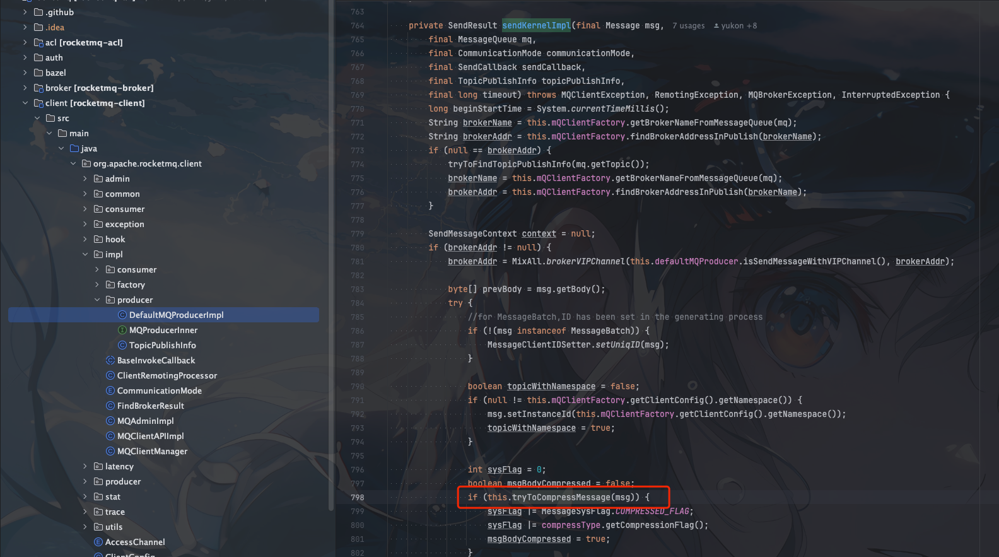
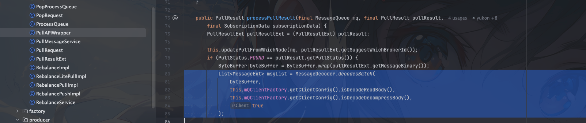
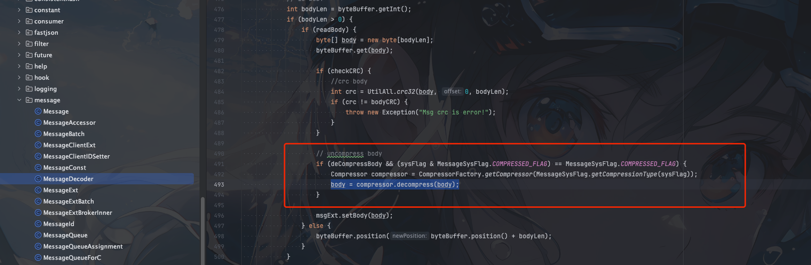
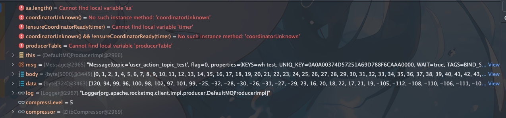

## 背景

最近同事发现线上发送的`RocketMQ`消息太大，同事为了节省网络带宽和存储空间，手动压缩消息然后再进行消息发送，发现磁盘也没有明显的缩减


所以我打算结合源码告诉他`RocketMQ`自带的消息压缩

## RocketMQ版本
- 5.1.0

## 为什么需要压缩消息

首先说一下为什么需要消息压缩，原因其实很简单。就是为了节省网络带宽和存储空间。


## 在哪里压缩消息

我们的消息压缩可以在很多个地方进行

有两种方案

1. 在client端进行压缩

比如我们可以在`Producer`发送消息的时候进行消息压缩

然后将压缩后的消息发送到`Broker`，`broker`只管存储

等到`consumer`需要消息的时候，原封不动的推送给消费者，由`consumer`自己进行解压缩

这种方式的好处是`broker`不需要关心消息的压缩和解压缩，只需要存储消息即可

2. 在broker端进行压缩

这种方式就是`Producer`发送消息的时候，不进行压缩

`RocketMQ`在存储的时候自己进行消息压缩，`consumer`进行消息拉取的时候，`broker`进行消息解压缩，然后推送给`consumer`

这种方式就是消耗`broker` cpu，也不能节省网络带宽，只能节省存储空间


所以很明显是在`client`端进行压缩比较好

## 源码分析

这里我们来具体结合源码分析下

在消息发送`org.apache.rocketmq.client.impl.producer.DefaultMQProducerImpl.sendKernelImpl`方法中会对消息进行压缩判断




### tryToCompressMessage 消息压缩

什么消息会被压缩呢？

```java
    private boolean tryToCompressMessage(final Message msg) {
        if (msg instanceof MessageBatch) {
            //batch does not support compressing right now
            return false;
        }
        byte[] body = msg.getBody();
        if (body != null) {
            if (body.length >= this.defaultMQProducer.getCompressMsgBodyOverHowmuch()) {
                try {
                    byte[] data = compressor.compress(body, compressLevel);
                    if (data != null) {
                        msg.setBody(data);
                        return true;
                    }
                } catch (IOException e) {
                    log.error("tryToCompressMessage exception", e);
                    log.warn(msg.toString());
                }
            }
        }

        return false;
    }

```

1. 批量消息不支持压缩
2. 消息体长度大于`defaultMQProducer.getCompressMsgBodyOverHowmuch()`的时候进行压缩。默认1024 * 4 = 4kb
3. 压缩算法是什么呢？

RocketMQ目前提供三种压缩算法
- LZ4
- ZSTD
- ZLIB

默认压缩算法为`ZLIB`

```java
    private CompressionType compressType = CompressionType.of(System.getProperty(MixAll.MESSAGE_COMPRESS_TYPE, "ZLIB"));
```

压缩等级为5
```java
private int compressLevel = Integer.parseInt(System.getProperty(MixAll.MESSAGE_COMPRESS_LEVEL, "5"));
```
4. 消息压缩完后会通过`sysFlag`进行标记，表示消息进行了压缩，方便后续解压

```java
                    sysFlag |= MessageSysFlag.COMPRESSED_FLAG;
                    sysFlag |= compressType.getCompressionFlag();
```


### 消息解压 

消息解压主要是在方法`org.apache.rocketmq.common.message.MessageDecoder.decode(java.nio.ByteBuffer, boolean, boolean, boolean, boolean, boolean)`中进行的

在`client`拉取到消息成功后对`PullResult`对象进行处理执行`decodesBatch`方法



消息解析`decodesBatch`方法会调用`org.apache.rocketmq.common.message.MessageDecoder.decode(java.nio.ByteBuffer, boolean, boolean, boolean, boolean, boolean)`方法

`decode`方法会对消息进行解压




## 消息压缩验证

我们可以通过发送一条大于4k的消息进行debug验证，看消息是否被压缩

- 发送消息

```java
    private static Message buiderMessage() {
    return new Message(TOPIC, TAG, generateLargeContent());
}

    private static byte[] generateLargeContent() {
    byte[] largeMessageBody = new byte[5000]; // 5000字节，超过4KB
    // 填充消息体内容
    for (int i = 0; i < largeMessageBody.length; i++) {
        largeMessageBody[i] = (byte) (i % 256);
    }
    return largeMessageBody;
}
```

这里只给出构造大于4k的代码，消息发送的代码很简单。我们随便写写即可

然后我们debug查看消息的原始大小和压缩后的大小



通过`debug`我们可以看到，原始的body大小为`5000`，压缩后的`data`大小为`324`，可以看到压缩效果还是很明显的

因为我们都是生成的重复字符串

也可以看到我们默认的压缩算法就是`ZLIB`，压缩等级为5

## 总结

- 消息压缩主要是为了节省网络带宽和存储空间。
- `RocketMQ`提供了三种压缩算法，分别是`LZ4`、`ZSTD`、`ZLIB`，默认为`ZLIB`
- 消息压缩主要是在`Producer`发送消息的时候进行压缩，`broker`只管存储
- 消息解压主要是在`Consumer`拉取消息的时候进行解压
- RocketMQ消息压缩仅支持单条消息压缩，不支持批量消息压缩
- 一般消息压缩都会选择在`client`端进行压缩，这样可以节省`broker`的cpu