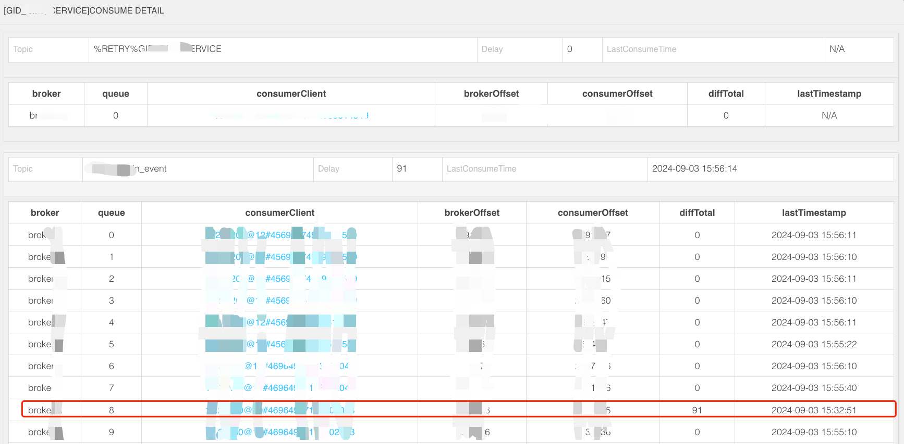
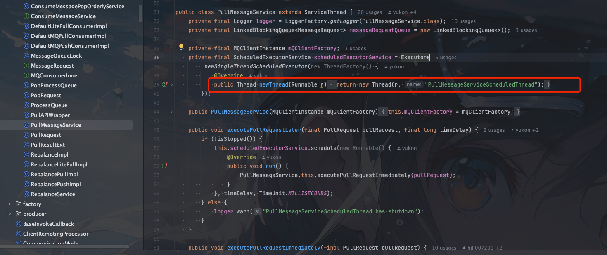
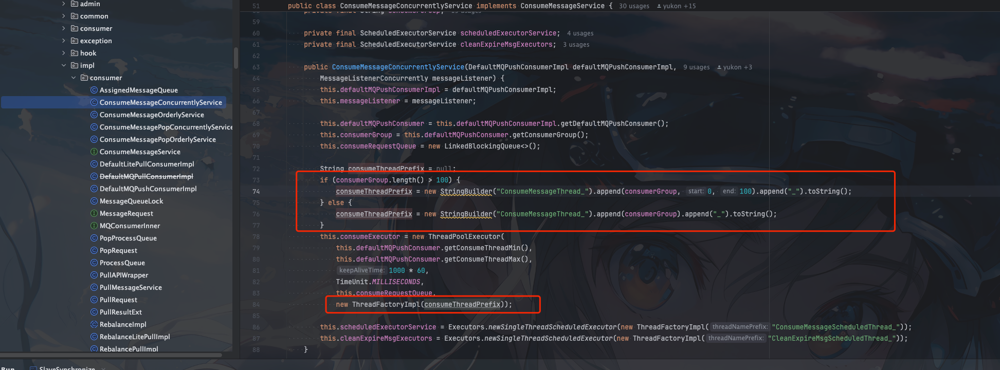
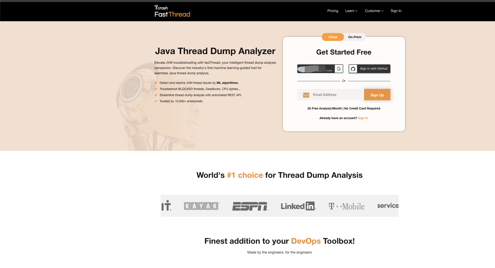
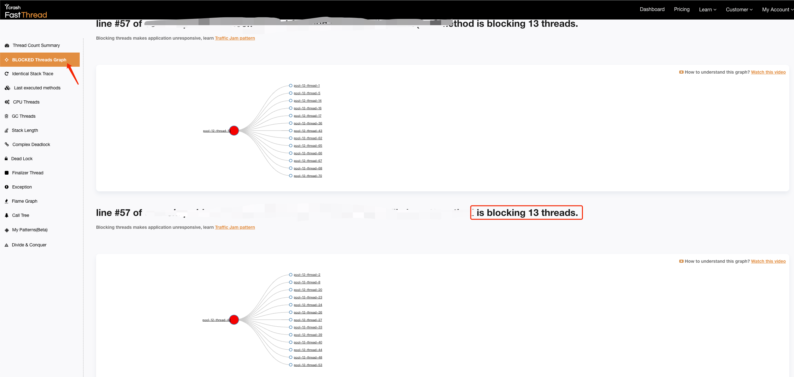

## 背景

团队小伙伴突然找到我们团队说，不得了了，线上的`RocketMQ`又出现了消费停滞，怎么办？ 要不要我们先重启一下

其实早在之前也出现过一次，当时为了快速恢复业务的，就直接重启解决的。

这次因为堆积量不多，所以想对运行环境进行一些环境快照保留。所以就和业务方沟通是否看见接受短暂的消息延时

得到肯定答案后就是放手干吧


## 问题定位

首先我们要确定业务反馈的是否属实，所以需要去`RocketMQ` `dashboard`上看看具体的消费进度





可以看到`consumer`中并不是全部的`queue`消费都堆积了，只有一个`queue`消息堆积了。

这个消费者订阅的`topic`是分区有序的，正常来说分区有序，如果某个分区的消息单条消息出现了消费异常，必须要等这条消息消费成功(或者是重试结束)后才能继续消费后面的消息。

有时候会因为这个原因出现消息堆积是正常的，但是业务对消息重试进行了合理的设置，设置的重试次数比较合理，不会出现长时间的堆积


### RocketMQ的消费线程

一般出现这种问题很明显就是线程出现了死锁或者僵死之类的情况

熟悉`RocketMQ`的都知道`RocketMQ`消费消息主要是依赖1个线程1个线程池

1. 以`PullMessageService`开头的线程, 主要用来拉去消息




2. 以`ConsumeMessageThread`开头的线程(实际是一个线程池),主要用来执行消费逻辑




直到了`RocketMQ`的消费线程模型后我们就好解决了。我们直接通过`jstack`命令查看线程的堆栈信息


### 线程快照分析

我们直接通过`jstack`命令生成线程快照


```shell
jstack <pid> > thread_dump_$(date +%Y%m%d_%H%M%S).txt
```

> pid 和后面的 thread_dump_$(date +%Y%m%d_%H%M%S).txt自己随便取个名字就行。自己记得就行


由于应用运行在`pod`中，生成了我们就下载到本地


我们自己看还是比较难分析出分体。这里我们直接使用一个在线的网站进行线程快照的分析

### fastthread

fastthread是一个在线的线程快照分析工具，可以直接将线程快照上传到这个网站进行分析




我们上传我们下载的线程快照文件

然后进行线程分析



很快定位到阻塞其他线程的代码


这里的代码被我打码了

### arhtas

如果我们使用`arthas`也可以很方便的找到阻塞的线程

```shell
thread -b
```

arthas 提供了thread -b， 一键找出那个罪魁祸首。

## 问题元凶找到


通过阻塞代码我们很快定位到是由于线程池使用不当导致的阻塞


## 线程池使用不当

什么情况下会出现线程池使用不当导致的"死锁"呢？

我们看看下面的demo

```java
public class XiaoZouExample {

    public static void main(String[] args) {

        ExecutorService executor = new ThreadPoolExecutor(2, 5, 0L, TimeUnit.MILLISECONDS, new LinkedBlockingQueue<>());


        // 提交两个外部任务
        for (int i = 0; i < 2; i++) {
            executor.submit(new OuterTask(executor));
        }

        // 等待一段时间后关闭线程池
        try {
            Thread.sleep(10000);
        } catch (InterruptedException e) {
            e.printStackTrace();
        }
        executor.shutdown();

    }

    static class OuterTask implements Runnable {

        private final ExecutorService executor;

        public OuterTask(ExecutorService executor) {
            this.executor = executor;
        }

        @Override
        public void run() {
            System.out.println("小奏技术 Outer task started by thread: " + Thread.currentThread().getName());

            // 创建一个Future来等待内部任务的结果
            Future<?> future = executor.submit(new InnerTask());

            try {
                // 等待内部任务完成
                future.get();
            } catch (InterruptedException | ExecutionException e) {
                e.printStackTrace();
            }

            System.out.println("小奏技术 Outer task finished by thread: " + Thread.currentThread().getName());
        }
    }

    static class InnerTask implements Runnable {
        @Override
        public void run() {
            System.out.println("小奏技术 Inner task started by thread: " + Thread.currentThread().getName());
            try {
                // 模拟长时间运行的任务
                Thread.sleep(5000);
            } catch (InterruptedException e) {
                e.printStackTrace();
            }
            System.out.println("小奏技术 Inner task finished by thread: " + Thread.currentThread().getName());
        }
    }

}
```

- 运行结果


可以看到没有任何任务执行完成，线程池一直处于被阻塞状态

核心原因就是首先线程池的核心线程数是2，核心线程用来执行2个任务，用完了所有线程

然后在核心线程执行的2个任务中又用原来的线程池进行执行任务，这时候因为没有线程可以去执行任务了，所以会添加到阻塞队列中等待核心线程执行完任务后再执行

但是核心线程想要释放任务又必须等待这两个子任务执行完，这样就形成了一个死锁

## 解决方案

解决方式有多种，最简单的方式可以考虑不要使用队列，直接使用`SynchronousQueue`

```java
ExecutorService executor = new ThreadPoolExecutor(2, 5, 0L, TimeUnit.MILLISECONDS, new SynchronousQueue<>());
```

让多的任务直接通过主线程执行或者丢弃任务

当然最好的方式就是避免这种情况的发生，合理的使用线程池，不要线程池中的任务还要使用这个线程池去执行任务

这种情况是比较难避免的，因为现在大部分业务开发都是隐式使用线程池，自己也不知道自己用的哪个线程池

比如spring的`@Async`注解，`@Scheduled`注解等等

## 总结

线程池的使用还是要尽量消息，要避免出现线程池中的任务继续使用该线程池去执行任务，出现死锁

也可以考虑对线程池进行监控，避免出现大量任务阻塞
