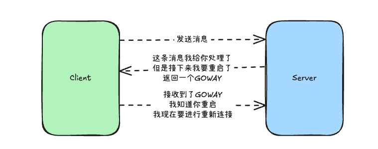
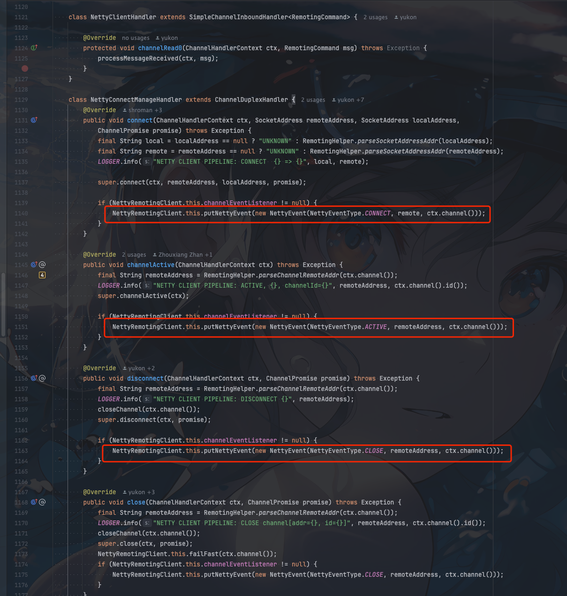

## 背景

我们先看看我们的`client`和`server`通信的这么一种场景


`client`和`server`需要保持长连接。然后无论客户端还是服务端出现异常重启。我们都希望长连接都应该具备**重试保活**。


`HTTP2`中是如何实现这种重连机制呢？

答案就是`GOAWAY`帧。

`HTTP2` 使用 GOAWAY 帧信号来控制连接关闭。当服务端需要重启的时候，就会给`client`发送一个 GOAWAY 帧，告诉业务方，我要重启了，你们可以重连了。


`client`收到`GOAWAY`帧后，会关闭当前连接，然后重新发起连接。

大致流程如下




## 大部分的网络通信封装

实际我们如果去看开源项目。很多开源项目`client`和`server`无论是私有协议还是`GRPC`协议对`GOAWAY`帧的实现都不是很好，或者没有这种处理


## RocketMQ中的GOAWAY帧应用

在早期的4.0或者早一点的5.x版本都没有实现类似`GOAWAY`帧


我们来看看`RocketMQ`现在是如何实现`GOAWAY`优雅停机的


1. 首先在`ResponseCode`新增了一个状态码

```java
public static final int GO_AWAY = 1500;
```

2. 如果服务端要进行停机，会给`client`发送一个`GOAWAY`帧


```java
protected AtomicBoolean isShuttingDown = new AtomicBoolean(false);

public void processRequestCommand(final ChannelHandlerContext ctx, final RemotingCommand cmd) {
    // 省略部分代码
    if (isShuttingDown.get()) {
        if (cmd.getVersion() > MQVersion.Version.V5_3_1.ordinal()) {
            final RemotingCommand response = RemotingCommand.createResponseCommand(ResponseCode.GO_AWAY,
                "please go away");
            response.setOpaque(opaque);
            writeResponse(ctx.channel(), cmd, response);
            log.info("proxy is shutting down, write response GO_AWAY. channel={}, requestCode={}, opaque={}", ctx.channel(), cmd.getCode(), opaque);
            return;
        }
    }
    
}
```

3. 客户端如果接收到`GOAWAY`帧，会关闭当前连接，然后重新发起连接

- NettyRemotingClient

```java
    public CompletableFuture<ResponseFuture> invokeImpl(final Channel channel, final RemotingCommand request,
        final long timeoutMillis) {
    if (response.getCode() == ResponseCode.GO_AWAY) {
        ChannelWrapper channelWrapper = channelWrapperTables.computeIfPresent(channel, (channel0, channelWrapper0) -> {
            try {
                // 重新建立连接
                if (channelWrapper0.reconnect(channel0)) {
                    LOGGER.info("Receive go away from channelId={}, channel={}, recreate the channelId={}", channel0.id(), channel0, channelWrapper0.getChannel().id());
                    channelWrapperTables.put(channelWrapper0.getChannel(), channelWrapper0);
                }
            } catch (Throwable t) {
                LOGGER.error("Channel {} reconnect error", channelWrapper0, t);
            }
            return channelWrapper0;
        });
        
        
    }
    
}
```

重新建立连接的时候也会对重新建立连接的`broker`进行心跳发送。


这里主要是对所有的`channal`进行了封装

- NettyConnectManageHandler




```java

```
