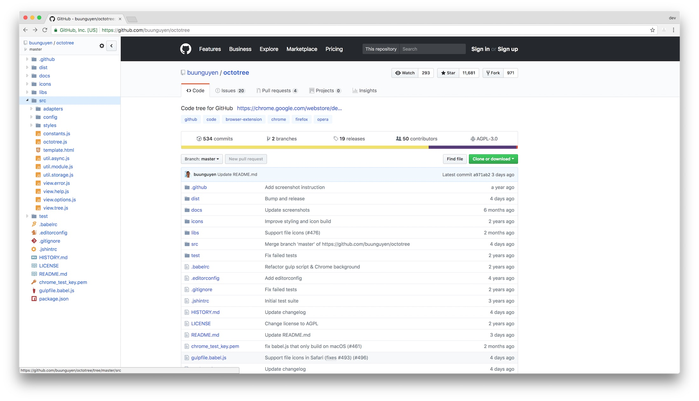
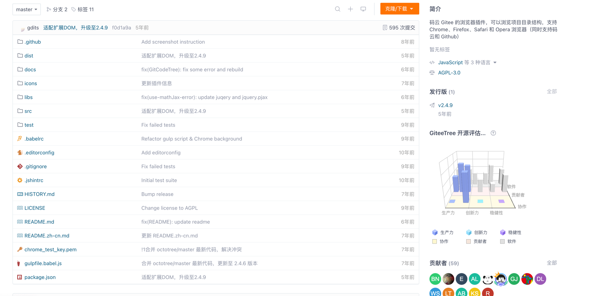
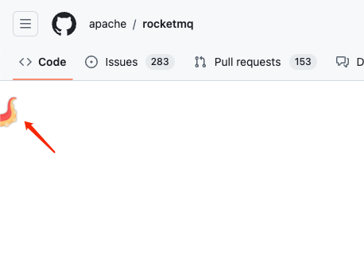
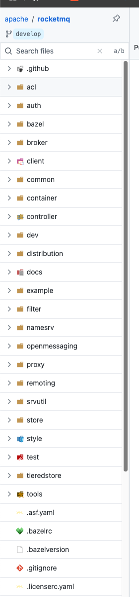

## 背景

大家在不管是`github`还是`gitee`看源码的时候可能都有这种需求

想看项目的目录结构，像在`IDE`一样简单易用的代码树

比如这样

之前使用的是`gitee`官方提供的开源插件[GitCodeTree](https://gitee.com/oschina/GitCodeTree)

但是这个插件已经很多年没更新了

可以看到最近更新还是5年前。

使用这个插件目前遇到了一些问题
1. 在github使用现在有bug，总会出现点击文件第一次空白，需要刷新浏览器
2. 需要提供github`token`

其实2倒是次要的，主要是第一个问题，很影响使用体验

所以打算换一个插件

## Octotree

Octotree是比较成熟和知名的插件了

国内外知名度都很高

提供基础版和付费版

基础版功能已经很强大了，基本满足大部分需求

不过不是开源的，但是也不影响使用

但是今天我们要推荐一个国产开源完全免费的插件`Gitako`

## Gitako

`Gitako`是一个国人开源的插件，完全免费

纯JS写的，不需要添加`github`的`token`

UI也特别好看，下面给大家看看UI

logo和平时不展开的样子都是一只可爱的章鱼

展开后不同的文件类型有不同的图标，非常可爱

`Google`浏览器插件商店地址：[Gitako](https://chromewebstore.google.com/detail/gitako-github-file-tree/giljefjcheohhamkjphiebfjnlphnokk?pli=1): https://chromewebstore.google.com/detail/gitako-github-file-tree/giljefjcheohhamkjphiebfjnlphnokk?pli=1

安装后就可以直接使用了，不需要配置`github`的`token`,非常方便