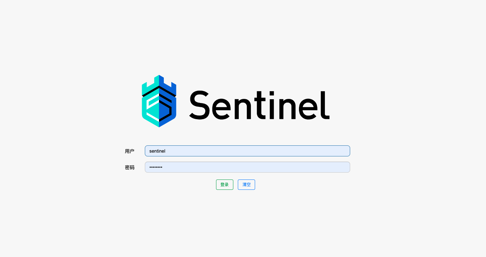
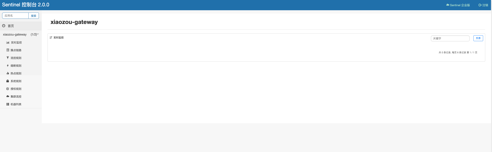

> 这里是**weihubeats**,觉得文章不错可以关注公众号**小奏技术**，文章首发。拒绝营销号，拒绝标题党

## 背景

线上的网关可能会存在单个服务因为大量异常接口导致整个网关或者业务系统被打爆，所以为了系统的可用性，我们会选择对网关和服务进行保护，添加熔断


## 版本
- spring cloud: 2021.0.4
- spring boot: 2.7.0
- sentinel: 1.8.6

## 源码地址
- [源码](https://github.com/weihubeats/weihubeats_demos/blob/master/spring-cloud-demos/spring-cloud-gateways/spring-cloud-gateway/README.md): https://github.com/weihubeats/weihubeats_demos/blob/master/spring-cloud-demos/spring-cloud-gateways/spring-cloud-gateway/README.md

## 官方文档地址
- https://sentinelguard.io/zh-cn/docs/api-gateway-flow-control.html

## 搭建 sentinel dashboard

这里我们直接使用源码的方式启动`sentinel-dashboard`

1. 下载[源码](https://github.com/alibaba/Sentinel):https://github.com/alibaba/Sentinel
2. 启动


这里启动无需添加任何启动参数，直接启动即可

然后访问地址`http://127.0.0.1:8080/`




默认账号密码
- sentinel
- sentinel




进入后的效果，需要注意的是网关的相关路由没有被调用是不会在`簇点链路`展示。所以我们现在网关先来接入`sentinel`

## gateway接入sentinel

### 1. 引入依赖

```xml
<dependency>
            <groupId>com.alibaba.csp</groupId>
            <artifactId>sentinel-transport-simple-http</artifactId>
            <version>1.8.6</version>
        </dependency>

        <dependency>
            <groupId>com.alibaba.csp</groupId>
            <artifactId>sentinel-spring-cloud-gateway-adapter</artifactId>
            <version>1.8.6</version>
        </dependency>
```

> 这里我们并没有使用`spring-cloud-starter-alibaba-sentinel`,因为`spring cloud alibaba`现在维护频率相对来说比较低。

### 2. 配置sentinel配置

新建配置类
- GatewayConfiguration

```java
@Configuration
public class GatewayConfiguration {

    private final List<ViewResolver> viewResolvers;
    private final ServerCodecConfigurer serverCodecConfigurer;

    public GatewayConfiguration(ObjectProvider<List<ViewResolver>> viewResolversProvider,
                                ServerCodecConfigurer serverCodecConfigurer) {
        this.viewResolvers = viewResolversProvider.getIfAvailable(Collections::emptyList);
        this.serverCodecConfigurer = serverCodecConfigurer;
    }

    @Bean
    @Order(Ordered.HIGHEST_PRECEDENCE)
    public SentinelGatewayBlockExceptionHandler sentinelGatewayBlockExceptionHandler() {
        // Register the block exception handler for Spring Cloud Gateway.
        return new SentinelGatewayBlockExceptionHandler(viewResolvers, serverCodecConfigurer);
    }

    @Bean
    @Order(Ordered.HIGHEST_PRECEDENCE)
    public GlobalFilter sentinelGatewayFilter() {
        return new SentinelGatewayFilter();
    }


    @PostConstruct
    public void init() {
        BlockRequestHandler blockRequestHandler = (serverWebExchange, throwable) -> {
            HashMap<String, Object> map = new HashMap<>();
            map.put("code", HttpStatus.TOO_MANY_REQUESTS.value());
            map.put("msg", "请稍后再试...");
            map.put("success", true);
            //自定义异常处理
            return ServerResponse.status(HttpStatus.TOO_MANY_REQUESTS)
                    .contentType(MediaType.APPLICATION_JSON)
                    .body(BodyInserters.fromValue(map));
        };
        GatewayCallbackManager.setBlockHandler(blockRequestHandler);
    }


}
```

这里我们通过`GatewayCallbackManager`自定义了我们的异常处理器，如果不自定义。默认返回的不够友好。线上需要结合自己的基础`Result`定制

### 3. 设置路由

这里我们就正常的配置路由

```yaml
spring:
  cloud:
    gateway:
      httpclient:
        response-timeout: 3s
        pool:
          type: fixed
          max-connections: 200
          max-idle-time: 5000
          acquire-timeout: 10000
      routes: 
        - id: order-service
          predicates:
            - Path=/ms/order-service/**
          filters:
            - StripPrefix=2
          uri: lb://order-service
        - id: pay-service
          predicates:
            - Path=/ms/pay-service/**
          filters:
            - StripPrefix=1
          uri: http://localhost:9999/pay-service
          metadata:
            response-timeout: 5000
```
### 4. 启动网关

注意启动参数添加`sentinel`相关启动参数
```
-Dcsp.sentinel.dashboard.server=localhost:8080 -Dproject.name=xiaozou-gateway
```

注意相关的启动参数不能配置在`yaml`里面，因为我们使用的不是`spring-cloud-starter-alibaba-sentinel`，所以是不支持`yaml`配置


### 5. 路由服务启动

- [路由服务源码地址](https://github.com/weihubeats/weihubeats_demos/blob/master/spring-cloud-demos/spring-cloud-gateways/spring-cloud-gateway-pay-service/pom.xml): https://github.com/weihubeats/weihubeats_demos/blob/master/spring-cloud-demos/spring-cloud-gateways/spring-cloud-gateway-pay-service/pom.xml


就是一个最简单`spring boot`项目，然后提供一个接口
```java
@GetMapping("/pay")
    public String pay(Long timeout) throws Exception {
        System.out.printf("timeout: %s", timeout);
        if (Objects.nonNull(timeout)) {
            TimeUnit.SECONDS.sleep(timeout);
        }
        return "return pay";
    }
```

这里故意设值一个睡眠时间，让网关出现超时异常

### 6. 初次调用，初始化Sentinel
Sentinel 会在客户端首次调用的时候进行初始化，开始向控制台发送心跳包
所以我们需要手动调用一次接口
```curl
localhost:8090/ms/pay-service/pay?timeout=1
```

### 7. 配置熔断

初始化后我们就可以在`簇点链路`看到我们的路由资源了


这里我们通过点击`熔断`按钮配置熔断


熔断策略目前有三个
- 慢调用比例
- 异常比例
- 异常数

我们这里使用`异常比例`，阈值设置为0.5,最小的请求数量是5个。统计时长为5s，统计的滑动窗口为1000ms


## 测试

这里我们使用`Jmeter`进行压测,不熟悉`Jmeter`可以参考之前的文章
- [使用Jmeter进行简单的压测](https://weihubeats.blog.csdn.net/article/details/118860462):https://weihubeats.blog.csdn.net/article/details/118860462

这里我们定义200个线程


然后运行


可以看到是存在`Gateway Timeout`相关的异常

但是更多的是我们自定义的降级异常


## 总结

本次我们演示了`spring cloud gateway`集成`sentinel`实现熔断。实际使用还是比较简单，但是不推荐在生产使用，因为现在的熔断规则都是直接存储在`Sentinel dashboard`内存中，然后推送到业务系统，没有持久化，如果需要持久化我们需要更多对`Sentinel`进行改造